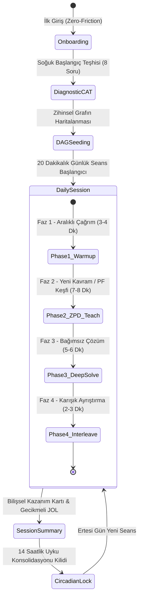

# 19-APPLICATION-FLOW-AND-USER-JOURNEY.md
# UYGULAMA AKIŞI VE KULLANICI YOLCULUĞU (APPLICATION FLOW & USER JOURNEY)
## Uçtan Uca Oturum Durum Makinesi, 20 Dakikalık Seans Mimarisi ve Çözüm Tahtası Mikro-Döngüsü

---

## 1. GİRİŞ VE KULLANICI DENEYİMİ PRENSİBİ

Geleneksel eğitim yazılımları kullanıcıyı uzun menüler, sıkıcı formlar veya dikkat dağıtıcı animasyonlarla yorar. Bu sistemde ise:
* **"İlk Tıklamadan İtibaren Aktif Düşünme":** Kullanıcı sisteme girdiği andan itibaren pasif bir izleyici değil, zihinsel bir aktördür.
* **Katı Zaman Sınırı (Timeboxing):** Günlük seans 20 dakikadır; ne bir dakika eksik, ne bir dakika fazla. Beyin yorulmadan, en yüksek nöral plastisite anında seans kapatılır.

---

## 2. UÇTAN UCA KULLANICI YOLCULUĞU DURUM MAKİNESİ (MACRO FSM)



---

## 3. ADIM ADIM OTURUM EVRELERİ (THE 5-STAGE JOURNEY)

### EVRE 1: SIFIR SÜRTÜNMELİ BAŞLANGIÇ (ONBOARDING)
* **Kullanıcı Deneyimi:** Kayıt formu, şifre onaylama veya uzun anketler YOKTUR.
* **Giriş:** Kullanıcı tek tıkla ("Hemen Başla") anonim bir UUID oturumu açar.
* **İlk Karşılama:** *"Cebirde nerede olduğunu anlamak için sana 8 özel soru soracağız. Bilmediğin yerde tahmin etmek yerine 'Emin Değilim' butonuna basman sistemin sana tam ihtiyacın olan seviyeyi sunmasını sağlar."*

---

### EVRE 2: 2PL-IRT UYARLAMALI DİNAMİK TEŞHİS (ADAPTIVE DIAGNOSTIC)
* **Süre:** 3 - 5 Dakika.
* **Soru Sayısı:** 8 Kalibre Parametrik Soru (`CAT-ITEM-01` .. `CAT-ITEM-08`).
* **Akış:**
  1. Başlangıç sorusu orta zorluktaki monik çarpanlara ayırma düğümünden (`[N12]`) gelir ($b = 0.0, a = 1.85$).
  2. Kullanıcı doğru çözerse sistem daha üst düğümlere (`[N20]` Kuadratik Formül veya `[N29]` Modelleme) zıplar.
  3. Kullanıcı yanlış yaparsa sistem alt önkoşul düğümlerine (`[N06]` Ortak Parantez veya `[N02]` Doğrusal Denklem) iner.
* **Çıktı (DAG Seeding):** 8. sorunun sonunda Fisher Bilgisi ile kestirilen $\hat{\theta}$ yetenek puanı, 30 düğümlü Cebir Atlası üzerinde Bayesian olasılıklarına ($P(L)$) dönüştürülür:
  - Usta olunan düğümler: $P(L) \ge 0.85$ (Yeşil)
  - Hedef ZPD düğümü: $P(L) \approx 0.50$ (Sarı - Başlangıç Noktası)
  - Henüz kilitli düğümler: $P(L) \le 0.10$ (Gri)

---

### EVRE 3: 20 DAKİKALIK GÜNLÜK ÖĞRENME SEANSI (THE DAILY ENGINE)

Seans 4 senkronize fazdan oluşur ve ekranda geri sayım sayacı ile yönetilir:

#### Faz 1: Zihni Güçlendirme & Aralıklı Çağrım (Retrieval Warm-up | 3-4 Dakika)
* **Amaç:** FSRS-4.5 algoritmasına göre unutulma riski ($R < 0.90$) eşiğine gelen 2 eski kavramı uyandırmak.
* **Format:** 2 hızlı prosedürel soru. Destek/ipucu asgaridir. Başarı durumunda stabilite ($S$) çarpanla uzatılır.

#### Faz 2: Yeni Kavram Edinimi & Üretici Başarısızlık (ZPD Exploration & PF | 7-8 Dakika)
* **Hedef:** ZPD sınırındaki yeni düğümün (örn. `[N15]` Tam Kareye Tamamlama) kavramsal inşası.
* **Akış:**
  1. *Keşif Aşaması (Exploration Sandbox):* Formül verilmez. Öğrenciye $x^2 + 6x - 2 = 0$ denklemi verilir ve *"En az 2 farklı sezgisel yol dene, yanılmaktan çekinme, puan cezası yoktur"* denir.
  2. *SGR Sınıflandırma:* Öğrencinin denemeleri (karolar, aritmetik tahmin, hatalı cebir) arka planda eşlenir.
  3. *Konsolidasyon (Karşılaştırmalı Vakalar):* AI Tutor öğrencinin sezgisini kanonik tam kare kuralına bağlar: *"Harika fark ettin, kenarı (x+3) olan bir kare için köşede 9 birim eksikti! Her iki tarafa 9 ekleyelim..."*

#### Faz 3: Derin Problem Çözme & Hata Onarımı (Deep Problem Solving | 5-6 Dakika)
* **Hedef:** Kavramsal şemayı bağımsız yürütmeye dönüştürmek.
* **Format:** 2 parametrik problem. Öğrenci adımlarını Scratchpad'e tek tek yazar.
* **Hata Anı:** Öğrenci bir bozuk kural işletirse (örn. $x^2=25 \implies x=5$), sistem cevabı vermez; Sokratik olarak *"Karesi 25 eden negatif bir sayı olabilir mi?"* diye yönlendirir.

#### Faz 4: Karışık Ayrıştırma & Metabilişsel Kalibrasyon (Interleaving & Reflection | 2-3 Dakika)
* **Hedef:** Şablon ezberini kırmak ve yöntem seçimi (strategy selection) yaptırmak.
* **Format:** Karışık 4 denklem sunulur: *"Bu denklemlerden hangisinde tam kare yöntemi çarpanlara ayırmadan daha hızlı sonuç verir?"*
* **Güven Beyanı:** Öğrenci cevabını verirken güven derecesini (%25, %50, %75, %100) seçer; Brier Proper Scoring puanı hesaplanır.

---

### EVRE 4: SEANS SONU BİLİŞSEL KAZANIM KARTI (SESSION SUMMARY)
* **Kullanıcıya Gösterilen Ekran:**
  - 🧠 **Beyin Haritası Güncellemesi:** *"Bugün 'Tam Kareye Tamamlama' düğümünün kilidi açıldı (%72 Usta)."*
  - 🎯 **Kalibrasyon Skoru:** *"%85 Tutarlılık. Kendine güvenin ile gerçek bilgin birbiriyle uyumlu."*
  - ⏰ **Konsolidasyon Kilidi:** *"Bugünkü nöral kapasite hedefine ulaşıldı. Bu bilgilerin uzun süreli belleğe mühürlenmesi için şimdi dinlenme ve uyku zamanı. Bir sonraki seans yarın saat 09:00'da açılacaktır."*

---

## 4. ADIM BAZLI ÇÖZÜM TAHTASI MİKRO-DÖNGÜSÜ (THE SCRATCHPAD MICRO-LOOP)

Öğrencinin bir soruyu çözerken attığı her tekil adımdaki veri ve karar akışı:

```text
[ÖĞRENCİ] ─── MathLive ile Adım Yazar (örn: "(x + 3)² = 11")
    │
    ▼ (<= 15 ms)
[İSTEMCİ TIER-1] ─── Parantez Dengesi & Sözdizim Kontrolü
    │
    ▼ (WebSocket / HTTP POST <= 60 ms)
[SUNUCU CAS TIER-2] ─── SymPy AST Eşdeğerlik Doğrulaması
    │
    ├─────────► [ADIM GEÇERLİ VE DOĞRU]
    │                 │
    │                 ▼
    │           Yeni Boş Adım Kutusu Açılır [✓ Doğrulandı]
    │           iBKT P(L) Güncellenir, DDM Sürüklenme Hızı (v) Hesaplanır
    │
    └─────────► [ADIM HATALI VEYA SAPMA]
                      │
                      ▼
                [HATA MOTORU] ─── 5 Buggy Rule Taraması (BUG-QUAD-01..05)
                      │
                      ▼
                [AI TUTOR İÇ MONOLOG HATTI]
                1. Pedagojik Stratejist (ZPD İskele Seviyesi Belirler)
                2. Sokratik İletişimci (Soru Üretir)
                3. Zero-Leakage Regex Kalkanı (Cevabı Taramadan Geçirir)
                      │
                      ▼
                [ÇÖZÜM TAHTASINDA SOKRATİK BALONCUK BELİRİR]
                "Sol tarafı tam kare yaptın, harika! Peki sağ tarafın
                 karekökünü alırken hangi cebirsel ihtimali atladın?"
```

---

## 5. HATA VE İSTİSNA DURUMLARI (EXCEPTION FLOWS)

1. **Öfke Tıklaması ve Donma (Thrashing / Freezing):**
   * Öğrenci ekranda donarsa ($RT > 45\text{ s}$) veya hızlıca anlamsız tuşlara basarsa:
   * Scratchpad kilitlenir, afektif şalter devreye girer ve *"Bir Nefes Verelim"* rahatlama modalı açılır.
2. **İpucu İstismarı (Bottom-Out Abuse):**
   * Öğrenci çözmek yerine sürekli ipucuna basarsa:
   * İmposter / İstismar Kilidi devreye girer; *"Sen bu adımı biliyorsun, bu adımda ipucu yok, dene!"* diyerek bağımsız hamleye zorlar.
