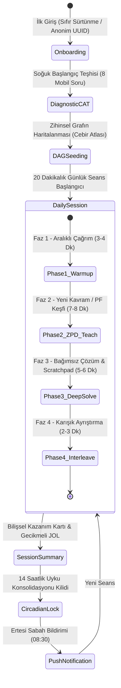

# 19-APPLICATION-FLOW-AND-USER-JOURNEY.md
# MOBİL UYGULAMA AKIŞI VE KULLANICI YOLCULUĞU (MOBILE APPLICATION FLOW & USER JOURNEY)
## Akıllı Telefon Oturum Durum Makinesi, 20 Dakikalık Seans Mimarisi, Çift Modlu Giriş ve Mobil Bildirim Döngüsü

---

## 1. GİRİŞ VE MOBİL KULLANICI DENEYİMİ PRENSİBİ

Geleneksel eğitim uygulamaları kullanıcıyı uzun menüler, sıkıcı formlar veya dikkat dağıtıcı animasyonlarla yorar. Bu sistemde ise:
* **"İlk Dokunuştan İtibaren Aktif Düşünme":** Kullanıcı uygulamayı açtığı andan itibaren pasif bir video izleyicisi değil, zihinsel bir aktördür.
* **Katı Zaman Sınırı (Timeboxing):** Günlük seans 20 dakikadır; ne bir dakika eksik, ne bir dakika fazla. Beyin yorulmadan, en yüksek nöral plastisite anında seans kapatılır.
* **Başparmak ve Dokunsal (Haptic) Bütünlük:** Tüm adımlar dokunsal onaylama ile mühürlenir, bilişsel geri bildirim titreşimle fizikselleşir.

---

## 2. UÇTAN UCA MOBİL KULLANICI YOLCULUĞU (MACRO FSM)



---

## 3. ADIM ADIM MOBİL OTURUM EVRELERİ (THE 5-STAGE JOURNEY)

### EVRE 1: SIFIR SÜRTÜNMELİ BAŞLANGIÇ (ONBOARDING)
* **Kullanıcı Deneyimi:** Kayıt formu, şifre onaylama, SMS kodu veya uzun anketler YOKTUR.
* **Giriş:** Kullanıcı tek dokunuşla ("Hemen Başla") anonim bir UUID oturumu açar (cihaz anahtarlığında saklanır).
* **İlk Karşılama:** *"Cebirde nerede olduğunu anlamak için sana 8 özel soru soracağız. Bilmediğin yerde tahmin etmek yerine 'Emin Değilim' butonuna basman sistemin sana tam ihtiyacın olan seviyeyi sunmasını sağlar."*

---

### EVRE 2: 2PL-IRT UYARLAMALI MOBİL TEŞHİS (ADAPTIVE DIAGNOSTIC)
* **Süre:** 3 - 5 Dakika.
* **Soru Sayısı:** 8 Kalibre Parametrik Soru (`CAT-ITEM-01` .. `CAT-ITEM-08`).
* **Mobil Giriş:** Öğrenci ekranın altındaki **[ 🧮 Tuş Takımı ]** veya **[ ⌨️ Serbest Klavye ]** ile yanıtını yazar.
* **Akış:**
  1. Başlangıç sorusu orta zorluktaki monik çarpanlara ayırma düğümünden (`[N12]`) gelir ($b = 0.0, a = 1.85$).
  2. Kullanıcı doğru çözerse sistem daha üst düğümlere (`[N20]` Kuadratik Formül) zıplar.
  3. Yanlış yaparsa alt önkoşul düğümlerine (`[N06]` Ortak Parantez veya `[N02]` Doğrusal Denklem) iner.
* **Çıktı (DAG Seeding):** 8. sorunun sonunda kestirilen $\hat{\theta}$ yetenek puanı, 20 düğümlü Cebir Atlası üzerinde Bayesian olasılıklarına ($P(L)$) dönüştürülür:
  - Usta düğümler: $P(L) \ge 0.85$ (Yeşil)
  - Hedef ZPD düğümü: $P(L) \approx 0.50$ (Sarı - Başlangıç Noktası)
  - Henüz kilitli düğümler: $P(L) \le 0.10$ (Kilitli Gri)

---

### EVRE 3: 20 DAKİKALIK GÜNLÜK ÖĞRENME SEANSI (THE DAILY ENGINE)

Seans dikey ekranda 4 senkronize fazdan oluşur ve ekranda geri sayım sayacı ile yönetilir:

#### Faz 1: Zihni Güçlendirme & Aralıklı Çağrım (Retrieval Warm-up | 3-4 Dakika)
* **Amaç:** FSRS-4.5 algoritmasına göre unutulma riski ($R < 0.90$) eşiğine gelen 2 eski kavramı uyandırmak.
* **Format:** 2 hızlı prosedürel soru. Destek asgaridir. Başarı durumunda hafıza stabilitesi ($S$) uzatılır.

#### Faz 2: Yeni Kavram Edinimi & Üretici Başarısızlık (ZPD Exploration & PF | 7-8 Dakika)
* **Hedef:** ZPD sınırındaki yeni düğümün (örn. `[N15]` Tam Kareye Tamamlama) kavramsal inşası.
* **Akış:**
  1. *Keşif Aşaması (Exploration Sandbox):* Formül verilmez. Öğrenciye $x^2 + 6x - 2 = 0$ denklemi verilir ve *"En az 2 farklı sezgisel yol dene, puan cezası yoktur"* denir.
  2. *SGR Sınıflandırma:* Öğrencinin denemeleri arka planda eşlenir.
  3. *Konsolidasyon (Karşılaştırmalı Vakalar):* AI Tutor öğrencinin sezgisini kanonik kurala bağlar: *"Harika fark ettin, kenarı (x+3) olan bir kare için köşede 9 birim eksikti! Her iki tarafa 9 ekleyelim..."*

#### Faz 3: Derin Problem Çözme & Hata Onarımı (Deep Problem Solving | 5-6 Dakika)
* **Hedef:** Kavramsal şemayı bağımsız yürütmeye dönüştürmek.
* **Format:** 2 parametrik problem. Öğrenci adımlarını mobil Scratchpad'e tek tek yazar.
* **Hata Anı:** Öğrenci bir bozuk kural işletirse (örn. $x^2=25 \implies x=5$), sistem cevabı vermez; tok bir haptik titreşimle Sokratik olarak *"Karesi 25 eden negatif bir sayı olabilir mi?"* diye yönlendirir.

#### Faz 4: Karışık Ayrıştırma & Metabilişsel Kalibrasyon (Interleaving & Reflection | 2-3 Dakika)
* **Hedef:** Şablon ezberini kırmak ve yöntem seçimi (strategy selection) yaptırmak.
* **Format:** Karışık 4 denklem sunulur: *"Bu denklemlerden hangisinde tam kare yöntemi çarpanlara ayırmadan daha hızlı sonuç verir?"*
* **Güven Beyanı:** Öğrenci cevabını verirken dikey güven ölçeğinden (%25, %50, %75, %100) seçim yapar; Brier Kalibrasyon Skoru güncellenir.

---

### EVRE 4: SEANS SONU BİLİŞSEL KAZANIM KARTI (SESSION SUMMARY)
* **Ekranda Gösterilen Veriler:**
  - 🧠 **Cebir Atlası Güncellemesi:** *"Bugün 'Tam Kareye Tamamlama' düğümünün kilidi açıldı (%72 Usta)."*
  - 🎯 **Kalibrasyon Skoru:** *"%85 Tutarlılık. Kendine güvenin ile gerçek başarın uyumlu."*
  - 🌙 **Sirkadiyen Kilit Bildirimi:** *"Bugünkü nöral kapasite hedefine ulaşıldı. Bu bilgilerin uzun süreli belleğe yazılması için şimdi uyku zamanı. Uygulama yarın sabah 08:00'e kadar kilitlendi."*

---

## 4. MOBİL ÇÖZÜM TAHTASI MİKRO-DÖNGÜSÜ (SCRATCHPAD MICRO-LOOP)

```text
[ÖĞRENCİ] ─── Çift Modlu Girişle Adım Yazar (Touchpad / Serbest Klavye)
    │
    ▼ (<= 5 ms)
[MOBİL TIER-1 / FLUTTER] ─── Parantez Dengesi & Yerel Sözdizim Kontrolü
    │
    ▼ (REST POST <= 40 ms)
[SUNUCU CAS TIER-2 / PYTHON] ─── SymPy AST Eşdeğerlik Doğrulaması
    │
    ├─────────► [ADIM GEÇERLİ VE DOĞRU]
    │                 │
    │                 ▼
    │           Mobil Cihaz: Hafif Haptik Titreşim (lightImpact)
    │           Adım Kartı Yeşil Yanar, Yeni Satır Açılır [✓ Doğrulandı]
    │           iBKT P(L) Güncellenir, DDM Sürüklenme Hızı (v) Hesaplanır
    │
    └─────────► [ADIM HATALI VEYA BOZUK KURAL]
                      │
                      ▼
                Mobil Cihaz: Tok Haptik Titreşim (heavyImpact)
                [HATA MOTORU] ─── 5 Buggy Rule Taraması (BUG-QUAD-01..05)
                      │
                      ▼
                [AI TUTOR İÇ MONOLOG & REGEX KALKANI]
                (Nihai çözüm sızdırılmadan Sokratik soru üretilir)
                      │
                      ▼
                [EKRANDA SOKRATİK KOÇ BALONU BELİRİR]
                "Sol tarafı tam kare yaptın, harika! Peki sağ tarafın
                 karekökünü alırken hangi cebirsel ihtimali atladın?"
```

---

## 5. MOBİL YAŞAM DÖNGÜSÜ VE KESİNTİ PROTOKOLLERİ (APP LIFECYCLE)

1. **Uygulamanın Arka Plana Atılması (App Backgrounding):**
   - Telefon araması geldiğinde veya kullanıcı uygulamadan çıktığında 20 dakikalık seans sayacı anında dondurulur.
   - Mevcut ekran durumu ve yazılmış adımlar yerel veritabanına (Isar/SQLite) kaydedilir; sıfır veri kaybı garantilenir.
2. **Ağ Bağlantısı Kesintisi (Offline Resilience):**
   - İnternet koptuğunda öğrencinin yazdığı adımlar yerel kuyrukta tutulur. Tier-1 yerel AST sözdizimini doğrulamaya devam eder, bağlantı geldiğinde sunucu CAS analizi tamamlanır.
3. **Sirkadiyen Bildirim Sistemi (Push Notification):**
   - 14 saatlik kilit süresi dolduğunda ertesi sabah 08:30'da tek bir odaklanmış bildirim gönderilir:
     > *"🧠 Nöral konsolidasyon tamamlandı. Dün çalıştığın 'Tam Kare' kavramı zihninde hazır. 20 dakikalık odak seansı için dokun."*
4. **Öfke Tıklaması ve Afektif Şalter:**
   - Ekranda peş peşe 3 hatalı adım veya aşırı hızlı dokunma (thrashing) tespit edildiğinde arayüz kilitlenir; nefes alma animasyonu ile öğrenilmiş çaresizlik önlenir.
5. **Adım Düzenleme ve Geçmişe Dönüş Kuralları (Step Rollback):**
   - Öğrenci önceki bir adıma (örn. Adım 2) dokunup onu değiştirdiğinde veya sildiğinde, o adımdan türetilen sonraki tüm adımlar (Adım 3, 4...) otomatik olarak iptal edilir (Rollback).
   - Ekranda *"Önceki adım güncellendiği için sonraki adımlar sıfırlandı"* uyarısı verilir; mantıksal süreklilik korunur.
6. **Odaklanma ve Uygulama Terk Telemetrisi (DDM Outlier Guard):**
   - Seans sırasında başka bir uygulamaya geçilirse veya bildirim açılırsa adım sayacı dondurulur.
   - 15 saniyeden uzun süren arka plan kesintilerinde o adımın tepki süresi ($RT$), Ratcliff Drift-Diffusion (DDM) zihinsel çaba hesabından hariç tutulur (*Outlier Truncation*).
7. **Kenar Müsveddesi (Floating Scratch Canvas):**
   - Ekranın sağ kenarından çekilebilen yarı saydam serbest çizim kanvası.
   - Öğrenci ara aritmetik işlemlerini (ör. $\Delta = 36 + 8 = 44$) parmağıyla burada karalar; tek dokunuşla temizler. Bu karalamalar resmi CAS değerlendirmesine girmez.
8. **Örtük Çarpma ve Mobil Sözdizimi Hoşgörüsü:**
   - Öğrencinin `2x`, `(x+1)(x+3)`, `4ac` yazımları istemcide otomatik olarak `2*x`, `(x+1)*(x+3)`, `4*a*c` biçimine dönüştürülür. Öğrenci mobilde sürekli `*` tuşuna basmaya zorlanmaz.
9. **Hatalı Adımın Silinmemesi ve Zihinsel Kontrast (Mental Contrast):**
   - Hatalı bir adım atıldığında o satır silinmez veya gizlenmez. Kırmızı zemin ve üzeri çizili biçimde (`~~x + 3 = √11~~`) adım listesinde kalır.
   - Hemen altına Sokratik yönlendirme kartı açılır. Öğrenci doğru adımı onun altına yazarak eski bozuk kural ile doğru kuralı yan yana karşılaştırır (VanLehn 1990; Siegler 2002).
10. **Proaktif Sokratik İskele ("Takıldım" Butonu):**
    - Öğrenci bir adımda tıkandığında rastgele sallamak yerine dilediği an `[ 💡 Takıldım ]` butonuna basabilir.
    - Sisteme sıfır ceza puanı ile ZPD seviye-1'deki en hafif yönlendirici Sokratik soruyu tetikletir; öğrenilmiş çaresizliği önler.
11. **Sessiz / Kütüphane Modu (Library Mode):**
    - Sistemde zaten dikkat dağıtıcı zil, alkış veya ses efekti yoktur.
    - Kütüphane modunda dokunsal geri bildirim ultra-hafif mikro titreşime (`selectionClick`) indirgenir; masayı titretmeden sadece tutan parmaklara fiziksel onay hissi verir.
12. **Çevrimdışı Yumuşak Geçiş (Offline Grace Mode):**
    - Metroda veya internet kesildiğinde Flutter Tier-1 yerel AST motoru parantez ve temel sözdizimini cihazda doğrular.
    - Adım yerel Isar kuyruğuna yazılır; seans bölünmeden devam eder, ağ bağlantısı kurulduğunda derin CAS doğrulaması senkronize edilir.


