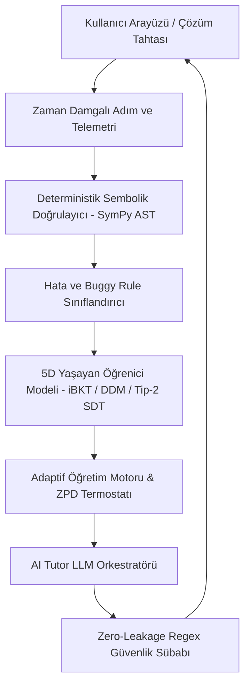

# KİŞİSEL ÖĞRENME MOTORU (PERSONAL LEARNING ENGINE)
## Bilişsel Bilim, İleri Psikometri ve Nöro-Sembolik Yapay Zeka Temelli Adaptif Öğrenme Sistemi
### Kapsamlı Ürün Şartnamesi, Sistem Mimarisi ve Araştırma Kütüphanesi

---

## 1. PROJE VİZYONU VE TEMEL FELSEFE

Bu depo, geleneksel eğitim teknolojilerinin (EdTech) iki büyük açmazını—**pasif video izletme / yüzeysel oyunlaştırma** ve **öğrencinin yerine ödevi çözen halüsinatif sohbet botları**—kökten reddeden yeni nesil bir **Bilişsel Öğrenme Motoru'nun (Cognitive Learning Engine)** eksiksiz mimari ve pedagojik şartnamesini içerir.

Sistem, öğrenciyi pasif bir alıcı değil, hipotez üreten, sınırları test eden ve zihinsel modeller inşa eden aktif bir araştırmacı olarak konumlandırır. Tüm pedagojik kararlar hakemli bilişsel psikoloji, öğrenme bilimleri ve psikometrik ölçme literatürüne dayanır.

### Temel Hedef Metriğimiz:
$$\text{R-LGpM} = \frac{\Delta \text{Gain} \times \text{Retention}(14 \text{ gün})}{\text{Süre (Dakika)}}$$
*Anlık oturum başarısı veya süre uzatma değil, 14 gün sonra kalıcılığı kanıtlanmış birim zaman başına net kavramsal öğrenme kazancı.*

---

## 2. DÖKÜMANTASYON HARİTASI VE ŞARTNAME REHBERİ

Depo, birbirini tamamlayan ve katı bağımlılık ilişkileriyle birbirine bağlı 18 ana şartname dosyasından oluşur:

| No | Doküman Adı | Odak Alanı ve Bilişsel Temel | Temel Modeller / Formüller |
| :---: | :--- | :--- | :--- |
| **00** | [00-PROJECT-VISION.md](00-PROJECT-VISION.md) | Proje Vizyonu, Hedef Kitle, Başarı Tanımı | Anti-EdTech Bildirgesi, R-LGpM, Hedef Personalar (A, B, C) & Anti-Personalar |
| **01** | [01-LEARNING-SCIENCE-FOUNDATION.md](01-LEARNING-SCIENCE-FOUNDATION.md) | Bilişsel Bilim Temelleri ve Kanıt Hiyerarşisi | Testing Effect, Spacing, Interleaving, CLT, PF, SDT |
| **02** | [02-PRODUCT-PRINCIPLES.md](02-PRODUCT-PRINCIPLES.md) | 12 Sarsılmaz Ürün ve Pedagoji Prensibi | 12 İlke, Eksen 1-7 Çapraz Matrisi, Proper Scoring, Afektif Şalter, ZPD Termostatı |
| **03** | [03-LEARNER-MODEL.md](03-LEARNER-MODEL.md) | Yaşayan Öğrenici Modeli & Psikometri | iBKT, CT-BKT, DDM, Tip-2 SDT ($d'_2, c_2$), ECE |
| **04** | [04-KNOWLEDGE-AND-PREREQUISITE-GRAPH.md](04-KNOWLEDGE-AND-PREREQUISITE-GRAPH.md) | Bilgi Grafı ve Önkoşul Ağı (DAG) | 30 Düğümlü Kuadratik Graf, Topolojik Bağımlılık Matrisi, CAT Entegrasyonu |
| **05** | [05-DIAGNOSTIC-ENGINE.md](05-DIAGNOSTIC-ENGINE.md) | Dinamik Teşhis ve Seviye Belirleme | 2PL-IRT Bilgisayarlı Uyarlamalı Test (CAT), Madde Havuzu Parametreleri, DAG Seeding |
| **06** | [06-ADAPTIVE-TEACHING-ENGINE.md](06-ADAPTIVE-TEACHING-ENGINE.md) | Adaptif Öğretim & Pedagojik FSM | Paas $E$ İndeksi, ZPD Termostatı, Manu Kapur PF, HMM |
| **07** | [07-AI-TUTOR-BEHAVIOR-SPEC.md](07-AI-TUTOR-BEHAVIOR-SPEC.md) | Sokratik Yapay Zeka Öğretici Şartnamesi | 4 Katmanlı İç Monolog, Paul-Elder, Zero-Leak Regex |
| **08** | [08-ERROR-AND-MISCONCEPTION-ENGINE.md](08-ERROR-AND-MISCONCEPTION-ENGINE.md) | Hata ve Yanılgı Teşhis Motoru | VanLehn Buggy Rules, SymPy AST Eşleme, 5 Temel Hata Kataloğu |
| **09** | [09-MASTERY-AND-ASSESSMENT-MODEL.md](09-MASTERY-AND-ASSESSMENT-MODEL.md) | Yetkinlik ve Ölçme Modeli | 5 Boyutlu Kapı Denetimi, Stealth Assessment, Karantina |
| **10** | [10-RETENTION-AND-SPACING-ENGINE.md](10-RETENTION-AND-SPACING-ENGINE.md) | Kalıcılık ve Aralıklı Tekrar Motoru | ACT-R Aktivasyonu, FSRS-4.5, Parça-Bütün, Uyku Konsolidasyonu |
| **11** | [11-CONTENT-AND-REPRESENTATION-SYSTEM.md](11-CONTENT-AND-REPRESENTATION-SYSTEM.md) | Çoklu Temsil ve İçerik Sistemi | 4 Çeyrek Temsil, Al-Harezmi Geometrisi, Parabol Morf |
| **12** | [12-UX-AND-CORE-LEARNING-LOOP.md](12-UX-AND-CORE-LEARNING-LOOP.md) | Kullanıcı Deneyimi ve 20 Dk Akış | Düşük Sürtünmeli Çözüm Tahtası, Çift Panel PF, Beyin Haritası |
| **13** | [13-MVP-SCOPE.md](13-MVP-SCOPE.md) | MVP Kapsamı ve Taviz Verilmez Sınırlar | Kuadratik Sandbox, SymPy Doğrulayıcı, Yerel SQLite/Postgres |
| **14** | [14-METRICS-AND-EXPERIMENTATION.md](14-METRICS-AND-EXPERIMENTATION.md) | Metrikler ve A/B Test Mimarisi | R-LGpM, Öğrenme Verimliliği, Kaplan-Meier Kalıcılık Analizi |
| **15** | [15-RISKS-FAILURE-MODES-AND-SAFETY.md](15-RISKS-FAILURE-MODES-AND-SAFETY.md) | Riskler, Güvenlik ve Hata Modları | Kırmızı Takım, LLM Halüsinasyon Gardiyanı, Afektif Güvenlik |
| **16** | [16-TECHNICAL-ARCHITECTURE-OPTIONS.md](16-TECHNICAL-ARCHITECTURE-OPTIONS.md) | Teknik Mimari Seçenekleri | Nöro-Sembolik Ayrım, Fastify/Go Backend, Pyodide CAS |
| **17** | [17-OPEN-QUESTIONS-AND-RESEARCH-GAPS.md](17-OPEN-QUESTIONS-AND-RESEARCH-GAPS.md) | Açık Sorular ve Araştırma Boşlukları | Ampirik Boşluklar, Tez/Deney Tasarımları, Hipotezler |
| **18** | [18-FOUNDATION-GOALS-AND-DEFINITION-OF-DONE.md](18-FOUNDATION-GOALS-AND-DEFINITION-OF-DONE.md) | Temel Hedefler ve Bitiş Kriterleri | 6 Katı Kabul Kapısı (DoD), Hata Toleransı, Kabul Kontratları |
| **19** | [19-APPLICATION-FLOW-AND-USER-JOURNEY.md](19-APPLICATION-FLOW-AND-USER-JOURNEY.md) | Uygulama Akışı ve Kullanıcı Yolculuğu | Makro FSM, 20 Dk Günlük Seans Evreleri, Çözüm Tahtası Mikro-Döngüsü |
| **20** | [20-UI-UX-DESIGN-SYSTEM-AND-WIREFRAMES.md](20-UI-UX-DESIGN-SYSTEM-AND-WIREFRAMES.md) | UI/UX Tasarım Sistemi ve Ekran Şemaları | Minimalist Bilişsel Tasarım, Renk Belirteçleri, 7 Ekran ASCII Wireframe'i |
| **21** | [21-TECH-STACK-AND-LANGUAGE-DECISIONS.md](21-TECH-STACK-AND-LANGUAGE-DECISIONS.md) | Teknoloji Yığını ve Dil Kararları | Python 3.11/FastAPI + Next.js 14, Pydantic v2, PostgreSQL, Monorepo |

---

## 3. 7 TEMEL ARAŞTIRMA VE MİMARİ EKSENİ (THE 7 COGNITIVE AXES)

Platformun arkasındaki bilimsel derinlik 7 bağımsız araştırma ekseninin sentezidir:

```text
                                  +---------------------------------------+
                                  |     KİŞİSEL ÖĞRENME MOTORU            |
                                  |     (Bilişsel Çekirdek Mimarisi)      |
                                  +---------------------------------------+
                                                      │
         ┌──────────────────┬─────────────────────────┼─────────────────────────┬──────────────────┐
         ▼                  ▼                         ▼                         ▼                  ▼
  [ EKSEN 1: HATA ]  [ EKSEN 2: MODEL ]        [ EKSEN 3: SOKRATİK ]     [ EKSEN 4: YÜK ]   [ EKSEN 5: BELLEK ]
  Buggy Rules        iBKT + CT-BKT             AutoTutor 5-Adım          Concreteness       ACT-R + FSRS-4.5
  VanLehn AST        DDM + Tip-2 SDT           Zero-Leakage Guardrail    Fading & Paas E    Part-Whole Spacing
         │                                            │                         │                  │
         └──────────────────────────┬─────────────────┴─────────────────────────┴──────────────────┘
                                    │
                  ┌─────────────────┴─────────────────┐
                  ▼                                   ▼
          [ EKSEN 6: METABİLİŞ ]              [ EKSEN 7: KEŞİF ]
          Nelson-Narens İzleme                Manu Kapur PF
          Aşırı Güven Terapisi                Kontenjan İskeleleme
          Proper Scoring Rule                 Afektif Şalter (HMM)
```

1. **Eksen 1: Bilişsel Hata Anatomisi & Buggy Rules (VanLehn, 1990; Brown & Burton, 1978):**
   * Hatalar rastgele bilgisizlik değildir; mantıksal olarak tutarlı ama hatalı kurallardır (*Buggy Rules*).
   * Deterministik SymPy AST örüntü eşleyicisi cebirsel ara adımları analiz eder; sıfır-çarpım yanılgısını, işaret hatalarını ve kök kaybını anında yakalar.
2. **Eksen 2: İleri Psikometri ve Çok Boyutlu Ölçme (iBKT, CT-BKT, DDM, Wald SPRT):**
   * Öğrencinin zihinsel durumu tek bir skora indirgenemez. $5D$ yetkinlik vektörü (Çağrım, Kavram, Prosedür, Strateji, Transfer) tutulur.
   * Ratcliff Drift-Diffusion Model (DDM) ile latens-doğruluk ilişkisinden içsel zihinsel çaba drift hızı ($v$) kestirilir.
   * Wald SPRT ile ustalık onayları istatistiksel olarak katı güven aralıklarında verilir.
3. **Eksen 3: Sokratik Diyalog & Zeki Öğretici Sistemler (ITS - Graesser et al., AutoTutor):**
   * Doğrudan cevap vermek pedagojik suçtur. 4 katmanlı iç monolog hattı (Pedagojik $\to$ Matematiksel CAS $\to$ Sokratik $\to$ Güvenlik Filtresi).
   * Regex tabanlı *Zero-Leakage Guardrail* ile LLM'in cevabı sızdırması %100 engellenir.
4. **Eksen 4: Temsili Akıcılık ve Bilişsel Yük Yönetimi (Sweller, 1988; Paas, 1993):**
   * Somutluk Sönümlemesi (*Concreteness Fading*): Eylemsel (Cebir Karoları) $\to$ İkonik (Alan Taslağı) $\to$ Sembolik Denklem.
   * Paas Bilişsel Verimlilik İndeksi ($E = \frac{z_P - z_R}{\sqrt{2}}$) ile öğrencinin aşırı yüklenme veya uzmanlık tersinirliği anları milisaniyelik izlenir.
5. **Eksen 5: Prosedürel Bellek ve Dinamik Aralıklandırma (Anderson ACT-R; FSRS-4.5):**
   * Matematik kelime ezberi değildir; üretim kuralları zinciridir.
   * Alt önkoşullara parça-bütün yayılımı ($Part\text{-}Whole Propagation$) ile pratik kredisi dağıtılır.
   * Bilişsel yorgunluk indirimi (Mackworth, 1948) ve uyku konsolidasyonu bariyeri (Walker & Stickgold, $\ge 14$ saat).
6. **Eksen 6: Metabilişsel Kalibrasyon & Aşırı Güven Terapisi (Nelson & Narens, 1990):**
   * Tip-2 Sinyal Tespit Kuramı (SDT) ile metabilişsel duyarlılık ($d'_2$) ve kriter taraflılığı ($c_2$) ölçülür.
   * Aşırı özgüvenli yanılgılar Brier Proper Scoring Rule ($10 - 20(c - y)^2$) ile cezalandırılır; 3 aşamalı bilişsel çelişki enjeksiyonu ve duygusal güvenlik yayı uygulanır.
   * İmposter sendromu yaşayan öğrencilere *Reassurance Weaning* (ipucu kilidi) uygulanır.
7. **Eksen 7: Üretici Başarısızlık ve Dinamik İskeleleme (Manu Kapur, 2016; Van de Pol, 2010):**
   * Keşif ve Üretim (Exploration & Generation) sandbox'ında hatalar BKT/CAT'te cezalandırılmaz (Karantina Sandbox).
   * Karşılaştırmalı Vakalar (Contrasting Cases) ile öğrencinin sezgisel denemeleri kanonik Tam Kareye Tamamlama yöntemine bağlanır.
   * D'Mello & Graesser (2012) HMM modeliyle yıkıcı hüsran riski ($F_{\text{score}} \ge 0.85$) saptandığında Duygudurumsal Şalter (Circuit Breaker) iner.

---

## 4. MVP SANDBOX: İKİNCİ DERECEDEN DENKLEMLER (QUADRATIC EQUATIONS)

Tüm teorik modeller, lise seviyesi İkinci Dereceden Denklemler konusu üzerinde somutlaştırılmıştır:
* **Önkoşul Düğümleri:** Tam Sayı İşlemleri, Doğrusal Denklemler, Ortak Paranteze Alma, İki Kare Farkı, Tam Kare Açılımı.
* **Çekirdek Düğümler:** Sıfır Çarpım İlkesi, Çarpanlara Ayırma ($a=1$ ve $a \neq 1$), Tam Kareye Tamamlama, Diskriminant Analizi ($\Delta = b^2 - 4ac$), Kuadratik Formül.
* **İleri Düğümler:** Viète Bağıntıları, Parabol Tepe Noktası ve Grafiği, Karmaşık Kökler, Fiziksel Modelleme (Atış Hareketleri).

---

## 5. MİMARİ VE ÇALIŞMA PRENSİPLERİ



---

## 6. PROJE YÖNETİMİ VE KATKIDA BULUNMA KILAVUZU

1. **Katı Mühendislik Çekirdeği:** Herhangi bir dokümanda değişiklik yapılırken akademik kaynak belirtilmeden yeni varsayım eklenemez. İfadeler `EVIDENCE`, `ASSUMPTION`, `DESIGN DECISION`, `OPEN QUESTION` etiketleriyle ayrıştırılmalıdır.
2. **Sembolik Doğruluk İlkesi:** LLM hiçbir zaman matematiksel doğruluk kontrolörü olarak tek başına yetkilendirilemez. Matematiksel geçerlilik %100 deterministik CAS katmanına aittir.
3. **Dokümantasyon Bütünlüğü:** Bir dokümanda güncellenen metrik veya formül, ona bağımlı olan diğer şartname dosyalarında (özellikle `03`, `06`, `07`, `09`, `10`) eşzamanlı olarak güncellenmelidir.

---

## 7. GELİŞTİRME YOL HARİTASI VE FAZ KAPILARI

Sistemin çalışan bir yazılıma dönüştürülme süreci, katı Definition of Done (DoD) kriterleri içeren 6 fazlı mühendislik planı üzerinden yönetilmektedir:
* **Ayrıntılı Plan ve Doğrulama Kriterleri:** 👉 [ROADMAP.md](ROADMAP.md)
  - **Faz 0:** Şartname ve Mimari Kilitlenme `(TAMAMLANDI ✓)`
  - **Faz 1:** Sembolik CAS Çekirdeği ve 5 Buggy Rule Engine
  - **Faz 2:** 30 Düğümlü Bilgi Grafı, 2PL-IRT CAT ve Yaşayan Öğrenici Modeli
  - **Faz 3:** FSRS-4.5 Aralıklı Tekrar, Üretici Başarısızlık ve Afektif HMM
  - **Faz 4:** Sokratik AI Orkestrasyonu ve Zero-Leakage Regex Kalkanı
  - **Faz 5:** Next.js 14 Çözüm Tahtası, Al-Harezmi Karoları ve Canlı Arayüz
  - **Faz 6:** Olay Kaynağı Backend (FastAPI/Postgres/Redis) ve 50 Kişilik Kohort Pilotu

