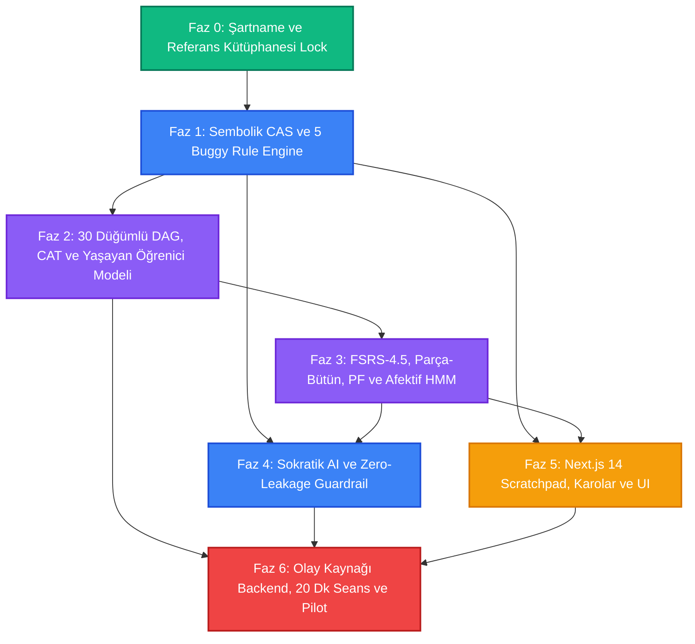

# UYGULAMA YOL HARİTASI (ENGINEERING IMPLEMENTATION ROADMAP)
## Kişisel Öğrenme Motoru (Personal Learning Engine)
### Kademeli Geliştirme, Doğrulama Kapıları ve Uçtan Uca Teslimat Planı

---

## 1. GİRİŞ VE GELİŞTİRME FELSEFESİ

Bu yol haritası, **18 temel referans şartname dokümanında** tanımlanan kuramsal, matematiksel ve pedagojik mimariyi çalışan bir yazılım sistemine dönüştürmek üzere tasarlanmıştır.

### Katı Mühendislik İlkelerimiz:
1. **Nöro-Sembolik Ayrım:** Deterministik matematiksel CAS çekirdeği ve psikometrik modeller (iBKT, DDM, Wald SPRT), LLM veya kullanıcı arayüzünden önce **bağımsız olarak inşa edilir ve test edilir**.
2. **Doğrulanmış Davranış > Varsayımsal Tamamlanma:** Hiçbir faz veya kilometre taşı, önceden tanımlanmış ampirik test ve doğrulama kontratlarını (DoD) eksiksiz geçmeden bir sonrakine devredilemez.
3. **Sıfır İllüzyon:** Kodun var olması veya derlenmesi başarı sayılmaz; belirlenen matematiksel ve bilişsel kriterleri sağladığı otomatik testlerle kanıtlanmalıdır.

---

## 2. FAZ VE KİLOMETRE TAŞI ÖZETİ (PHASE SUMMARY)

```text
[ FAZ 0: ŞARTNAME VE MİMARİ KİLİTLENME ] ──────► (TAMAMLANDI ✓)
                   │
                   ▼
[ FAZ 1: SEMBOLİK CAS ÇEKİRDEĞİ VE HATA MOTORU ] ───► (AST, 5 Buggy Rule, Güvenlik Sandbox)
                   │
                   ▼
[ FAZ 2: BİLGİ GRAFI VE PSİKOMETRİ MOTORU ] ────────► (30 Düğümlü DAG, CAT, iBKT, DDM, SPRT)
                   │
                   ▼
[ FAZ 3: KALICILIK VE ADAPTİF ÖĞRETİM MOTORU ] ─────► (FSRS-4.5, Parça-Bütün, PF Sandbox, HMM)
                   │
                   ▼
[ FAZ 4: SOKRATİK AI VE GÜVENLİK SÜBABİ ] ──────────► (4-Katmanlı Hat, Zero-Leak Regex, Red Team)
                   │
                   ▼
[ FAZ 5: İNTERAKTİF ÇÖZÜM TAHTASI VE ARAYÜZ ] ──────► (Next.js 14, MathLive, Karo SVG, Çift Panel)
                   │
                   ▼
[ FAZ 6: OLAY KAYNAĞI BACKEND VE PİLOT TEST ] ──────► (FastAPI, Redis, Postgres, 50 Kişilik Kohort)
```

---

## 3. AYRINTILI GELİŞTİRME FAZLARI VE ÇIKIŞ KRİTERLERİ (DEFINITION OF DONE)

### FAZ 0: ŞARTNAME, KURAMSAL ALTYAPI VE MİMARİ KİLİTLENME
* **Durum:** `TAMAMLANDI` (14 Eylül 2026)
* **Tamamlanan Çıktılar:**
  - 18 kapsamlı şartname dokümanı ([`00-PROJECT-VISION.md`](00-PROJECT-VISION.md) - [`17-OPEN-QUESTIONS-AND-RESEARCH-GAPS.md`](17-OPEN-QUESTIONS-AND-RESEARCH-GAPS.md)).
  - Ana proje indeksi ve mimari rehber ([`README.md`](README.md)).
  - 7 Temel Bilişsel Araştırma Ekseni (VanLehn Buggy Rules, iBKT/DDM/SPRT, AutoTutor, Concreteness Fading, FSRS-4.5, Metacognitive SDT, Manu Kapur PF).
* **DoD Kontrolü:** Kırık link sayısı: 0, eksik model: 0, 18 şartname onaylandı.

---

### FAZ 1: SEMBOLİK CAS ÇEKİRDEĞİ VE HATA TEŞHİS MOTORU
* **Hedef:** Öğrencinin cebirsel adımlarını deterministik olarak doğrulayan ve 5 temel kavram yanılgısını (buggy rules) tespit eden motorun inşası.
* **Girdi Dokümanları:** [`08-ERROR-AND-MISCONCEPTION-ENGINE.md`](08-ERROR-AND-MISCONCEPTION-ENGINE.md), [`15-RISKS-FAILURE-MODES-AND-SAFETY.md`](15-RISKS-FAILURE-MODES-AND-SAFETY.md).
* **Kilometre Taşları:**
  - **M1.1 (Scaffolding & Test Harness):** Python 3.11+, SymPy 1.13, PyTest ve CI ortamının kurulması.
  - **M1.2 (Symbolic Equivalence Engine):** `simplify(user_step - target_step) == 0` mantığını güvenli AST parser ile çalıştıran çekirdek. Ham `eval()`/`exec()` yasak, maksimum AST derinliği 15, zaman aşımı 500ms multiprocessing worker.
  - **M1.3 (Quadratic Misconception Detector):** `QuadraticMisconceptionDetector` sınıfı (`BUG-QUAD-01` .. `BUG-QUAD-05`).
    - *BUG-QUAD-01:* Sıfır olmayan sayıya sıfır çarpım uygulama ($x(x+6)=2 \implies x=2$).
    - *BUG-QUAD-02:* Negatif kök kaybı ($x^2=25 \implies x=5$).
    - *BUG-QUAD-03:* Üslere dağılma hatası ($(x+3)^2 = x^2+9$).
    - *BUG-QUAD-04:* Kök katli / sadeleştirme tuzağı ($x^2=6x \implies x=6$).
    - *BUG-QUAD-05:* Kuadratik formülde eksi işaret çarpımı hatası.
  - **M1.4 (Falsification Test Suite):** 500 sentetik cebirsel adım testi (doğru adımlar, hatalı adımlar, sınır durumlar, ReDoS saldırıları).
* **Çıkış Kriterleri (DoD):**
  - [ ] 500 test senaryosunda %100 doğruluk (0 False Positive, 0 False Negative).
  - [ ] Her adımın analiz süresi $P_{95} \le 120\text{ ms}$.
  - [ ] AST derinlik ve bellek aşımı testlerinde güvenli kesinti (ReDoS / DoS koruması).

---

### FAZ 2: BİLGİ GRAFI, ADAPTİF TEŞHİS VE PSİKOMETRİ MOTORU
* **Hedef:** Öğrencinin zihinsel durumunu 5 boyutta anlık takip eden yaşayan öğrenici modelinin ve 30 düğümlü grafın inşası.
* **Girdi Dokümanları:** [`03-LEARNER-MODEL.md`](03-LEARNER-MODEL.md), [`04-KNOWLEDGE-AND-PREREQUISITE-GRAPH.md`](04-KNOWLEDGE-AND-PREREQUISITE-GRAPH.md), [`05-DIAGNOSTIC-ENGINE.md`](05-DIAGNOSTIC-ENGINE.md).
* **Kilometre Taşları:**
  - **M2.1 (Knowledge DAG Core):** 30 düğümlü kuadratik graf veri yapısı (`[N01]` - `[N30]`), topolojik sıralama, strict/soft/transfer bağımlılık matrisi, döngüsel bağımlılık kontrolü (Cycle-free validator).
  - **M2.2 (2PL-IRT CAT Engine):** Kalibre edilmiş 8 maddelik madde havuzu parametreleri, Fisher Bilgisi maksimizasyonu ile madde seçimi, $\hat{\theta}$ kestirimi ve Bayesyen DAG seeding protokolü.
  - **M2.3 (Living Learner State - iBKT & CT-BKT):** 5D Yetkinlik Vektörü, öğrenci/madde kovaryatlı iBKT lojistik link fonksiyonları, Kolmogorov diferansiyel denklemli CT-BKT.
  - **M2.4 (Ratcliff DDM Solver):** Wagenmakers EZ-Diffusion kapalı form çözümleri ($P_c, MRT, VRT$) ile zihinsel çaba drift hızı ($v$) hesabı ve DDM kognitif durum sınıflandırıcısı.
  - **M2.5 (Wald SPRT Mastery Gate):** Log-likelihood oranı $\Lambda_n$, Truncated SPRT sınırları ($\ln A = 2.890, \ln B = -2.251, N_{\max}=12$) ile ustalık onay modülü.
  - **M2.6 (Metacognitive Profiler):** Tip-2 SDT ($d'_2, c_2$), Brier Proper Scoring Rule ($10 - 20(c-y)^2$) ve 10 kutulu ECE hesaplayıcı.
* **Çıkış Kriterleri (DoD):**
  - [ ] 10,000 sentetik öğrenci Monte Carlo simülasyonunda CAT motorunun 5 soruda $\text{SE}(\hat{\theta}) \le 0.35$ hassasiyete ulaşması.
  - [ ] SPRT algoritmasının sahte ustalık oranını (Tip-1 hata $\alpha$) $\le 0.05$ düzeyinde tutması.
  - [ ] BKT ve DDM güncelleme gecikmesinin adım başına $\le 20\text{ ms}$ olması.

---

### FAZ 3: KALICILIK, ÇOKLU TEMSİL VE ADAPTİF ÖĞRETİM MOTORU
* **Hedef:** Öğrencinin unutma eğrisini yöneten, kavramları somuttan soyuta sönümleyen ve üretici başarısızlık döngüsünü işleten FSM'in inşası.
* **Girdi Dokümanları:** [`06-ADAPTIVE-TEACHING-ENGINE.md`](06-ADAPTIVE-TEACHING-ENGINE.md), [`10-RETENTION-AND-SPACING-ENGINE.md`](10-RETENTION-AND-SPACING-ENGINE.md), [`11-CONTENT-AND-REPRESENTATION-SYSTEM.md`](11-CONTENT-AND-REPRESENTATION-SYSTEM.md).
* **Kilometre Taşları:**
  - **M3.1 (FSRS-4.5 Spaced Scheduler):** 17 parametreli $\mathbf{w}$ vektörü, DSR durum güncelleyicisi, yorgunluk indirimi ($t > 15\text{ dk} \implies S \times 0.85$), sirkadiyen uyku bariyeri ($\Delta t < 14\text{ saat} \implies \Delta S = 0$).
  - **M3.2 (Part-Whole Propagation Matrix):** Nilpotent DAG matris operatörü $\mathbf{P} = (\mathbf{I} - \gamma \mathbf{A})^{-1}$ ($\gamma = 0.80^{\text{depth}}$) ile alt önkoşullara otomatik stabilite dağıtımı.
  - **M3.3 (Pedagogical FSM & ZPD Thermostat):** Paas Bilişsel Verimlilik İndeksi ($E$), sürekli iskele sönümleme denklemi ($S_{t+1}$), geriye doğru eksiltme (Backward Fading) motoru.
  - **M3.4 (Productive Failure Sandbox):** "Kareleme Çıkmazı" ($x^2 + 6x - 2 = 0$) oturumu, SGR sınıflandırıcı, Karantina koruması (BKT/CAT dondurma) ve Karşılaştırmalı Vakalar (Contrasting Cases) sentezleyici.
  - **M3.5 (Affective Circuit Breaker & HMM):** D'Mello & Graesser 5-durumlu Markov modeli, öfke tıklaması (thrashing) ve donma (freezing) dedektörü, $F_{\text{score}} \ge 0.85$ otomatik şalteri.
* **Çıkış Kriterleri (DoD):**
  - [ ] 50 farklı senaryoda FSM durum geçişlerinin %100 deterministik ve hatasız işlemesi.
  - [ ] Parça-bütün yayılım matrisinin kuadratik pratikle doğrusal önkoşul stabilitesini analitik beklentiye uygun yükselttiğinin doğrulanması.
  - [ ] Afektif dedektörün simüle edilmiş öfke girdilerinde 3 saniye içinde koruyucu şalteri tetiklemesi.

---

### FAZ 4: SOKRATİK YAPAY ZEKA VE GÜVENLİK SÜBABİ
* **Hedef:** Asla cevabı vermeyen, öğrenciyi adım adım düşündüren, bilişsel çelişkiyi güvenle yöneten çok ajanlı Sokratik diyalog hattının inşası.
* **Girdi Dokümanları:** [`07-AI-TUTOR-BEHAVIOR-SPEC.md`](07-AI-TUTOR-BEHAVIOR-SPEC.md), [`15-RISKS-FAILURE-MODES-AND-SAFETY.md`](15-RISKS-FAILURE-MODES-AND-SAFETY.md).
* **Kilometre Taşları:**
  - **M4.1 (4-Layer Inner Monologue Pipeline):**
    - *Katman 1 (Pedagojik Stratejist):* Hedef ZPD, iskele seviyesi ve Sokratik niyet belirleme.
    - *Katman 2 (Matematiksel CAS):* Doğruluk ve hata tespiti kısıtı.
    - *Katman 3 (Sokratik İletişimci):* Doğrudan cevabı içermeyen Sokratik soru üretimi.
    - *Katman 4 (Güvenlik Sübapı):* Deterministik çıkış denetimi.
  - **M4.2 (Zero-Leakage Regex Guardrail):** LLM çıktısını regex ve AST ile tarayan, çözüm kümesindeki köklerin veya kritik ara adımların sızdırılmasını fiziksel olarak engelleyen `enforce_zero_leakage` filtresi.
  - **M4.3 (Metacognitive & Imposter Dialogue Engine):** Sezgi Freni (CRT Probing), Bilişsel Çelişki ve Güvenlik Yayı ("Rebound"), İmposter Güvence Kilidi (*Reassurance Weaning*).
  - **M4.4 (Adversarial Red Teaming):** 100 farklı jailbreak, prompt injection ve acil ödev çözdürme saldırısına karşı falsification testi.
* **Çıkış Kriterleri (DoD):**
  - [ ] 100 adversarial jailbreak denemesinde %0 cevap sızıntısı (Zero-Leakage doğrulaması).
  - [ ] Sokratik pedagojik sadakat oranının (Soru / Açıklama Oranı) $\ge 2.0$ olması.
  - [ ] LLM yanıt gecikmesinin $P_{95} \le 800\text{ ms}$ bandında kalması.

---

### FAZ 5: İNTERAKTİF ÇÖZÜM TAHTASI VE KULLANICI DENEYİMİ (CLIENT UX)
* **Hedef:** Matematiksel yazım sürtünmesini sıfırlayan, Al-Harezmi karoları ile cebirsel adımları eşzamanlı görselleştiren web arayüzünün inşası.
* **Girdi Dokümanları:** [`11-CONTENT-AND-REPRESENTATION-SYSTEM.md`](11-CONTENT-AND-REPRESENTATION-SYSTEM.md), [`12-UX-AND-CORE-LEARNING-LOOP.md`](12-UX-AND-CORE-LEARNING-LOOP.md).
* **Kilometre Taşları:**
  - **M5.1 (Frontend Scaffold):** Next.js 14 (App Router), TypeScript, Tailwind CSS, shadcn/ui.
  - **M5.2 (Interactive Scratchpad):** MathLive klavye entegrasyonu, Akıllı Sembol Tuşları (`x`, `²`, `±`, `√`, `= 0`), adım adım girdi kutusu.
  - **M5.3 (Al-Khwarizmi SVG Tiles Canvas):** $x^2$, $x$ ve $1$ birimlik karo yerleşim motoru, eksik köşe vurgusu, sıfır çifti iptal animasyonu.
  - **M5.4 (Dynamic Parabola Canvas):** $f(x) = a(x-h)^2 + k$ tepe noktası formu ve köklerin simetri ekseninden sapma animasyonu ($\delta = \frac{\sqrt{\Delta}}{2|a|}$).
  - **M5.5 (Linked Dual-View Synchronizer):** Sembolik adım atıldığında geometrik karoların otomatik hizalanması ve tersi (Sweller Bölünmüş Dikkat koruması).
  - **M5.6 (Living Brain Map):** React Flow tabanlı 30 düğümlü etkileşimli Cebir Atlası haritası.
  - **M5.7 (PF Dual View & Affective Overlay):** Bölünmüş ekran Karşılaştırmalı Vakalar görünümü ve nefes dairesi içeren Şefkatli Mola modalı.
* **Çıkış Kriterleri (DoD):**
  - [ ] First Contentful Paint (FCP) $\le 1.2\text{ s}$, Time to Interactive (TTI) $\le 2.0\text{ s}$.
  - [ ] Scratchpad sembol yazma gecikmesi $\le 50\text{ ms}$.
  - [ ] WCAG 2.1 AA erişilebilirlik ve tam mobil dokunmatik uyumluluğu.

---

### FAZ 6: OLAY GÜDÜMLÜ BACKEND, BÜTÜNLEŞİK E2E ENTEGRASYON VE PİLOT DENEY
* **Hedef:** Olay kaynağı (Event Sourcing) mimarisinde çalışan üretim sunucusu, 20 dakikalık günlük seans orkestrasyonu ve bilimsel A/B pilot testi.
* **Girdi Dokümanları:** [`14-METRICS-AND-EXPERIMENTATION.md`](14-METRICS-AND-EXPERIMENTATION.md), [`16-TECHNICAL-ARCHITECTURE-OPTIONS.md`](16-TECHNICAL-ARCHITECTURE-OPTIONS.md), [`17-OPEN-QUESTIONS-AND-RESEARCH-GAPS.md`](17-OPEN-QUESTIONS-AND-RESEARCH-GAPS.md).
* **Kilometre Taşları:**
  - **M6.1 (Event Sourcing Backend):** FastAPI, PostgreSQL 15 (Append-Only Event Store), Redis 7.2 (`StepSolved`, `HintRequested`, `ConfidenceStated` olayları).
  - **M6.2 (20-Minute Daily Learning Loop):** 3 dk Aralıklı Isınma $\to$ 12 dk ZPD Adaptif Seans $\to$ 5 dk Kapanış/Metabiliş akış yöneticisi.
  - **M6.3 (R-LGpM Analytics Dashboard):** Hake normalize kazanç, Kaplan-Meier 14 günlük sağkalım eğrisi, ECE kalibrasyon diyagramı, Paas $E$ Pareto sınırı analiz paneli.
  - **M6.4 (Empirical Cohort Trial):** 50 öğrencilik (veya simüle edilmiş kohort) pilot deneme, ön-test / son-test / 14 günlük gecikmeli kalıcılık testi, ANCOVA analizi.
* **Çıkış Kriterleri (DoD):**
  - [ ] Uçtan uca adım doğrulama gecikmesi (CAS + BKT): $P_{95} \le 180\text{ ms}$.
  - [ ] 10 kullanıcı x 5 gün dahili testte sıfır veri kaybı, sıfır P0 hata.
  - [ ] Pilot kohortta geleneksel video/çözümlü çalışma grubuna göre R-LGpM metriğinde en az %35 istatistiksel olarak anlamlı üstünlük ($p < 0.01$).

---

## 4. BAĞIMLILIK HARİTASI VE KRİTİK YOL (DEPENDENCY GRAPH)



---

## 5. RİSK ANALİZİ VE MÜHENDİSLİK ÖNLEMLERİ (CONTINGENCY MATRIX)

| Risk Tanımı | Kritiklik | Tetikleyici | Mühendislik Önlemi / B Planı |
| :--- | :---: | :--- | :--- |
| **CAS Yürütme Gecikmesi ($>200\text{ms}$)** | Yüksek | Ağ gecikmesi veya karmaşık `simplify()` adımları | **İki Kademeli Hibrit Model:** İstemcide yerel sözdizim sanity kontrolü, sunucuda paralel multiprocessing worker havuzu. |
| **LLM Sokratik Kural İhlali (Cevap Sızdırma)** | Kritik | Öğrencinin kurnazca prompt injection yapması | **Fiziksel Regex Kalkanı:** Yanıt istemciye gitmeden önce kökleri içeren her ifade `enforce_zero_leakage` tarafından engellenir. |
| **Öğrencinin Cezadan Kaçması (Nötr Güven)** | Orta | Brier cezasından kaçmak için hep %50 işaretleme | **Metabilişsel Sönümleme:** Düşük duyarlılıkta güven sorusu sorulmaz; örtük telemetri (latens, tereddüt) devreye girer. |
| **Çalışma Belleği Aşırı Yüklenmesi ($E < -1.0$)** | Yüksek | Öğrencinin somut temsilde boğulması | **Afektif Şalter:** Görev derhal Çözümlü Örneğe (Worked Example) çekilir; puan cezası dondurulur. |

---

## 6. UYGULAMA İÇİN İLK ADIM (IMMEDIATE NEXT STEP)

Yol haritası onaylandıktan sonra doğrudan başlanacak ilk eylem paketi:
👉 **Faz 1 / Kilometre Taşı M1.1 & M1.2:**
- Proje dizininde Python sanal ortamının kurulması.
- `SymbolicEquivalenceEngine` ve AST doğrulama sandbox'ının oluşturulması.
- 5 Temel Kuadratik Yanılgıyı (`BUG-QUAD-01..05`) yakalayan PyTest test takımının koşturulması.
