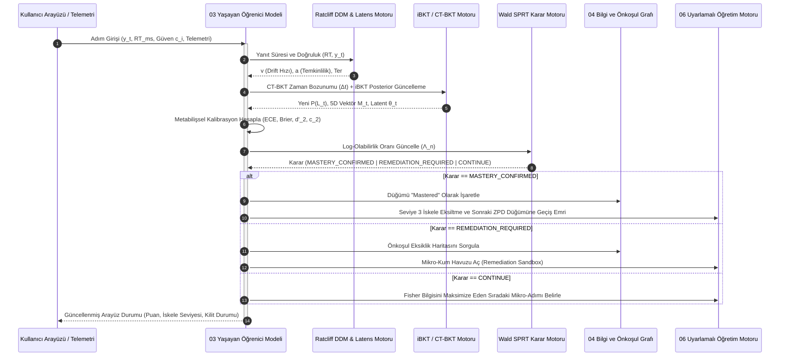

# 03-LEARNER-MODEL.md
# YAŞAYAN ÖĞRENİCİ MODELİ (LIVING LEARNER MODEL)
## Çok Boyutlu Bilişsel Yetkinlik, Sürekli Zamanlı Dinamikler, Difüzyon Karar Süreçleri ve Metabilişsel İskele Mimarisi

---

## 1. SUBSYSTEM 10-SORU MATRİSİ

1. **Neden Var?**  
   Öğrencinin zihinsel durumunun tek bir kaba skora ("%70 başarı") indirgenemeyecek kadar heterojen, zamana duyarlı, latent ve metabilişsel kalibrasyona sıkı sıkıya bağlı olması nedeniyle vardır. Gerçek öğrenme; salt olgusal hatırlamadan ibaret olmayıp kavramsal sezgi, prosedürel akıcılık, strateji seçimi ve yeni bağlamlara transferin birleşik fonksiyonudur.

2. **Hangi Problemi Çözer?**  
   - "Yetkinlik Yanılsaması" (Illusion of Competence) ve Dunning-Kruger etkisini (öğrencinin bilmediğini bilmemesi).
   - "İmposter Güvence Bağımlılığı" (Reassurance Addiction - bildiği halde ipucu olmadan adım atamama).
   - "Boşa Kürek Çekme" (Labor-in-Vain Effect - öğrencinin hazır olmadığı zorlukta bilişsel tıkanmaya terk edilmesi).
   - Yanıltıcı performans ile gerçek kalıcı öğrenme arasındaki ayrımı yapamayan geleneksel test modellerinin körlüğünü.

3. **Girdiler:**  
   - Ayrık adım doğruluğu ($y_{ij} \in \{0, 1\}$).
   - Milisaniye hassasiyetli yanıt süresi ve latens profili ($RT_{ij} \in \mathbb{R}^+$).
   - Açık sübjektif güven beyanı ($c_i \in [0.0, 1.0]$ veya $c_i \in [0.25, 1.0]$).
   - Metabilişsel yargı verileri: Çözüm Öncesi Kolaylık Yargısı (EOL), Bilme Hissi (FOK), Çözüm Sonrası Güven Yargısı (CR), Gecikmeli Öğrenme Yargısı (Delayed JOL).
   - Çözüm tahtası örtük telemetrisi (imleç duraklamaları, silme/düzeltme frekansı, alt-adım deneme sayısı, ipucu talep geçmişi).

4. **Tuttuğu Durum (State):**  
   - 5 Boyutlu Yaşayan Yetkinlik Vektörü ($\mathbf{M}_{ij}(t) \in [0, 1]^5$) ve Latent Yetenek Vektörü ($\boldsymbol{\theta}_{ij}(t) \in \mathbb{R}^5$).
   - Bireyselleştirilmiş BKT (iBKT) parametreleri: $P(L_0), P(T), P(S), P(G)$.
   - Sürekli Zamanlı BKT (CT-BKT) geçiş üreteç matrisi ($\mathbf{Q}$) ve FSRS hafıza kararlılığı ($S$).
   - Ratcliff Drift-Diffusion Modeli (DDM) durum parametreleri: Sürüklenme hızı ($v$), karar eşiği ($a$), bilişsel olmayan gecikme ($T_{er}$).
   - Non-Compensatory Çok Boyutlu IRT (MIRT) parametreleri ve Fisher bilgi kovaryansı.
   - Metabilişsel kalibrasyon metrikleri: Beklenen Kalibrasyon Hatası ($ECE$), Brier Skoru ($BS$), Tip-2 Sinyal Tespit hassasiyeti ($d'_2$) ve kriteri ($c_2$).
   - Metabilişsel İskele Kademesi ($S_{\text{meta}} \in \{1, 2, 3\}$) ve İmposter Kilit Bayrağı.

5. **Aldığı Kararlar:**  
   - Wald Sıralı Olasılık Oran Testi (Wald SPRT) ile bir Bilgi Bileşeni (KC) üzerinde "Ustalık Onayı" (Mastery Confirmed), "Takviye/Kum Havuzu Gereksinimi" (Remediation) veya "Örnekleme Devam" (Sample) kararı.
   - Bilişsel Çelişki Enjeksiyonu (Cognitive Dissonance Triggering) tetiklenmesi (aşırı özgüvenli yanlışlarda).
   - İmposter İpucu Kilidi (Reassurance Weaning Protocol) aktivasyonu.
   - Metabilişsel soru frekansının azaltılması veya tamamen kaldırılması (Metacognitive Scaffolding Fading).
   - Müfredat Grafı üzerinde bir sonraki optimum mikro-adımın ve zorluk seviyesinin belirlenmesi.

6. **Çıktılar:**  
   - Gerçek zamanlı $\vec{M}_{ij}(t)$ yetkinlik dağılımı ve varyansları ($SE(\hat{\boldsymbol{\theta}})$).
   - ECE Güvenilirlik Diyagramı ve Tip-2 SDT profili ($d'_2, c_2$).
   - Zihinsel çaba ve bilişsel yük indikatörü (DDM parametreleri türevi).
   - Uyarlamalı Öğretim Motoru (06) ve Teşhis Motoru (05) için Bayesyen öncül (prior) ve kısıt vektörleri.

7. **Çalıştığını Nasıl Anlarız?**  
   - Öğrencinin Tip-2 metabilişsel duyarlılığının $d'_2 > 1.8$ bandına yerleşmesi.
   - Beklenen Kalibrasyon Hatasının $ECE < 0.08$ eşiğinin altına gerilemesi.
   - Sistem tarafından "Mastered" onayı verilen bir KC'nin, 14 gün sonra habersiz sunulan gecikmeli transfer testinde $\ge \%85$ kalıcılık göstermesi.
   - Öğrencinin Seviye 3 (tamamen özerk, ekranda soru olmadan kendi kendini izleyen) metabilişsel profile terfi etmesi.

8. **Nasıl Çöker (Failure Modes)?**  
   - **Risk Aversion (Riskten Kaçınma):** Öğrencinin negatif puan cezasından kaçmak için sürekli güven puanını ortada (%50) kilitlemesi.
   - **Gaming the Latency (Süreyi Manipüle Etme):** DDM drift modelini aldatmak için öğrencinin bilerek beklemesi veya rastgele tıklaması.
   - **Identifiability Collapse (Tanımlanamama Çöküşü):** iBKT parametrelerinin (özellikle $P(G)$ ve $P(S)$) aşırı serbest bırakılarak yerel minimumlara sıkışması.
   - **Prerequisite Blindness:** Çok boyutlu bir eksikliğin tek bir boyuta yüklenerek öğrencinin yanlış bir mikrokavrama kilitlenmesi.

9. **MVP Kapsamı:**  
   - 5 Boyutlu Yetkinlik Vektörü + Durum Matrisi.
   - Lojistik kovaryatlı iBKT + FSRS tabanlı CT-BKT bozunumu.
   - Kapalı form EZ-Diffusion ile gerçek zamanlı DDM drift hızı ve temkinlilik kestirimi.
   - Non-Compensatory MIRT adım modeli.
   - Wald SPRT ustalık durdurma kuralı.
   - ECE ve Brier Skoru hesaplayıcısı + Tip-2 SDT ($d'_2, c_2$).
   - Gecikmeli JOL protokolü + 3 Aşamalı Metabilişsel İskele Eksiltme.

10. **Geleceğe Bırakılanlar:**  
    - Göz izleme (eye-tracking) ile pupillometri tabanlı bilişsel yük kestirimi.
    - Ses spektrumu ve mikromimiklerden duygusal/afektif durum analizi (Affective Tutoring).
    - Tam Bayesyen MCMC tabanlı hiyerarşik DDM (HDDM) gerçek zamanlı sunucu kümesi.

---

## 2. 5 BOYUTLU YAŞAYAN YETKİNLİK VEKTÖRÜ (LIVING COMPETENCE VECTOR)

Geleneksel eğitim teknolojileri öğrencinin bir konudaki durumunu skalar bir başarı oranıyla ($P \in [0, 1]$) modeller. Bu yaklaşım, bir formülü ezbere yazan fakat ne anlama geldiğini bilmeyen bir öğrenci ile, kavramın derin felsefesini anlayıp işlem hatası yapan bir öğrenciyi ayırt edemez.

Yaşayan Öğrenici Modeli, her $j$ Bilgi Bileşeni (Knowledge Component - KC) için öğrencinin zihinsel durumunu 5 ortogonal boyuttan oluşan **Yaşayan Yetkinlik Vektörü** ($\mathbf{M}_{ij}$) ve buna karşılık gelen sürekli latent yetenek vektörü ($\boldsymbol{\theta}_{ij}$) ile modeller:

$$\mathbf{M}_{ij}(t) = \begin{bmatrix} m_{ij, \text{recall}}(t) \\ m_{ij, \text{concept}}(t) \\ m_{ij, \text{proc}}(t) \\ m_{ij, \text{strat}}(t) \\ m_{ij, \text{transfer}}(t) \end{bmatrix} \in [0, 1]^5, \quad \boldsymbol{\theta}_{ij}(t) = \begin{bmatrix} \theta_{ij, \text{recall}}(t) \\ \theta_{ij, \text{concept}}(t) \\ \theta_{ij, \text{proc}}(t) \\ \theta_{ij, \text{strat}}(t) \\ \theta_{ij, \text{transfer}}(t) \end{bmatrix} \in \mathbb{R}^5$$

### 2.1. Boyutların Bilişsel Tanımları

```text
+──────────────────────────────────────────────────────────────────────────────────────────────────+
|                                5 BOYUTLU BİLİŞSEL YETKİNLİK MATRİSİ                              |
+──────────────────────────┬────────────────────────────────────────┬──────────────────────────────+
| Boyut Adı                | Psikometrik Tanım                      | Operasyonel Kanıt Kriteri    |
+──────────────────────────┼────────────────────────────────────────┼──────────────────────────────+
| 1. Recall Fluency        | Formül, aksiyom ve sembolik kuralların | Sıfır ipucu, RT < 15s,        |
|    (Hatırlama Akıcılığı) | çalışma belleğine desteksiz çağrılması | sembolik tam eşleşme         |
+──────────────────────────┼────────────────────────────────────────┼──────────────────────────────+
| 2. Conceptual            | "Neden" sorusunun kavranması; sınır    | Ters-köşe tuzak ayrıştırma,  |
|    Understanding         | şartlarının, karşıt örneklerin ve      | grafiksel-cebirsel çoklu     |
|    (Kavramsal Sezgi)     | temsil dönüşümlerinin farkındalığı     | temsil doğrulaması           |
+──────────────────────────┼────────────────────────────────────────┼──────────────────────────────+
| 3. Procedural Execution  | Çok adımlı algoritmik operasyonların   | Parametrik izomorfik soruda  |
|    (Prosedürel Yürütme)  | kurallara uygun, hatasız işletilmesi   | 3 ardışık doğru ara adım     |
+──────────────────────────┼────────────────────────────────────────┼──────────────────────────────+
| 4. Strategy Selection    | Birden fazla geçerli çözüm yolu        | Alternatif yöntemleri analiz |
|    (Strateji Seçimi)     | arasından probleme en uygun olanı      | etme, en az adımlı optimal   |
|                          | bilişsel maliyetle seçme yeteneği      | yöntemi seçme ve gerekçeleme |
+──────────────────────────┼────────────────────────────────────────┼──────────────────────────────+
| 5. Far Transfer          | Yüzey özellikleri farklı, yeni ve      | Hikayeleştirilmiş veya fizik |
|    (Uzak Transfer)       | gerçek dünya bağlamlarında derin yapıyı| modellemesinden standart     |
|                          | tanıyıp matematiksel modele dökme      | denklemi kurup yorumlama     |
+──────────────────────────┴────────────────────────────────────────┴──────────────────────────────+
```

### 2.2. Boyutlar Arası Korelasyon ve Kovaryans Matrisi

Yetkinlik boyutları birbirinden bağımsız incelenebilse de aralarında doğal bir bilişsel hiyerarşi ve kovaryans vardır. Çok boyutlu latent yetenek dağılımı çok değişkenli normal dağılımla modellenir:

$$\boldsymbol{\theta}_{ij} \sim \mathcal{N}(\boldsymbol{\mu}_j, \boldsymbol{\Sigma}_j)$$

$$\boldsymbol{\Sigma}_j = \begin{bmatrix} 
\sigma_1^2 & \rho_{12}\sigma_1\sigma_2 & \rho_{13}\sigma_1\sigma_3 & \rho_{14}\sigma_1\sigma_4 & \rho_{15}\sigma_1\sigma_5 \\
\rho_{21}\sigma_2\sigma_1 & \sigma_2^2 & \rho_{23}\sigma_2\sigma_3 & \rho_{24}\sigma_2\sigma_4 & \rho_{25}\sigma_2\sigma_5 \\
\rho_{31}\sigma_3\sigma_1 & \rho_{32}\sigma_3\sigma_2 & \sigma_3^2 & \rho_{34}\sigma_3\sigma_4 & \rho_{35}\sigma_3\sigma_5 \\
\rho_{41}\sigma_4\sigma_1 & \rho_{42}\sigma_4\sigma_2 & \rho_{43}\sigma_4\sigma_3 & \sigma_4^2 & \rho_{45}\sigma_4\sigma_5 \\
\rho_{51}\sigma_5\sigma_1 & \rho_{52}\sigma_5\sigma_2 & \rho_{53}\sigma_5\sigma_3 & \rho_{54}\sigma_5\sigma_4 & \sigma_5^2 
\end{bmatrix}$$

Burada $\rho_{13}$ (Recall - Procedural) genellikle yüksek iken ($\approx 0.65$), $\rho_{15}$ (Recall - Far Transfer) zayıftır ($\approx 0.20$). Bu kovaryans yapısı, bir boyuttaki gözlemin diğer boyutların posterior tahminlerini Bayesyen filtreleme yoluyla güncellemesini sağlar.

### 2.3. Durum Matrisi JSON Şeması (Production Schema)

```json
{
  "$schema": "http://json-schema.org/draft-07/schema#",
  "title": "LivingLearnerCompetenceState",
  "type": "object",
  "required": [
    "learner_id",
    "kc_id",
    "timestamp_utc",
    "competence_vector",
    "latent_theta_vector",
    "estimation_uncertainty",
    "bkt_state",
    "ddm_state",
    "metacognitive_profile"
  ],
  "properties": {
    "learner_id": { "type": "string", "format": "uuid" },
    "kc_id": { "type": "string", "pattern": "^[a-z0-9_]+(\\.[a-z0-9_]+)+$" },
    "timestamp_utc": { "type": "string", "format": "date-time" },
    "competence_vector": {
      "type": "object",
      "required": ["recall", "conceptual", "procedural", "strategy_selection", "far_transfer"],
      "properties": {
        "recall": { "type": "number", "minimum": 0.0, "maximum": 1.0 },
        "conceptual": { "type": "number", "minimum": 0.0, "maximum": 1.0 },
        "procedural": { "type": "number", "minimum": 0.0, "maximum": 1.0 },
        "strategy_selection": { "type": "number", "minimum": 0.0, "maximum": 1.0 },
        "far_transfer": { "type": "number", "minimum": 0.0, "maximum": 1.0 }
      }
    },
    "latent_theta_vector": {
      "type": "object",
      "required": ["theta_recall", "theta_conceptual", "theta_procedural", "theta_strategy", "theta_transfer"],
      "properties": {
        "theta_recall": { "type": "number", "minimum": -4.0, "maximum": 4.0 },
        "theta_conceptual": { "type": "number", "minimum": -4.0, "maximum": 4.0 },
        "theta_procedural": { "type": "number", "minimum": -4.0, "maximum": 4.0 },
        "theta_strategy": { "type": "number", "minimum": -4.0, "maximum": 4.0 },
        "theta_transfer": { "type": "number", "minimum": -4.0, "maximum": 4.0 }
      }
    },
    "estimation_uncertainty": {
      "type": "object",
      "description": "Standard errors (SE) of latent thetas",
      "properties": {
        "se_recall": { "type": "number", "minimum": 0.01 },
        "se_conceptual": { "type": "number", "minimum": 0.01 },
        "se_procedural": { "type": "number", "minimum": 0.01 },
        "se_strategy": { "type": "number", "minimum": 0.01 },
        "se_transfer": { "type": "number", "minimum": 0.01 }
      }
    },
    "bkt_state": {
      "type": "object",
      "required": ["p_learned", "p_transit", "p_slip", "p_guess", "fsrs_stability_days"],
      "properties": {
        "p_learned": { "type": "number", "minimum": 0.0, "maximum": 1.0 },
        "p_transit": { "type": "number", "minimum": 0.001, "maximum": 0.5 },
        "p_slip": { "type": "number", "minimum": 0.01, "maximum": 0.35 },
        "p_guess": { "type": "number", "minimum": 0.01, "maximum": 0.4 },
        "fsrs_stability_days": { "type": "number", "minimum": 0.1 }
      }
    },
    "ddm_state": {
      "type": "object",
      "required": ["drift_rate_v", "boundary_a", "non_decision_time_ter"],
      "properties": {
        "drift_rate_v": { "type": "number", "description": "Information processing rate" },
        "boundary_a": { "type": "number", "minimum": 0.1, "description": "Caution/threshold" },
        "non_decision_time_ter": { "type": "number", "minimum": 0.1, "maximum": 5.0 }
      }
    },
    "metacognitive_profile": {
      "type": "object",
      "required": ["scaffolding_level", "d_prime_2", "c_2", "ece", "brier_score", "reassurance_lock_active"],
      "properties": {
        "scaffolding_level": { "type": "integer", "enum": [1, 2, 3] },
        "d_prime_2": { "type": "number", "description": "Type-2 SDT Sensitivity" },
        "c_2": { "type": "number", "description": "Type-2 SDT Criterion / Bias" },
        "ece": { "type": "number", "minimum": 0.0, "maximum": 1.0 },
        "brier_score": { "type": "number", "minimum": 0.0, "maximum": 1.0 },
        "reassurance_lock_active": { "type": "boolean" },
        "sprt_log_likelihood_ratio": { "type": "number" }
      }
    }
  }
}
```

---

## 3. BİREYSELLEŞTİRİLMİŞ BAYESIAN KNOWLEDGE TRACING (iBKT) FORMÜLASYONU

Klasik BKT (Corbett & Anderson, 1995); tüm öğrenciler ve tüm maddeler için sabit parametreler ($P(L_0), P(T), P(S), P(G)$) varsayar. Bu varsayım gerçek eğitim ortamlarında geçersizdir. Öğrencilerin öğrenme hızları, ön bilgileri ve dikkatsizlik eğilimleri farklı olduğu gibi, maddelerin de ayırt ediciliği ve tahmin edilebilirliği farklıdır.

Yaşayan Öğrenici Modeli, **Bireyselleştirilmiş BKT (iBKT)** formülasyonunu kullanır (Yudelson, Koedinger & Gordon, 2011; Pardos & Heffernan, 2010). Her parametre öğrenci kovaryatları ($\theta_i, \eta_i, \kappa_i$) ve madde parametreleri ($b_j, a_j, c_j$) ile lojistik link fonksiyonları üzerinden dinamik olarak hesaplanır:

### 3.1. Lojistik Parametrizasyon Denklemleri

Lojistik sigmoid fonksiyonu: $\sigma(z) = \frac{1}{1 + e^{-z}}$

1. **Öğrenme Öncesi Bilme Olasılığı (Prior Knowledge - $P(L_{0, ij})$):**
   $$P(L_{0, ij}) = \sigma\left( \beta_{0, j} + \gamma_{0, i} - b_{0, j} \right)$$
   * $\beta_{0, j}$: İlgili KC'nin genel popülasyondaki baz bilinme düzeyi.
   * $\gamma_{0, i}$: Öğrencinin geçmiş konulardan gelen küresel akademik hazırbulunuşluk katsayısı.
   * $b_{0, j}$: KC'nin bilişsel soyutluk/giriş bariyeri.

2. **Öğrenme / Durum Değiştirme Hızı (Transition Rate - $P(T_{ij})$):**
   $$P(T_{ij}) = \sigma\left( \beta_{T, j} + \eta_i \cdot \alpha_j - d_j \right)$$
   * $\beta_{T, j}$: Konunun ortalama kavranma kolaylığı.
   * $\eta_i \in \mathbb{R}$: Öğrencinin nöro-bilişsel öğrenme çevikliği (öğrenme hızı kovaryatı).
   * $\alpha_j$: Sunulan pedagojik iskelenin veya problemin açıklayıcılık gücü.
   * $d_j$: Problemin içsel bilişsel yükü (Intrinsic Cognitive Load).

3. **Dalgınlık / Kayma Olasılığı (Slip Probability - $P(S_{ij})$):**
   $$P(S_{ij}) = \sigma\left( \beta_{S, j} - \kappa_i \cdot \theta_{i, \text{proc}} + \omega_j \right), \quad \text{Kısıt: } P(S_{ij}) \le 0.25$$
   * Öğrencinin prosedürel yetkinliği ($\theta_{i, \text{proc}}$) ve dikkat katsayısı ($\kappa_i$) arttıkça slip ihtimali eksponansiyel olarak düşer.
   * $\omega_j$: Sorunun işlem kalabalığı ve operasyonel uzunluğu (aritmik risk faktörü).

4. **Şans / Tahmin Olasılığı (Guess Probability - $P(G_{ij})$):**
   $$P(G_{ij}) = \frac{1}{K_j} \cdot \sigma\left( \beta_{G, j} - a_j \cdot (\theta_i - b_j) \right)$$
   * $K_j$: Seçenek sayısı (Açık uçlu sembolik girdilerde $K_j \to \infty \implies P(G) \approx 0.01$).
   * $a_j$: Maddenin ayırt ediciliği. Kaliteli çeldiriciler barındıran maddelerde yetenekli olmayan öğrencinin şansla doğru yapma ihtimali hızla düşer.

### 3.2. Bayesyen Posterior ve İleri Adım Güncellemeleri

Öğrencinin $t$. adımdaki gözlemi $y_t \in \{0, 1\}$ (0: Yanlış, 1: Doğru) olmak üzere:

**Adım Doğru ise ($y_t = 1$):**
$$P(L_{t, ij} \mid y_t = 1) = \frac{P(L_{t-1, ij}) \cdot (1 - P(S_{ij}))}{P(L_{t-1, ij}) \cdot (1 - P(S_{ij})) + (1 - P(L_{t-1, ij})) \cdot P(G_{ij})}$$

**Adım Yanlış ise ($y_t = 0$):**
$$P(L_{t, ij} \mid y_t = 0) = \frac{P(L_{t-1, ij}) \cdot P(S_{ij})}{P(L_{t-1, ij}) \cdot P(S_{ij}) + (1 - P(L_{t-1, ij})) \cdot (1 - P(G_{ij}))}$$

**Zaman/Öğrenme İlerlemesi ile $t+1$ Adımına Projeksiyon:**
$$P(L_{t+1, ij}) = P(L_{t, ij} \mid y_t) + \left(1 - P(L_{t, ij} \mid y_t)\right) \cdot P(T_{ij})$$

**Gözlem Olasılık Kestirimi (Model Fit & Residual Analizi için):**
$$P(Y_t = 1) = P(L_{t-1, ij}) \cdot (1 - P(S_{ij})) + (1 - P(L_{t-1, ij})) \cdot P(G_{ij})$$

---

## 4. SÜREKLİ ZAMANLI BKT (CONTINUOUS-TIME BKT - CT-BKT) VE HAFIZA BOZUNUM DİFERANSİYEL DENKLEMLERİ

Klasik BKT zamanı ayrık adımlar ($t \in \mathbb{N}$) olarak kabul eder. Ancak gerçekte iki öğrenme olayı arasında geçen süre ($\Delta t$) saniyelerden haftalara kadar değişir. Seanslar arasında pratik yapılmadığında Ebbinghaus unutma eğrisi devreye girer ve yetkinlik azalır.

CT-BKT modeli, durumu sürekli zamanlı iki durumlu bir Markov süreci (Continuous-Time Markov Chain - CTMC) olarak modeller:

### 4.1. Durum Geçiş Üreteç Matrisi (Generator Matrix $\mathbf{Q}$)

Öğrencinin latent durumu $X(t) \in \{0: \text{Öğrenilmedi}, 1: \text{Öğrenildi}\}$:

$$\mathbf{Q} = \begin{bmatrix} -q_{01} & q_{01} \\ q_{10} & -q_{10} \end{bmatrix} = \begin{bmatrix} -\lambda_T & \lambda_T \\ \lambda_F & -\lambda_F \end{bmatrix}$$

* $\lambda_T \ge 0$: Sürekli öğrenme akış hızı (aktif problem çözme ve odaklanma anındaki kavrama debisi).
* $\lambda_F \ge 0$: Hafıza bozunum ve unutma hızı (Forgetting rate).

### 4.2. Kolmogorov İleri Diferansiyel Denklemi (Master Equation)

$$\frac{d}{dt} \mathbf{P}(t) = \mathbf{P}(t) \mathbf{Q}$$

Öğrenilme olasılığı $P(L(t))$ için 1. dereceden doğrusal diferansiyel denklem:

$$\frac{d P(L(t))}{dt} = \lambda_T \cdot (1 - P(L(t))) - \lambda_F \cdot P(L(t)) = \lambda_T - (\lambda_T + \lambda_F) P(L(t))$$

Bu diferansiyel denklemin $\Delta t$ zaman aralığı boyunca analitik genel çözümü:

$$P(L(t_0 + \Delta t)) = P_\infty + \left( P(L(t_0)) - P_\infty \right) e^{-(\lambda_T + \lambda_F) \Delta t}$$

Burada asimptotik durağan denge durumu:
$$P_\infty = \frac{\lambda_T}{\lambda_T + \lambda_F}$$

### 4.3. Seanslar Arası Pasif Unutma ve FSRS Kararlılık Entegrasyonu

Öğrenci sistemden uzaktayken veya aktif öğretim yokken $\lambda_T = 0$ olur. Bu durumda diferansiyel denklem saf unutma moduna geçer:

$$\frac{d P(L(t))}{dt} = -\lambda_F \cdot P(L(t)) \implies P(L(t_0 + \Delta t)) = P(L(t_0)) \cdot e^{-\lambda_F \cdot \Delta t}$$

Unutma hızı $\lambda_F$, sistemin **FSRS (Free Spaced Repetition Scheduler)** motorundaki hafıza kararlılığı ($S_{ij}$, gün cinsinden) ile doğrudan bağlanır:

$$\lambda_F(S) = \frac{\ln(1 / R_{\text{target}})}{S_{ij}} = \frac{-\ln(0.90)}{S_{ij}} \approx \frac{0.10536}{S_{ij}}$$

Böylece öğrenci 5 gün sisteme girmediğinde, $P(L)$ değeri keyfi bir ceza ile değil, nöro-biyolojik hafıza bozunum denklemi uyarınca tam olarak azalır.

---

## 5. RATCLIFF DRIFT-DIFFUSION MODELİ (DDM) VE ZİHİNSEL ÇABA KESTİRİMİ

Sadece doğru/yanlış verisi bilişsel sürecin derinliğini açıklayamaz. 2.5 saniyede doğru çözen bir öğrenci ile 48 saniyede, 3 kez silip yazarak doğru çözen öğrencinin zihinsel durumları tamamen farklıdır.

Yaşayan Öğrenici Modeli, bilişsel karar verme süreçlerini **Ratcliff Drift-Diffusion Modeli (DDM)** ile çözer (Ratcliff, 1978; Ratcliff & McKoon, 2008).

### 5.1. Stokastik Diferansiyel Denklem (SDE)

Zihinsel kanıt birikim süreci ($x(t)$):

$$dx(t) = v \cdot dt + s \cdot dW(t), \quad x(0) = z$$

```text
Eşik +a (Doğru Karar Eşiği)  ─────────────────────────────────── ▲
                                      / \     /\                 │
Kanıt Birikimi x(t)                 /   \   /  \                │ Karar Mesafesi (a)
                                   /     \/     \──► Karar: Doğru│
Başlangıç z (Öncül Yanlılık)  ────●                              │
                                   \                             │
                                    \                            │
Eşik 0 (Hatalı Karar Eşiği)   ─────────────────────────────────── ▼
                              |◄─ Ter ─►|◄────── Karar RT ─────►|
                              (Motor)   (Bilişsel Entegrasyon)
```

* $v$: **Sürüklenme Hızı (Drift Rate):** Birim zamandaki bilişsel enformasyon işleme hızı ve bilgi kalitesi. $v > 0$ doğru eşiğe doğru akışı, $v < 0$ sistematik kavram yanılgısına doğru akışı gösterir.
* $a$: **Karar Sınırı Mesafesi (Boundary Separation):** Bilişsel temkinlilik (caution). Yüksek $a$: Hata yapmaktan korkan, temkinli öğrenci. Düşük $a$: Dürtüsel, aceleci öğrenci.
* $z$: **Başlangıç Noktası (Starting Bias):** Genellikle nötr durumda $z = a/2$.
* $s$: **Difüzyon Gürültüsü:** Standart sapma sabiti (ölçekleme için $s = 0.1$ veya $s = 1.0$ kabul edilir).
* $dW(t)$: Standart Wiener süreci artışı ($dW \sim \mathcal{N}(0, dt)$).
* $T_{er}$: **Bilişsel Olmayan Gecikme (Non-Decision Time):** Ekranı algılama, soruyu görsel tarama ve motor yanıt (tuşa basma/yazma) süresi.

### 5.2. Gerçek Zamanlı Parametre Kestirimi: EZ-Diffusion Modeli

Sunucu üzerinde ağır MCMC çalıştırmadan, her adımda gözlemlenen doğruluk oranı ($P_c$), ortalama yanıt süresi ($MRT$) ve yanıt süresi varyansı ($VRT$) üzerinden parametreleri kapalı formda hesaplayan **EZ-Diffusion** algoritması kullanılır (Wagenmakers, van der Maas & Grasman, 2007):

Doğruluk lojiti:
$$L = \ln\left( \frac{P_c}{1 - P_c} \right)$$

1. **Sürüklenme Hızı ($v$):**
   $$v = \text{sign}(P_c - 0.5) \cdot s \cdot \left[ \frac{L \left( P_c^2 L - P_c L + P_c - 0.5 \right)}{VRT} \right]^{1/4}$$

2. **Karar Sınırı / Temkinlilik ($a$):**
   $$a = \frac{s^2 \cdot L}{v}$$

3. **Bilişsel Olmayan Zaman ($T_{er}$):**
   $$y = -\frac{v \cdot a}{s^2}$$
   $$M_{\text{karar}} = \frac{a}{2v} \left( \frac{1 - e^y}{1 + e^y} \right)$$
   $$T_{er} = MRT - M_{\text{karar}}$$

### 5.3. DDM Parametrelerinin Bilişsel Durum Teşhis Matrisi

```text
+───────────────────────┬───────────────────────┬──────────────────────────────────────────────────+
| DDM Parametre Profili | Bilişsel Teşhis       | Sistemsel Pedagojik Eylem                        |
+───────────────────────┼───────────────────────┼──────────────────────────────────────────────────+
| v >> 0, a dengeli,    | Akıcı Ustalık         | İskele eksilt, zorluğu artır,                    |
| Ter normal            | (Fluent Mastery)      | bir sonraki graf düğümüne geç                    |
+───────────────────────┼───────────────────────┼──────────────────────────────────────────────────+
| v ≈ 0, a çok düşük,   | Hızlı Tahmin          | Adımı geçersiz say; "Soruyu okumadan cevapladın" |
| RT < 3.0s             | (Rapid Guessing)      | uyarısı ver, cezalandırıcı izomorfik soru sun    |
+───────────────────────┼───────────────────────┼──────────────────────────────────────────────────+
| v << 0 (Negatif),     | Sistemik Yanılgı      | Karşıt-örnek testi aç; Bilişsel Çelişki          |
| a düşük, RT hızlı     | (Misconception Trap)  | Enjeksiyonu başlat (Misconception Engine 08)     |
+───────────────────────┼───────────────────────┼──────────────────────────────────────────────────+
| v ≈ 0, a çok yüksek,  | Boşa Kürek Çekme      | Bilişsel aşırı yük uyarısı ver; adımı dondur;    |
| RT aşırı uzun         | (Labor-in-Vain)       | 04 Mikro-Kum Havuzuna yönlendir (Remediation)    |
+───────────────────────┴───────────────────────┴──────────────────────────────────────────────────+
```

---

## 6. NON-COMPENSATORY ÇOK BOYUTLU IRT (NON-COMPENSATORY MIRT)

Geleneksel Compensatory (Telafi Edici) MIRT modellerinde, öğrencinin bir boyuttaki yüksek yeteneği ($\theta_1 = +3.0$) diğer boyuttaki mutlak cehaletini ($\theta_2 = -3.0$) telafi edebilir ($\sum a_k \theta_k$). Ancak matematiksel akıl yürütmede bu imkansızdır: Çarpanlara ayırmayı mükemmel bilen ($\theta_{\text{fact}} = +2.5$) fakat negatif sayılarla işaret çarpımını bilmeyen ($\theta_{\text{neg}} = -2.0$) bir öğrencinin ikinci dereceden bir denklemi desteksiz doğru çözme olasılığı sıfıra yakındır.

Yaşayan Öğrenici Modeli, çok bileşenli adımlarda **Non-Compensatory (Telafi Edilemez) Çok Boyutlu Madde Tepki Kuramını** kullanır (Sympson, 1978; Reckase, 2009):

### 6.1. Matematiksel Formülasyon

Bir $j$ görevi veya adımının doğru tamamlanması olasılığı, o adımın gerektirdiği tüm $k \in \mathcal{K}_j$ bilgi bileşenlerinin bağımsız lojistik başarı olasılıklarının çarpımına eşittir:

$$P(Y_{ij} = 1 \mid \boldsymbol{\theta}_i) = \prod_{k \in \mathcal{K}_j} P_{jk}(\theta_{ik}) = \prod_{k \in \mathcal{K}_j} \frac{1}{1 + \exp\left( - a_{jk} (\theta_{ik} - b_{jk}) \right)}$$

Alt asimptot şans parametresi ($c_j$) ile genişletilmiş 3PL formu:

$$P(Y_{ij} = 1 \mid \boldsymbol{\theta}_i) = c_j + (1 - c_j) \prod_{k \in \mathcal{K}_j} \frac{1}{1 + \exp\left( - a_{jk} (\theta_{ik} - b_{jk}) \right)}$$

* $\boldsymbol{\theta}_i = (\theta_{i1}, \theta_{i2}, \dots, \theta_{iK})^\top$: Öğrencinin $K$ boyutlu yetenek vektörü.
* $\mathcal{K}_j$: $j$ adımının gerektirdiği alt-KC kümesi (örn: $\mathcal{K}_j = \{\text{Negative Arithmetic}, \text{Factoring}\}$).
* $a_{jk} > 0$: $j$ maddesinin $k$. yetenek boyutundaki ayırt edicilik parametresi.
* $b_{jk}$: $j$ maddesinin $k$. boyuttaki zorluk eşiği.

### 6.2. Log-Olabilirlik ve Gradyan İnişi ile Yetenek Güncellemesi

Gözlem $y_{ij} \in \{0, 1\}$ için log-olabilirlik fonksiyonu:

$$\ln \mathcal{L}(\boldsymbol{\theta}_i) = y_{ij} \sum_{k \in \mathcal{K}_j} \ln P_{jk}(\theta_{ik}) + (1 - y_{ij}) \ln \left( 1 - \prod_{k \in \mathcal{K}_j} P_{jk}(\theta_{ik}) \right)$$

Her bir $k$ yetenek bileşeni için gradyan türevi:

$$\frac{\partial \ln \mathcal{L}}{\partial \theta_{ik}} = a_{jk} \left( 1 - P_{jk}(\theta_{ik}) \right) \left[ \frac{y_{ij} - P(Y_{ij}=1 \mid \boldsymbol{\theta}_i)}{1 - P(Y_{ij}=1 \mid \boldsymbol{\theta}_i)} \right]$$

Bu türev şu kritik psikometrik özelliği kanıtlar: Öğrenci soruyu yanlış yaptığında ($y_{ij} = 0$), en zayıf olduğu boyut ($\theta_{ik} \ll b_{jk}$) gradyanı domine eder; sistem cezanın neredeyse tamamını o önkoşul açığına keser. Böylece "hata kök neden analizi" matematiksel olarak kesinleşir.

---

## 7. WALD SIRALI OLASILIK ORAN TESTİ (WALD SPRT) İLE USTALIK ONAYI

Geleneksel sistemlerin "arka arkaya 3 soru doğru yapan geçer" kuralı istatistiksel bir faciadır: Şansla (%25 tahminle) 3 doğru yapma olasılığı %1.56'dır ve binlerce öğrencide binlerce sahte ustalık (False Mastery) üretir. Soruların zorluk derecesi hesaba katılmadığı için kolay sorularla usta olmak sistemi kandırmaya davetiye çıkarır.

Platform, **Wald Sıralı Olasılık Oran Testi (Wald Sequential Probability Ratio Test - SPRT)** ile her adımda dinamik hipotez testi yürütür (Wald, 1947; Reckase, 1983):

### 7.1. Hipotezlerin Tanımı

Bir $j$ Bilgi Bileşeni (KC) için yarışan iki zıt hipotez kurulur:
- **$H_0$ (Usta Değil / Non-Mastery):** $\theta \le \theta_0$ (örn. başarı olasılığı $p_0 = 0.60$, yetenek $\theta_0 = -0.40$).
- **$H_1$ (Usta / Mastery):** $\theta \ge \theta_1$ (örn. başarı olasılığı $p_1 = 0.88$, yetenek $\theta_1 = +1.20$).
- $[\theta_0, \theta_1]$ aralığı: Kararsızlık bölgesi (Indifference region).

### 7.2. Hata Sınırları ve Wald Eşikleri

- $\alpha$ (Tip-1 Hata / Sahte Ustalık): Gerçekte usta olmayan birine usta deme olasılığı $\le 0.05$.
- $\beta$ (Tip-2 Hata / Gereksiz Talim): Gerçekte usta olan birine usta değil deme olasılığı $\le 0.10$.

Wald karar eşikleri ($A$ ve $B$):

$$A = \frac{1 - \beta}{\alpha} = \frac{1 - 0.10}{0.05} = 18.0 \implies \ln A = \ln(18) \approx 2.890$$

$$B = \frac{\beta}{1 - \alpha} = \frac{0.10}{1 - 0.05} = \frac{0.10}{0.95} \approx 0.1053 \implies \ln B = \ln(0.1053) \approx -2.251$$

### 7.3. Kümülatif Log-Olabilirlik Oranı ($\Lambda_n$) ve Karar Kuralı

$n$ adım boyunca toplanan gözlemler dizisi $y_1, y_2, \dots, y_n$ için:

$$\Lambda_n = \sum_{m=1}^n \ln \left( \frac{P(y_m \mid H_1)}{P(y_m \mid H_0)} \right)$$

Bernoulli adım modeli için ($d_n = \sum_{m=1}^n y_m$ doğru sayısı):

$$\Lambda_n = d_n \cdot \ln\left( \frac{p_1}{p_0} \right) + (n - d_n) \cdot \ln\left( \frac{1 - p_1}{1 - p_0} \right)$$

```text
Log-Likelihood Oranı Λ_n
         ▲
         │                                       ● [Λ_n >= ln A: USTALIK ONAYLANDI!]
   ln A  ├───────────────────────────────────────▲──────────────────
  (+2.89)│                                      /
         │                     ●───────●───────/   (Kararsızlık Alanı:
         │                    /                     Örneklemeye Devam Et)
         │       ●─────●─────/
         │      /
   ln B  ├─────/────────────────────────────────────────────────────
  (-2.25)│    /
         │   ● [Λ_n <= ln B: YETERSİZLİK ONAYLANDI -> Kum Havuzuna Yönlendir]
         └──────────────────────────────────────────────────────────►
             1     2     3     4     5     6     7     8     9   Adım (n)
```

**Karar Algoritması:**
1. $\Lambda_n \ge \ln A \implies$ **H1 KABUL (MASTERY CONFIRMED):** Test derhal durdurulur. Düğüm kalıcı olarak yeşile döner, iskele eksiltilir, bir sonraki hedefe geçilir.
2. $\Lambda_n \le \ln B \implies$ **H0 KABUL (FAIL / REMEDIATION REQUIRED):** Test derhal durdurulur. Öğrenciyi yıpratmadan mikro-kum havuzuna veya önkoşula yönlendirilir.
3. $\ln B < \Lambda_n < \ln A \implies$ **ÖRNEKLEMEYE DEVAM (CONTINUE):** Yeni bir soru sunulur ($n \leftarrow n + 1$).

### 7.4. Kırpılmış SPRT (Truncated SPRT Sınırı)

Döngünün sonsuza uzamasını engellemek için tavan adım sınırı $N_{\max} = 12$ olarak sabitlenir. Eğer $n = N_{\max}$ adımına ulaşıldığı halde eşikler aşılamadıysa:
- $\Lambda_n > 0$ ise şartlı ustalık (ek takip bayrağıyla),
- $\Lambda_n \le 0$ ise eksik tamamlama kararı verilir.

---

## 8. METABİLİŞSEL KALİBRASYON: ECE, BRIER SKORU VE GÜVENİLİRLİK DİYAGRAMLARI

Öğrencinin ne bildiği kadar, **ne bildiğini bilip bilmediği** (metabilişsel kalibrasyon) hayati önem taşır. Kalibrasyonsuz zeka; ya tehlikeli bir aşırı özgüven (Dunning-Kruger) ya da felç edici bir yetersizlik kaygısı (İmposter sendromu) üretir.

### 8.1. Brier Skoru ve Murphy Ayrıştırması

Öğrencinin her $i$ adımı için beyan ettiği sübjektif güven $c_i \in [0, 1]$ ve gözlemlenen doğruluk $y_i \in \{0, 1\}$ olmak üzere:

$$BS = \frac{1}{N} \sum_{i=1}^N (c_i - y_i)^2, \quad BS \in [0, 1]$$

* $BS = 0.0$: Kusursuz kalibrasyon ve mutlak bilgi.
* $BS = 0.25$: Rastgele tahmin (hiçbir kalibrasyon yok).
* $BS > 0.50$: Ağır kavramsal yanılgı ve patolojik aşırı özgüven.

**Murphy (1973) Ayrıştırması:**
$$BS = \text{Kalibrasyon (Güvenilirlik)} - \text{Ayrıştırma (Resolution)} + \text{Belirsizlik (Uncertainty)}$$

### 8.2. Beklenen Kalibrasyon Hatası (Expected Calibration Error - ECE)

Güven aralığı $[0, 1]$, $M = 10$ eşit genişlikli kutuya ($B_1, B_2, \dots, B_M$) bölünür (her biri $\Delta c = 0.10$ genişliğinde).

$$ECE = \sum_{m=1}^M \frac{|B_m|}{N} \left| \text{acc}(B_m) - \text{conf}(B_m) \right|$$

Burada:
- Kutudaki ampirik doğruluk: $\text{acc}(B_m) = \frac{1}{|B_m|} \sum_{i \in B_m} y_i$
- Kutudaki ortalama güven: $\text{conf}(B_m) = \frac{1}{|B_m|} \sum_{i \in B_m} c_i$

Maksimum Kalibrasyon Hatası (MCE):
$$MCE = \max_{m \in \{1, \dots, M\}} \left| \text{acc}(B_m) - \text{conf}(B_m) \right|$$

### 8.3. Güvenilirlik Diyagramı (Reliability Diagram) Analizi

```text
Ampirik Doğruluk acc(Bm)
   1.0 ▲                                            /  İDEAL KALİBRASYON (acc = conf)
       │                                          / 
       │                       YETERSİZ ÖZGÜVEN /  
   0.8 │                       (IMPOSTER BÖLGESİ)
       │                                     /     ● B_8 [conf=0.8, acc=0.5: HATA!]
   0.6 │                                   /     ┌───┐
       │                                 /       │   │ AŞIRI ÖZGÜVEN
   0.4 │                               /         │   │ (DUNNING-KRUGER BÖLGESİ)
       │                             /           │   │
   0.2 │                           /             └───┘
       │                         /
   0.0 └────────────────────────●────────────────────────────►
      0.0       0.2       0.4       0.6       0.8       1.0   Beyan Edilen Güven conf(Bm)
```

- **Aşırı Özgüven Bölgesi ($\text{conf} > \text{acc}$):** Öğrenci %90 güven beyan edip %50 doğru yapıyorsa; sistem derhal Bilişsel Çelişki Enjeksiyonu başlatır ve Seviye 1 iskeleye düşürür.
- **İmposter Bölgesi ($\text{conf} < \text{acc}$):** Öğrenci %40 güven beyan edip %85 doğru yapıyorsa; sistem İmposter İpucu Kilidini aktive eder.

---

## 9. GECİKMELİ ÖĞRENME YARGISI (DELAYED JOL EFFECT: NELSON & DUNLOSKY, 1991)

Geleneksel eğitim arayüzleri öğrenciye bir konuyu anlatır anlatmaz "Bu konuyu anladın mı?" diye sorar. Bu metodolojik bir cehalettir.

### 9.1. Çalışma Belleği Yanılsaması (Working Memory Artifact)

Bir bilgi öğrenildiği anda çalışma belleğinde (Working Memory) aktiftir. Bilgi zihinsel yüzeyde olduğu için geri çağırma son derece akıcıdır (retrieval fluency). Bu esnada sorulan bir Öğrenme Yargısı (Judgment of Learning - JOL):
* Gerçek kalıcı hafızayı değil, çalışma belleğindeki geçici aktivasyonu ölçer.
* Kalıcı hafıza tahminiyle korelasyonu geçersizdir: $r \approx 0.15$ (Nelson & Dunlosky, 1991).

### 9.2. Gecikmeli JOL Protokolü (Delayed JOL)

Sistem JOL sorgusunu konu biter bitmez değil, **araya en az 10 dakikalık başka bilişsel görevler girdikten sonra veya seans sonunda** sunar:

```text
[ KONU TAMAMLANDI: math.alg.quadratics.factoring ]
                     │
                     ▼
[ 10 DAKİKALIK ENTERFERANS GÖREVİ: Farklı bir geometri veya aritmetik problemi ]
                     │ (Çalışma belleğindeki geçici izler tamamen silinir)
                     ▼
[ GECİKMELİ JOL SORGUSU (DELAYED JOL) ]
"10 dakika önce çalıştığın iki terimli çarpanlara ayırma kuralını,
yarın sabah desteksiz bir sınavda ne derece doğrulukla çözebilirsin?"
                     │
                     ▼
[ AKTİF GERİ ÇAĞIRMA PROBU (RETRIEVAL PROBE DYNAMICS) ]
Öğrenci bu soruya cevap verebilmek için uzun süreli belleğine (LTM) erişmek,
izleri taramak ve kavramı zihinsel olarak simüle etmek ZORUNDA KALIR.
                     │
                     ▼
[ SONUÇ: Tahmin ile 14 gün sonraki gerçek başarı korelasyonu: r >= 0.88 ]
```

---

## 10. TİP-2 SİNYAL TESPİT KURAMI (TYPE-2 SDT) VE PROPER SCORING

Metabilişsel duyarlılık (öğrencinin kendi doğruları ile yanlışlarını ayırt edebilme yeteneği), Tip-2 Sinyal Tespit Kuramı (Type-2 Signal Detection Theory - SDT) parametreleriyle izlenir (Fleming & Lau, 2014):

### 10.1. Tip-2 SDT Matrisi ve Formülasyon

```text
                          GERÇEK PERFORMANS
                     Doğru (y = 1)      Yanlış (y = 0)
GÜVEN    Yüksek   [ Tip-2 HIT ]      [ Tip-2 FALSE ALARM ]
BEYANI   Düşük    [ Tip-2 MISS ]     [ Tip-2 CORRECT REJECTION ]
```

Tip-2 İsabet Oranı: $HR_2 = \frac{\text{Tip-2 Hit}}{\text{Tip-2 Hit} + \text{Tip-2 Miss}} = P(c = \text{Yüksek} \mid y = 1)$

Tip-2 Yanlış Alarm Oranı: $FAR_2 = \frac{\text{Tip-2 FA}}{\text{Tip-2 FA} + \text{Tip-2 CR}} = P(c = \text{Yüksek} \mid y = 0)$

Uç oranlarda $\pm \infty$ patlamasını engellemek için standart log-linear düzeltme (Hautus, 1995) uygulanır: her hücreye $0.5$ eklenir.

1. **Tip-2 Metabilişsel Duyarlılık ($d'_2$):**
   $$d'_2 = z(HR_2) - z(FAR_2)$$
   * $d'_2 \le 0.0$: Rastgele tahmin, sıfır metabilişsel farkındalık.
   * $d'_2 \approx 1.0$: Tipik acemi kalibrasyonu.
   * $d'_2 > 1.8$: Yüksek metabilişsel usta profili.

2. **Tip-2 Karar Yanlılığı / Kriter ($c_2$):**
   $$c_2 = - \frac{z(HR_2) + z(FAR_2)}{2}$$
   * $c_2 < 0$: Aşırı iyimser / cesur beyan kriteri (Overconfident bias).
   * $c_2 > 0$: Aşırı muhafazakar / çekingen beyan kriteri (Underconfident bias).

### 10.2. Kesinlikle Dürüst Skorlama Kuralı (Strictly Proper Scoring Rule)

Öğrencinin kalibrasyon puanı, Brier quadratik skorlama kuralı uyarınca doğrudan oyunlaştırılmış puana dönüştürülür:

$$\text{Puan}_i = 10 - 20 \cdot (c_i - y_i)^2$$

```text
+───────────────┬─────────────────┬──────────────────────┬────────────────────────────────────────+
| Güven (c_i)   | Sonuç (y_i)     | Hesaplanan Skor      | Bilişsel Geri Bildirim                 |
+───────────────┼─────────────────┼──────────────────────┼────────────────────────────────────────+
| c = 1.0       | Doğru (y = 1)   | 10 - 20(0)² = +10    | Mükemmel kalibre edilmiş ustalık.      |
| c = 0.5       | Yanlış (y = 0)  | 10 - 20(0.25) = +5   | Belirsizliğin dürüstçe farkında olma.  |
| c = 0.0       | Yanlış (y = 0)  | 10 - 20(0)² = +10    | Bilmediğini tam bilme erdemi.          |
| c = 1.0       | Yanlış (y = 0)  | 10 - 20(1.0)² = -10  | AŞIRI ÖZGÜVEN FELAKETİ (Ceza Puanı).   |
| c = 0.0       | Doğru (y = 1)   | 10 - 20(1.0)² = -10  | İMPOSTER / ŞANS TAHMİNİ (Ceza Puanı).  |
+───────────────┴─────────────────┴──────────────────────┴────────────────────────────────────────+
```

Bu kural altında beklenen puanı maksimize etmenin tek yolu, beyan edilen güveni ($c_i$) zihindeki gerçek başarı olasılığına tam olarak eşitlemektir.

---

## 11. İMPOSTER SAĞALTIMI VE GÜVENCE BAĞIMLILIĞI KİLİDİ (REASSURANCE WEANING)

Eğitim yazılımlarında sıkça karşılaşılan patolojik bir durum: Öğrenci problemi bağımsız çözecek yetkinliğe sahip olduğu halde, anksiyeteden ötürü her adımda "İpucu Ver" butonuna basarak sistemden onay arar (Reassurance Addiction). Bu durum öğrencinin öz-yeterlik (self-efficacy) gelişimini baltalar.

### 11.1. İmposter Tetikleme Kriterleri

Sistem şu koşulların eşzamanlı sağlandığını tespit ettiği anda İmposter Protokolünü devreye alır:
1. Son 5 problemdeki adım doğruluğu $\ge \%80$ ($y=1$).
2. Ortalama beyan edilen güven $c_i \le 0.50$.
3. Tip-2 Yanlılık parametresi aşırı çekingen: $c_2 > +0.35$.
4. Doğru çözülmüş bir adım öncesinde gereksiz ipucu talep etme frekansı $> 0.60$.

### 11.2. İskele Kilidi Algoritması (Reassurance Weaning Protocol)

```text
[ İMPOSTER DURUMU TESPİT EDİLDİ ]
                 │
                 ▼
[ EYLEM 1: İPUCU BUTONUNU KİLİTLE ]
- "İpucu Ver" butonu 90 saniye boyunca devre dışı bırakılır.
- Ekranda yapıcı bildirim belirir:
  "Son 4 adımındaki matematiksel yürütmen kusursuzdu.
   Zihninde bu bilgi fazlasıyla var. İpucuna ihtiyacın yok;
   kendi kararına güven ve adımı yaz."
                 │
                 ▼
[ EYLEM 2: DDM TEMKİNLİLİK OPTİMİZASYONU ]
- Öğrencinin aşırı yüksek karar eşiği (a > 3.5), mikro-başarı teyitleriyle
  sağlıklı risk alma bandına (a in [1.5, 2.2]) çekilir.
                 │
                 ▼
[ EYLEM 3: ÖZ-YETERLİK GÜÇLENDİRME ]
- Adım başarıyla tamamlandığında Tip-2 Proper Score ödülü verilir:
  "Gördün mü? %40 güvenmiştin ama sıfır hatayla çözdün.
   Gerçek yetkinliğin şüphelerinin çok ötesinde."
```

---

## 12. 3 AŞAMALI METABİLİŞSEL İSKELE EKSİLTME ÇİZELGESİ (METACOGNITIVE FADING)

Öğrenciye her adımda güven sormak sonsuza kadar sürdürülemez. Bilişsel yük kuramı (Sweller) uyarınca, metabilişsel sorguların kendisi de bir ek yük (extraneous cognitive load) yaratır. Usta bir öğrenci kendi kendini otomatik izleyebilmelidir (Roll et al., 2011).

```text
+──────────────────────────────────────────────────────────────────────────────────────────────────+
|                    3 AŞAMALI METABİLİŞSEL İSKELE EKSİLTME ÇİZELGESİ (FADING)                     |
+──────────────────────────┬───────────────────────────┬───────────────────────────────────────────+
| Aşama                    | Giriş Kriteri             | Uygulanan Protokol                        |
+──────────────────────────┼───────────────────────────┼───────────────────────────────────────────+
| SEVİYE 1: ACEMİ          | Yeni konu başlangıcı veya | - Her adım öncesi/sonrası açık güven      |
| (Explicit Scaffolding)   | ECE >= 0.15 veya d'2 < 1.2|   ve akıl yürütme gerekçesi istenir.      |
|                          |                           | - Hatalarda detaylı bilişsel çelişki      |
|                          |                           |   panelleri açılır.                       |
+──────────────────────────┼───────────────────────────┼───────────────────────────────────────────+
| SEVİYE 2: ORTA           | d'2 > 1.50 VE             | - Rutin prosedürel adımlarda güven        |
| (Faded Scaffolding)      | 0.06 <= ECE < 0.15        |   soruları kaldırılır.                    |
|                          |                           | - Sadece kritik kavşaklarda, strateji     |
|                          |                           |   seçiminde ve ters-köşe tuzaklarda sorulur|
+──────────────────────────┼───────────────────────────┼───────────────────────────────────────────+
| SEVİYE 3: USTA / ÖZERK   | d'2 > 1.80 VE             | - Ekranda HİÇBİR açık güven sorusu        |
| (Autonomous Stealth)     | ECE < 0.06 VE             |   belirmez. Sıfır arayüz paraziti.        |
|                          | Wald SPRT H1 Onayı        | - Sistem tamamen örtük telemetriyi        |
|                          |                           |   (DDM drift hızı, RT latensi, silme      |
|                          |                           |   frekansı) arka planda sessizce dinler.  |
|                          |                           | - Tam zihinsel özerklik ve serbest akış.  |
+──────────────────────────┴───────────────────────────┴───────────────────────────────────────────+
```

### Seviye Düşme (Regresyon) Güvenlik Ağı
Eğer Seviye 3'teki bir öğrenci yeni bir alt-kavramda beklenmedik iki ardışık aşırı özgüvenli hata yaparsa veya DDM drift hızı negatife dönerse ($v < -0.5$), sistem öğrenciyi rencide etmeden otomatik olarak **Seviye 2**'ye çeker ve kritik kavşak iskelelerini yeniden etkinleştirir.

---

## 13. MİMARİ ENTEGRASYON VE VERİ AKIŞ DÖNGÜSÜ (DATA FLOW & EVENT LOOP)

Yaşayan Öğrenici Modeli, platformun diğer tüm motorlarıyla sıkı bir olay güdümlü (event-driven) döngü içinde çalışır:



Bu mimari sayesinde 03 Yaşayan Öğrenici Modeli; öğrencinin zihinsel durumunu nanosaniyeler içinde işleyen, matematiksel olarak sağlam temellere oturtulmuş, sahte öğrenmeyi sıfırlayan ve öğrenciyi tam metabilişsel özerkliğe ulaştıran yaşayan bir kognitif işletim sistemidir.
