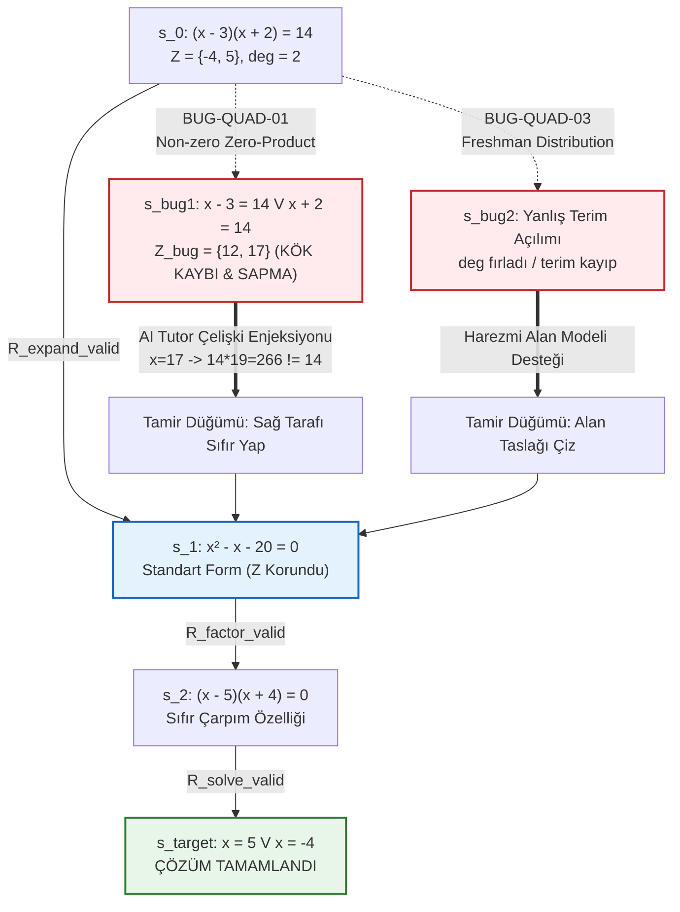

# 08-ERROR-AND-MISCONCEPTION-ENGINE.md
# HATA VE KAVRAM YANILGISI MOTORU (ERROR & MISCONCEPTION ENGINE)
## VanLehn "Mind Bugs", Brown & Burton "Buggy Rules", Deterministik SymPy AST Ziyaretçisi, Durum Uzayı Dönüşüm Grafı ve Teşhis Şartnamesi

---

## 1. SUBSYSTEM 10-SORU MATRİSİ

1. **Neden Var?**  
   Öğrencilerin cebirsel işlemlerde yaptıkları hatalar rastgele bir bilgisizlik veya "dikkatsizlik" değildir. Zihinde yanlış kurgulanmış fakat kendi içinde katı bir mantıkla çalışan usulsel kurallardır (*Buggy Rules*). Bu motor, öğrencinin ara adımlarını deterministik biçimde analiz edip kök kavram yanılgısını teşhis etmek, hatanın rastlantısal bir sürçme (*slip*) mi yoksa bilişsel bir yanılgı (*bug*) mı olduğunu ayrıştırmak ve AI Tutor ajanına cerrahi tamir yönergeleri sağlamak için vardır.

2. **Hangi Problemi Çözer?**  
   Geleneksel eğitim yazılımlarının yalnızca sonuca bakıp *"Yanlış cevap, tekrar dene"* demesi veya jenerik geniş dil modellerinin (LLM) halüsinatif biçimde cebirsel adımları yanlış onaylaması/yorumlaması problemini çözer. Öğrencinin tıkandığı noktada ürettiği hatalı cebirsel yamaları (*repair heuristics*) matematiksel kesinlikle ortaya çıkarır.

3. **Girdiler:**  
   - Öğrencinin yazdığı anlık cebirsel adım ($s_t$, LaTeX/ASCII/dizge formatında),
   - Bir önceki doğrulanmış denklem durumu ($s_{t-1}$),
   - Beklenen kanonik çözüm adımı ($s^*_t$),
   - Problem bağlamı ve hedef kök kümesi ($\mathcal{Z}^*$),
   - Kullanıcının işlem latensi ($\Delta t$, milisaniye) ve Tip-2 SDT güven beyanı ($c \in [0.25, 1.00]$).

4. **Tuttuğu Durum:**  
   - Öğrencinin aktif hata kütüphanesi ve frekans vektörü ($\vec{B}_u$),
   - Adım bazlı durum uzayı yörüngesi ($s_0 \to s_1 \to \dots \to s_t$),
   - İncelenen düğümdeki aktif bilişsel çelişki bayrağı (`cognitive_conflict_active`),
   - Yanılgı kalıcılık ve nüksetme sayacı (`bug_recurrence_counter`).

5. **Aldığı Kararlar:**  
   - Hatanın sınıflandırılması: `EQUIVALENT_STEP`, `ARITHMETIC_SLIP`, `SYSTEMATIC_BUG` veya `UNKNOWN_DEVIATION`,
   - Tespit edilen kuralın kimliği (`BUG-QUAD-01` .. `BUG-QUAD-05`),
   - Çözüm uzayı değişmezlerinin (derece, kök kümesi, tanım kümesi) ihlal analizi,
   - AI Tutor'a enjekte edilecek bilişsel çelişki (*Reductio ad Absurdum*) karşıt örneğinin seçimi.

6. **Çıktılar:**  
   - Deterministik `DiagnosticPayload` (JSON formatında, katı şemaya bağlı),
   - Kök kavram yanılgısı kodu (`bug_id`) ve şiddet derecesi (`severity`),
   - AI Tutor için pedagojik iyileştirme direktifi (`remediation_directive`),
   - İlgili önkoşul graf düğümü (`target_prerequisite_node`).

7. **Çalıştığını Nasıl Anlarız?**  
   - İkinci dereceden denklemlerdeki 5 temel yanılgı deseninin (BUG-QUAD-01..05) test veri setinde %100 deterministik kesinlikle (`Precision = 1.0, Recall ≥ 0.98`) yakalanmasıyla,
   - Yanılgı yaşayan öğrencilere sunulan karşıt örnek sonrası hatayı tekrarlamama oranının $\ge \%85$ olmasıyla.

8. **Nasıl Çöker?**  
   - Öğrencinin çok katmanlı, birden fazla bozuk kuralı aynı anda işlettiği (*compound bugs*) ve AST ağacının çözülemediği durumlarda `UNKNOWN_DEVIATION`'a düşerek yanlış yönlendirme yapmasıyla (Önlem: Adım ayrıştırma mikro-kum havuzu).

9. **MVP Kapsamı:**  
   - İkinci Dereceden Denklemler konusu için 5 büyük yanılgı (`BUG-QUAD-01` .. `BUG-QUAD-05`),
   - SymPy AST Ziyaretçi tabanlı desen eşleme motoru,
   - Durum uzayı dönüşüm grafı ve JSON Teşhis Yükü jeneratörü.

10. **Geleceğe Bırakılanlar:**  
    - Çok terimli rasyonel denklemler ve trigonometrik özdeşlikler için genişletilmiş AST kütüphanesi,
    - Nöro-sembolik hibrit parser ile elle yazılmış matematiksel serbest çizimlerin AST'ye dönüştürülmesi.

---

## 2. KURAMSAL BİLİŞSEL TEMELLER: MIND BUGS VE BUGGY RULES

Matematik eğitiminde yapılan hataların bilişsel mekanizması, bilgisayar bilimleri ve bilişsel psikolojinin ortak mirası olan iki temel kurama dayanır:

```text
+----------------------------------------------------------------------------------------------------+
|                                    BİLİŞSEL HATA HİYERARŞİSİ                                       |
+----------------------------------------------------------------------------------------------------+
|                                                                                                    |
|    +-------------------------+                           +------------------------------------+    |
|    |  İCRAİ SÜRÇME (SLIP)    |                           |     BOZUK KURAL (MIND BUG)         |    |
|    +-------------------------+                           +------------------------------------+    |
|    | - Düşük Bilişsel Yük    |                           | - Kendi İçinde Tutarlı ve Mantıklı |    |
|    | - Geçici Bellek Hatası  |                           | - Eksik Bilgiyi Yamalama Heuristiği|    |
|    | - Yüksek Pişmanlık      |                           | - Yüksek Öğrenci Güveni (c > 0.8)  |    |
|    | - Hızlı Öz-Düzeltme     |                           | - Sistematik Tekrar                |    |
|    +-------------------------+                           +------------------------------------+    |
|                 │                                                           │                      |
|                 ▼                                                           ▼                      |
|    Müdahale: "Tekrar bak" uyarısı                       Müdahale: Sokratik Bilişsel Çelişki        |
|    (Minimal Scaffolding)                                (Cognitive Conflict & Rebound)             |
+----------------------------------------------------------------------------------------------------+
```

### 2.1. John Seely Brown & Richard R. Burton (1978, *BUGGY*): Usulsel Hata Ağları

Brown & Burton, öğrencilerin aritmetik ve cebirdeki hatalarının "bilgisizlik" değil, hatalı bir algoritmanın harfiyen çalıştırılması olduğunu kanıtlamıştır.
* **Bozuk Kural (*Buggy Rule*):** Öğrenci, doğru bir kuralın bileşenlerinden birini yanlış bir operatörle değiştirir ve bu yeni kuralı tüm benzer problemlere genelleyerek tutarlı bir şekilde yanlış yapar.
* **Usulsel Ağ (*Procedural Network*):** Problem çözme bir üretim kuralları zinciridir ($Rule_1 \to Rule_2 \to \dots$). Bozuk kural, zincirin bir halkasına yerleştiğinde sonraki tüm adımlar bu yerel hatanın üstüne inşa edilir.

### 2.2. Kurt VanLehn (1990, *Mind Bugs*): Tıkanma-Tamir Kuramı (*Impasse-Repair Theory*)

VanLehn, bozuk kuralların zihinde nasıl filizlendiğini *Tıkanma-Tamir Kuramı* (*Impasse-Repair Theory*) ile açıklar:

$$\text{Problem Çözümü} \xrightarrow{\text{Eksik Bilgi / Belirsizlik}} \text{TIKANMA (Impasse)} \xrightarrow{\text{Pes Etmeme Dürtüsü}} \text{TAMİR (Repair Heuristic)} \xrightarrow{} \text{BOZUK KURAL (Bug)}$$

1. **Tıkanma (*Impasse*):** Öğrenci bir alt hedefi gerçekleştirmek için gerekli kanonik kuralı bilmediğinde veya hatırlayamadığında durur.
2. **Tamir Heuristiği (*Repair Heuristic*):** Öğrenci boş durmaz; zihnindeki mevcut diğer matematiksel operatörleri (örneğin lineer dağılma, sadeleştirme, aritmetik karekök alma) bağlam dışı bir şekilde tıkandığı yere uyarlar.
3. **Sentaktik İkna:** Öğrenci için bu yama "görünüşte mantıklıdır" ve bilişsel bir rahatlama sağlar. Hatanın dışarıdan mantıksız görünmesi, içerideki algoritmik mantığı değiştirmez.

### 2.3. Rastgele Hata (*Slip*) vs. Bozuk Kural (*Bug*) Karşılaştırma Matrisi

Sistemin öğrencinin girdisini doğru sınıflandırabilmesi için psikometrik ve davranışsal sinyaller birlikte değerlendirilir:

| ÖLÇÜT | RASTGELE SÜRÇME (SLIP) | BOZUK KURAL (BUG / MISCONCEPTION) |
| :--- | :--- | :--- |
| **Bilişsel Mekanizma** | Çalışma belleği aşımı, anlık dikkat dalgalanması | Kararlı ama kusurlu zihinsel şema (Buggy schema) |
| **Öz-Düzeltme (Regret)** | Hata gösterildiğinde derhal *"Ah, tabii ki!"* der | Hatayı savunur, kendi kuralının doğruluğunda diretir |
| **Tip-2 Güven Skoru ($c$)** | Düşük veya orta ($c \in [0.25, 0.60]$) | Çok yüksek ($c \in [0.80, 1.00]$ - Dunning-Kruger) |
| **İşlem Latensi ($\Delta t$)** | Genellikle çok hızlı (impulsif) veya dalgalı | Kararlı ve ritmik usulsel akış |
| **Tutarlılık** | Aynı soru tipinde rastgele doğru veya yanlış | Aynı soru yapısında deterministik olarak tekrarlar |
| **Pedagojik Reçete** | Minimal uyarı ("İşlem işaretine dikkat et") | Bilişsel Çelişki Enjeksiyonu + Harezmi Alan Modeli |

---

## 3. İKİNCİ DERECEDEN DENKLEMLER İÇİN TAM YANILGI KATALOĞU

Lise cebiri ve ikinci dereceden denklemler alanındaki en yaygın, en dirençli 5 kavram yanılgısı aşağıda formel matematiksel ve bilişsel anatomisiyle tanımlanmıştır.

```text
+----------------------------------------------------------------------------------------------------+
|                             5 TEMEL CEBİRSEL BOZUK KURAL (BUG CATALOGUE)                           |
+----------------------------------------------------------------------------------------------------+
|  [BUG-QUAD-01]  (x - a)(x - b) = k ==> x - a = k  VEYA  x - b = k  (k != 0)                        |
|                 Sıfır Olmayan Sayıya Sıfır-Çarpım Uygulama (Non-Zero Zero-Product Transfer)         |
+----------------------------------------------------------------------------------------------------+
|  [BUG-QUAD-02]  x² = k  ==>  x = √k  (x = -√k KÖKÜ KAYIP!)                                         |
|                 Eksik Karekök / Negatif Kök Kaybı (Missing Negative Root Bug)                      |
+----------------------------------------------------------------------------------------------------+
|  [BUG-QUAD-03]  (x + a)² = x² + a²  (ORTA TERİM 2ax KAYIP!)                                        |
|                 Dağılma Özelliğini Üslere Yanlış Genelleme (Freshman's Dream Bug)                  |
+----------------------------------------------------------------------------------------------------+
|  [BUG-QUAD-04]  x² = 6x  ==>  x = 6  (x = 0 KÖKÜ İMHA EDİLDİ!)                                     |
|                 Sadeleştirme Yanılsaması / Kök Katli (Root Cancelling / Annihilation Bug)          |
+----------------------------------------------------------------------------------------------------+
|  [BUG-QUAD-05]  b = -4  ==>  -b ± √(b² - 4ac) İÇİNDE  -b = -4  VE  (-4)² = -16                    |
|                 İşaret ve Parantez Hataları (Sign & Parenthesis Traps in Quadratic Formula)        |
+----------------------------------------------------------------------------------------------------+
```

---

### 3.1. BUG-QUAD-01: Sıfır Olmayan Sayıya Sıfır-Çarpım Uygulama (Non-zero Zero-Product Transfer)

#### 1. Biçimsel Matematiksel Gösterim:
$$(x - a)(x - b) = k \quad (k \neq 0) \implies (x - a = k) \lor (x - b = k)$$

#### 2. Bilişsel Kök Neden (VanLehn Tıkanma Analizi):
Öğrenci $A \cdot B = 0 \iff A = 0 \lor B = 0$ teoremini ezberlemiştir. Ancak $(x - 3)(x + 2) = 10$ denklemiyle karşılaştığında sıfır tarafı bulunmadığı için **Tıkanma (*Impasse*)** yaşar. Çarpanları açıp ikinci dereceden standart forma dönüştürmek yerine, sıfırın eşsiz "yutan eleman / sıfır böleni olmama" özelliğini rastgele bir $k$ sabitine aşırı geneller (*Over-generalization Repair*).

#### 3. Tipik Yüzey Varyantları:
- $(x - 3)(x + 2) = 10 \implies x - 3 = 10 \implies x = 13$
- $(x + 1)(x - 4) = 6 \implies x + 1 = 2 \land x - 4 = 3$ (Keyfi çarpan eşleme varyantı)

#### 4. Bilişsel Çelişki / Karşıt Örnek Motoru (*Reductio ad Absurdum*):
Öğrencinin bulduğu $x = 13$ kökünü sol tarafta yerine koydur:
$$(13 - 3) \cdot (13 + 2) = 10 \cdot 15 = 150$$
$$150 \neq 10$$
*"Çarpımları 10 eden sonsuz sayıda sayı ikilisi vardır (1·10, 2·5, 0.5·20, (-1)·(-10)). Neden çarpanlardan birinin mutlaka 10 olması gerektiğini düşündün? Sıfır için geçerli olan bu kural 10 için neden geçerli olamaz?"*

#### 5. Epistemik Değişmez İhlali:
- **Çözüm Kümesi Korunumu İhlali:** Gerçek çözüm kümesi $\mathcal{Z}^* = \{-4, 5\}$ iken öğrencinin kümesi $\mathcal{Z}_{\text{bug}} = \{8, 13\}$ olur. $\mathcal{Z}^* \cap \mathcal{Z}_{\text{bug}} = \emptyset$.

#### 6. Pedagojik İyileştirme Yönergesi:
- **Hedef Önkoşul Düğümü:** `[N11]` Sıfır Çarpım İlkesi (`math.alg.quad.zero_product`) ve `[N10]` İkinci Dereceden Denklem Standart Formu (`math.alg.quad.standard_form`) — Bkz: [04-KNOWLEDGE-AND-PREREQUISITE-GRAPH.md](04-KNOWLEDGE-AND-PREREQUISITE-GRAPH.md).
- **Eylem:** Parantezleri açıp tüm terimleri sol tarafa toplayarak sağ tarafı kesinlikle sıfır yapma kuralını modelle. İlgili prensip: İlke 3 ([02-PRODUCT-PRINCIPLES.md](02-PRODUCT-PRINCIPLES.md)).

---

### 3.2. BUG-QUAD-02: Eksik Karekök / Negatif Kök Kaybı (Missing Negative Root)

#### 1. Biçimsel Matematiksel Gösterim:
$$x^2 = k \quad (k > 0) \implies x = \sqrt{k} \quad (\text{Eksik: } x = -\sqrt{k})$$
$$(x - a)^2 = k \implies x - a = \sqrt{k} \quad (\text{Eksik: } x - a = -\sqrt{k})$$

#### 2. Bilişsel Kök Neden (VanLehn Tıkanma Analizi):
Aritmetik karekök fonksiyonunun tek değerli prensip tanımı ($\sqrt{k} \ge 0$) ile cebirsel denklemin kök kümesi ($x^2 = k \iff |x| = \sqrt{k} \iff x = \pm\sqrt{k}$) arasındaki derin kavramsal ayrımın bilinmemesi. Öğrencinin geometrik uzunluk sezgisini (kenar uzunluğu negatif olamaz) cebirsel kök uzayına kopyalaması.

#### 3. Tipik Yüzey Varyantları:
- $x^2 = 25 \implies x = 5$ (Çözüm kümesi tek elemanlı yazılır: ÇK = $\{5\}$)
- $(x - 3)^2 = 16 \implies x - 3 = 4 \implies x = 7$ (İkinci kök $x = -1$ tamamen kaybolur)

#### 4. Bilişsel Çelişki / Karşıt Örnek Motoru (*Reductio ad Absurdum*):
$$(-5)^2 = (-5) \cdot (-5) = +25$$
*"(-5) sayısının karesini aldığında ne buluyorsun? +25. Peki denklemimiz $x^2 = 25$ değil miydi? O halde $x = -5$ bu eşitliği sağlamıyor mu? İkinci dereceden bir denklemin derecesi 2 olduğuna göre en fazla kaç kökü olmalıdır?"*

#### 5. Epistemik Değişmez İhlali:
- **Kök Kümesi Kardinalite İhlali:** $|\mathcal{Z}^*| = 2$ iken $|\mathcal{Z}_{\text{bug}}| = 1$. Cebirin Temel Teoremi ihlali.

#### 6. Pedagojik İyileştirme Yönergesi:
- **Hedef Önkoşul Düğümü:** `[N13]` Karekök Alma Yoluyla Çözüm (`math.alg.quad.pure_quadratics`) ve `[N01]` Negatif Sayılarla İşlemler (`math.arith.signed_ops`) — Bkz: [04-KNOWLEDGE-AND-PREREQUISITE-GRAPH.md](04-KNOWLEDGE-AND-PREREQUISITE-GRAPH.md).
- **Eylem:** Karekök alma adımında araya zorunlu mutlak değer köprüsü yerleştir.

---

### 3.3. BUG-QUAD-03: Dağılma Özelliğini Üslere Yanlış Genelleme (Freshman's Dream Bug)

#### 1. Biçimsel Matematiksel Gösterim:
$$(x + a)^2 \implies x^2 + a^2 \quad (\text{Orta terim } 2ax \text{ kayıp})$$
$$(x - a)^2 \implies x^2 - a^2 \quad \text{veya} \quad x^2 + a^2$$
$$\sqrt{x^2 + a^2} \implies x + a$$

#### 2. Bilişsel Kök Neden (VanLehn Tıkanma Analizi):
Çarpmanın toplama üzerine dağılma özelliği olan $c(x + a) = cx + ca$ ve üssün çarpma üzerine dağılma özelliği olan $(x \cdot y)^2 = x^2 y^2$ kurallarının, üs ve kök işlemlerine lineer olarak aşırı genellenmesi ($f(u + v) = f(u) + f(v)$ doğrusallık yanılsaması).

#### 3. Tipik Yüzey Varyantları:
- $(x + 4)^2 = x^2 + 16$
- $(2x - 3)^2 = 4x^2 + 9$ veya $4x^2 - 9$
- $x^2 + 6x + 9 = (x + 3)^2$ dönüşümünde çarpanlara ayırma yaparken $(x + 9)^2$ yazmak.

#### 4. Bilişsel Çelişki / Karşıt Örnek Motoru (*Reductio ad Absurdum*):
Basit bir aritmetik karşıt örnek sun: $x = 3, a = 4$ olsun.
$$(3 + 4)^2 = 7^2 = 49$$
Senin formülünle:
$$3^2 + 4^2 = 9 + 16 = 25$$
$$49 \neq 25$$
*"Aradaki $49 - 25 = 24$ fark nereye kayboldu? Geometrik olarak $(x+4)$ kenarlı bir karenin alanını çizdiğinde, köşedeki $x^2$ ve $16$'nın dışında kalan iki büyük dikdörtgeni ($4x + 4x = 8x$) nereye bıraktın?"*

#### 5. Epistemik Değişmez İhlali:
- **Polinom Özdeşlik İhlali:** $\Delta(x) = (x+a)^2 - (x^2+a^2) = 2ax \not\equiv 0$.

#### 6. Pedagojik İyileştirme Yönergesi:
- **Hedef Önkoşul Düğümü:** `[N14]` Geometrik Alan Modeli (`math.alg.quad.geom_complete_sq`) ve `[N07]` Tam Kare Özdeşliği (`math.alg.factoring.perfect_sq`) — Bkz: [04-KNOWLEDGE-AND-PREREQUISITE-GRAPH.md](04-KNOWLEDGE-AND-PREREQUISITE-GRAPH.md) ve [11-CONTENT-AND-REPRESENTATION-SYSTEM.md](11-CONTENT-AND-REPRESENTATION-SYSTEM.md).
- **Eylem:** Somutluk sönümlemesiyle (Cebir karosu $\to$ İkonik alan taslağı $\to$ Sembolik açılım) kayıp $2ax$ terimini görselleştir.

---

### 3.4. BUG-QUAD-04: Sadeleştirme Yanılsaması / Kök Katli (Root Cancelling / Annihilation Bug)

#### 1. Biçimsel Matematiksel Gösterim:
$$x^2 = kx \implies x = k \quad (\text{Denklem } x \text{'e bölünerek } x = 0 \text{ kökü yok edildi!})$$
$$ax^2 + bx = 0 \implies ax + b = 0 \implies x = -\frac{b}{a}$$

#### 2. Bilişsel Kök Neden (VanLehn Tıkanma Analizi):
Lineer denklem çözme rutininde yerleşmiş olan *"Bilinmeyeni yalnız bırakmak için her iki tarafı katsayıya böl"* kuralının, bilinmeyenin kendisine uygulanması. Değişkenin tek bir sabit sayı değil, sıfır değerini de alabilecek bir sayı kümesi olduğu gerçeğinin ve sıfıra bölme yasağının unutulması.

#### 3. Tipik Yüzey Varyantları:
- $x^2 = 6x \implies \frac{x^2}{x} = \frac{6x}{x} \implies x = 6$ (Kök $x = 0$ kayıp)
- $3x^2 - 15x = 0 \implies 3x^2 = 15x \implies x = 5$

#### 4. Bilişsel Çelişki / Karşıt Örnek Motoru (*Reductio ad Absurdum*):
Orijinal denklemde $x = 0$ değerini dene:
$$0^2 = 6 \cdot 0 \implies 0 = 0 \quad (\text{DOĞRU!})$$
*$"x = 0$ denklemi sağladığı halde bulduğun çözüm kümesinde neden yok? Her iki tarafı $x$'e bölerken eğer $x = 0$ ise aslında denklemi neye bölmüş oldun? Matematikte sıfıra bölmek serbest midir?"*

#### 5. Epistemik Değişmez İhlali:
- **Tanım Kümesi ve Derece İhlali:** İkinci derece denklem birinci dereceye düşürüldü; kök kümesi daraltıldı ($\mathcal{Z}^* = \{0, 6\}$, $\mathcal{Z}_{\text{bug}} = \{6\}$).

#### 6. Pedagojik İyileştirme Yönergesi:
- **Hedef Önkoşul Düğümü:** `[N05]` Ortak Çarpan Parantezine Alma (`math.alg.factoring.gcf`) ve `[N27]` Ters Köşe / Karşıt Örnek Analizi (`math.alg.quad.counterexamples`) — Bkz: [04-KNOWLEDGE-AND-PREREQUISITE-GRAPH.md](04-KNOWLEDGE-AND-PREREQUISITE-GRAPH.md).
- **Eylem:** Değişkene bölmek yerine tüm terimleri bir tarafa toplayıp ortak paranteze alma ($x(x - 6) = 0$) protokolünü zorunlu kıl.

---

### 3.5. BUG-QUAD-05: İşaret ve Parantez Hataları (Sign & Parenthesis Traps in Quadratic Formula)

#### 1. Biçimsel Matematiksel Gösterim:
$$ax^2 + bx + c = 0 \quad \text{denkleminde } b < 0 \text{ iken } x = \frac{-b \pm \sqrt{b^2 - 4ac}}{2a} \text{ uygulanırken:}$$
$$\text{Hata A (İşaret Çarpıtması): } b = -5 \implies -b = -5 \quad (\text{Eksi ile eksinin çarpımının unutulması})$$
$$\text{Hata B (Karesel Parantez): } b = -4 \implies b^2 = -4^2 = -16 \quad (\text{Diskriminantın negatif çıkması})$$
$$\text{Hata C (Payda Kapsamı): } x = -b \pm \frac{\sqrt{\Delta}}{2a} \quad (\text{Kesir çizgisinin sadece köke uygulanması})$$

#### 2. Bilişsel Kök Neden (VanLehn Tıkanma Analizi):
Unary eksi (işaret eksi, negatiflik) ile binary eksi (çıkarma operatörü) arasındaki zihinsel ayrımın kaybolması. İşlem önceliğinde üs almanın işaret belirlemeden önce gelmesi kuralının ($-3^2 = -(3^2) = -9$), cebirsel değişken yerine koymada parantez kullanılmaması nedeniyle yanılgıya yol açması.

#### 3. Tipik Yüzey Varyantları:
- $x^2 - 4x - 5 = 0 \implies x = \frac{-4 \pm \sqrt{16 - 4(1)(-5)}}{2} = \frac{-4 \pm 6}{2} \implies x = 1 \text{ veya } x = -5$
- $x^2 - 6x + 8 = 0 \implies \Delta = -6^2 - 4(1)(8) = -36 - 32 = -68 \implies \text{"Reel kök yok!"}$

#### 4. Bilişsel Çelişki / Karşıt Örnek Motoru (*Reductio ad Absurdum*):
$$(-4)^2 = (-4) \cdot (-4) = +16$$
*"Formülde $b^2$ ifadesi 'b sayısının tamamının karesi' demektir. $b = -4$ olduğuna göre, $(-4) \cdot (-4)$ kaç eder? Neden diskriminantı hesaplarken $-16$ aldın? Negatif bir sayının karesi negatif olabilir mi?"*

#### 5. Epistemik Değişmez İhlali:
- **Diskriminant İşaret İhlali:** Gerçekte $\Delta > 0$ iken öğrencinin hesabında $\Delta < 0$ çıkarak var olan reel köklerin yok sayılması.

#### 6. Pedagojik İyileştirme Yönergesi:
- **Hedef Önkoşul Düğümü:** `[N01]` Negatif Sayılarla İşlemler (`math.arith.signed_ops`) ve `[N18]` Kuadratik Formül Standart Uygulanışı (`math.alg.quad.formula_application`) — Bkz: [04-KNOWLEDGE-AND-PREREQUISITE-GRAPH.md](04-KNOWLEDGE-AND-PREREQUISITE-GRAPH.md).
- **Eylem:** Kuadratik formüle katsayıları yerleştirirken **boş parantez şablonu** kullanımını zorunlu kıl:
  $$x = \frac{-(\quad) \pm \sqrt{(\quad)^2 - 4(\quad)(\quad)}}{2(\quad)}$$

---

### 3.6. BUG-QUAD-06: Terim Taşırken İşaret Değiştirmeme (Sign Invariance Across Equality)

#### 1. Biçimsel Matematiksel Gösterim:
$$x^2 + 5x = 6 \implies x^2 + 5x + 6 = 0 \quad (\text{Eşitliğin karşısına geçen terimin işaretinin korunması})$$
$$x^2 = 3x - 2 \implies x^2 + 3x - 2 = 0$$

#### 2. Bilişsel Kök Neden (VanLehn Tıkanma Analizi):
Öğrenci, "terimi diğer tarafa atma" eylemini uzamsal bir hareket olarak algılar; eşitliğin her iki tarafına ters eleman ekleme ($+6 \to -6$) aksiyomunu değil, terimi sadece fiziksel olarak kaydırma mekanik alışkanlığını çalıştırır.

#### 3. Bilişsel Çelişki / Karşıt Örnek Motoru (*Reductio ad Absurdum*):
*"Eğer $x^2 + 5x = 6$ ise ve sen her iki taraftan 6 çıkarırsan sağ taraf ne olur? $6 - 6 = 0$. Peki sol taraftan 6 çıkardığında neden $+6$ yazdın? Bir terazinin bir kefesinden 6 kilo alırken diğer kefesine 6 kilo eklemiş oldun mu?"*

#### 4. Pedagojik İyileştirme Yönergesi:
- **Hedef Önkoşul Düğümü:** `[N02]` Doğrusal Denklemler ve Eşitliğin Korunumu.
- **Eylem:** Terazili çift taraflı işlem zorunluluğu iskelelemesi.

---

### 3.7. BUG-QUAD-07: Eşitliğin Tek Tarafına İşlem Uygulama (Unilateral Operations)

#### 1. Biçimsel Matematiksel Gösterim:
$$x^2 + 6x = 2 \implies x^2 + 6x + 9 = 2 \quad (\text{Sola 9 ekleyip sağa eklemeyi unutma})$$
$$2x^2 + 4x = 8 \implies x^2 + 2x = 8 \quad (\text{Sol tarafı 2'ye bölüp sağı bölmeme})$$

#### 2. Bilişsel Kök Neden (VanLehn Tıkanma Analizi):
Çalışma belleği aşırı yüklenmesi (CLT). Öğrenci tam kareye tamamlama veya katsayı sadeleştirme hedefine o kadar odaklanır ki, denklemin sağ tarafını dikkat penceresinden düşürür (Focal Blindness).

#### 3. Bilişsel Çelişki / Karşıt Örnek Motoru (*Reductio ad Absurdum*):
*"Sol tarafa 9 ekleyerek onu $(x+3)^2$ yaptın. Ama sağ taraf hâlâ 2 kaldı. İki taraf birbirine eşitken sadece bir tarafa 9 eklersen eşitlik bozulmaz mı? $10 = 10$ iken $10 + 9 = 10$ diyebilir miyiz?"*

#### 4. Pedagojik İyileştirme Yönergesi:
- **Hedef Önkoşul Düğümü:** `[N02]` Eşitlik Korunumu ve İki Taraflı Simetri İlkesi.

---

### 3.8. BUG-QUAD-08: Negatif Diskriminantta Sahte Reel Kök Üretme (Negative Discriminant Hallucination)

#### 1. Biçimsel Matematiksel Gösterim:
$$\Delta = b^2 - 4ac = -16 \implies \sqrt{\Delta} = 4 \quad \text{veya} \quad \sqrt{\Delta} = -4$$
$$x^2 + 2x + 5 = 0 \implies \Delta = 4 - 20 = -16 \implies x = \frac{-2 \pm 4}{2}$$

#### 2. Bilişsel Kök Neden (VanLehn Tıkanma Analizi):
Öğrenci, reel sayılarda karekök içinin negatif olamayacağı kuralını bildiği halde problemde ilerleme baskısıyla eksi işaretini görmezden gelir ($\sqrt{-16} = \sqrt{16} = 4$ yansıması).

#### 3. Bilişsel Çelişki / Karşıt Örnek Motoru (*Reductio ad Absurdum*):
*"Kök içinde $-16$ buldun ve buna $4$ dedin. Peki $4 \times 4$ kaç eder? $16$. Peki $(-4) \times (-4)$ kaç eder? O da $16$. Karesi $-16$ eden herhangi bir gerçel sayı var mıdır? Gerçel sayılar dünyasında bu denklemin grafiği x-eksenini kesebilir mi?"*

#### 4. Pedagojik İyileştirme Yönergesi:
- **Hedef Önkoşul Düğümü:** `[N19]` Diskriminant Analizi ve Parabolün Reel Kök Durumları.

---

## 4. DETERMINİSTİK SYMPY AST ZİYARETÇİSİ (AST VISITOR PATTERN)

### 4.1. Neden Yalnızca Sembolik Sadeleştirme Yetmez?

Matematiksel motorlarda sıkça yapılan hata şudur:
```python
# YETERSİZ VE YANLIŞ YAKLAŞIM:
is_correct = sp.simplify(user_expr - expected_expr) == 0
```
Bu yaklaşım sadece adımın doğru olup olmadığını söyler; **öğrencinin neden yanlış yaptığını ve hangi zihinsel kuralı işlettiğini söyleyemez.** 

Ayrıca öğrenci $(x-3)(x+2)=10$ denkleminden $x-3=10$ adımına geçtiğinde bu iki ifade matematiksel olarak eşdeğer değildir; aralarındaki fark sıfır çıkmaz. Ancak bu adım rastgele bir hata değil, **BUG-QUAD-01** kuralının deterministik bir AST türevidir. Bu nedenle sözdizimsel ağacın (AST) biçimsel desenlerle taranması zorunludur.

```text
+----------------------------------------------------------------------------------------------------+
|                                    SYMPY AST ANALİZ BORU HATTI                                     |
+----------------------------------------------------------------------------------------------------+
|                                                                                                    |
|    Girdi: Önceki Adım (s_prev) + Öğrenci Adımı (s_user) + Beklenen Adım (s_exp)                    |
|                                     │                                                              |
|                                     ▼                                                              |
|                     [ 1. Güvenli Parser (SymPy Parser) ]                                          |
|                     (Dönüştürme: String -> AST Equation)                                           |
|                                     │                                                              |
|                                     ▼                                                              |
|                [ 2. Semantik Eşdeğerlik Denetimi ]                                                 |
|                sp.simplify(s_user.lhs - s_user.rhs) == sp.simplify(s_exp.lhs - s_exp.rhs)        |
|                                     │                                                              |
|                   ┌─────────────────┴─────────────────┐                                            |
|                   ▼ (EVET)                            ▼ (HAYIR)                                    |
|          { status: "CORRECT" }              [ 3. Deterministic Bug Visitor ]                       |
|                                             ├── check_bug_quad_01_nonzero_product()               |
|                                             ├── check_bug_quad_02_missing_negative_root()          |
|                                             ├── check_bug_quad_03_freshmans_dream()               |
|                                             ├── check_bug_quad_04_root_cancelling()               |
|                                             └── check_bug_quad_05_sign_parenthesis()              |
|                                                               │                                    |
|                                                               ▼                                    |
|                                              [ 4. Teşhis Raporu & Payload Üretimi ]                |
+----------------------------------------------------------------------------------------------------+
```

### 4.2. Üretim Kalitesinde Python / SymPy AST Ziyaretçi Motoru

Aşağıdaki kod, üretim ortamında çalıştırılmak üzere tasarlanmış, katı tip denetimli ve modüler AST analiz motorudur:

```python
"""
08-error-and-misconception-engine
Deterministic SymPy AST Visitor for High School Quadratic Algebra Misconceptions.
"""

from __future__ import annotations
from dataclasses import dataclass, field
from enum import Enum
from typing import Optional, List, Dict, Any, Union
import sympy as sp


class ErrorSeverity(str, Enum):
    INFO = "INFO"
    MINOR = "MINOR"
    MAJOR = "MAJOR"
    CRITICAL = "CRITICAL"


class ErrorClass(str, Enum):
    VALID_STEP = "VALID_STEP"
    ARITHMETIC_SLIP = "ARITHMETIC_SLIP"
    CONCEPTUAL_MISCONCEPTION = "CONCEPTUAL_MISCONCEPTION"
    UNKNOWN_DEVIATION = "UNKNOWN_DEVIATION"


@dataclass(frozen=True)
class DiagnosticResult:
    is_valid: bool
    error_class: ErrorClass
    bug_id: Optional[str] = None
    severity: Optional[ErrorSeverity] = None
    confidence: float = 1.0
    cognitive_gap: Optional[str] = None
    remediation_directive: Optional[str] = None
    counterexample: Optional[Dict[str, Any]] = None
    target_prerequisite_node: Optional[str] = None
    ast_signature: Optional[str] = None


class QuadraticMisconceptionDetector:
    """
    İkinci dereceden denklem adımlarını analiz eden deterministik AST Ziyaretçisi.
    """

    def __init__(self, variable_name: str = "x"):
        self.x = sp.Symbol(variable_name)

    def parse_equation(self, expr_str: str) -> sp.Equality:
        """Metin girdisini güvenli bir şekilde SymPy Eq objesine dönüştürür."""
        clean_str = expr_str.strip().replace("^", "**")
        if "=" in clean_str:
            parts = clean_str.split("=")
            if len(parts) != 2:
                raise ValueError(f"Geçersiz denklem biçimi: {expr_str}")
            lhs = sp.parse_expr(parts[0])
            rhs = sp.parse_expr(parts[1])
            return sp.Eq(lhs, rhs)
        else:
            # Tek bir ifade girildiyse sıfıra eşit kabul et
            return sp.Eq(sp.parse_expr(clean_str), 0)

    def analyze_step(
        self,
        prev_step_str: str,
        user_step_str: str,
        canonical_step_str: Optional[str] = None,
    ) -> DiagnosticResult:
        """
        Öğrenci adımını AST seviyesinde inceler ve kesin teşhis üretir.
        """
        try:
            prev_eq = self.parse_equation(prev_step_str)
            user_eq = self.parse_equation(user_step_str)
        except Exception as e:
            return DiagnosticResult(
                is_valid=False,
                error_class=ErrorClass.UNKNOWN_DEVIATION,
                severity=ErrorSeverity.MINOR,
                cognitive_gap=f"Sözdizimi hatası veya çözümlenemeyen ifade: {str(e)}",
                remediation_directive="Cebirsel ifadenin yazımını kontrol et.",
            )

        # 1. Matematiksel Eşdeğerlik Kontrolü
        user_diff = sp.simplify((user_eq.lhs - user_eq.rhs))
        prev_diff = sp.simplify((prev_eq.lhs - prev_eq.rhs))

        # Eğer kullanıcı adımı önceki denklemle aynı kök kümesine sahipse veya denkse:
        if canonical_step_str:
            canonical_eq = self.parse_equation(canonical_step_str)
            can_diff = sp.simplify(canonical_eq.lhs - canonical_eq.rhs)
            if sp.simplify(user_diff - can_diff) == 0:
                return DiagnosticResult(is_valid=True, error_class=ErrorClass.VALID_STEP)

        if sp.simplify(user_diff - prev_diff) == 0:
            return DiagnosticResult(is_valid=True, error_class=ErrorClass.VALID_STEP)

        # Kök kümelerini karşılaştır
        try:
            prev_roots = set(sp.solve(prev_diff, self.x))
            user_roots = set(sp.solve(user_diff, self.x))
            if prev_roots and prev_roots == user_roots:
                return DiagnosticResult(is_valid=True, error_class=ErrorClass.VALID_STEP)
        except Exception:
            prev_roots = set()
            user_roots = set()

        # 2. BUG-QUAD-01: Sıfır Olmayan Sayıya Sıfır-Çarpım Uygulama
        res_01 = self._check_bug_quad_01(prev_eq, user_eq)
        if res_01:
            return res_01

        # 3. BUG-QUAD-04: Sadeleştirme Yanılsaması / Kök Katli
        res_04 = self._check_bug_quad_04(prev_eq, user_eq, prev_roots, user_roots)
        if res_04:
            return res_04

        # 4. BUG-QUAD-02: Eksik Karekök / Negatif Kök Kaybı
        res_02 = self._check_bug_quad_02(prev_eq, user_eq, prev_roots, user_roots)
        if res_02:
            return res_02

        # 5. BUG-QUAD-03: Dağılma Özelliğini Üslere Yanlış Genelleme
        res_03 = self._check_bug_quad_03(prev_eq, user_eq)
        if res_03:
            return res_03

        # 6. BUG-QUAD-05: İşaret ve Parantez Hataları
        res_05 = self._check_bug_quad_05(prev_eq, user_eq)
        if res_05:
            return res_05

        # Bilinmeyen genel sapma
        return DiagnosticResult(
            is_valid=False,
            error_class=ErrorClass.UNKNOWN_DEVIATION,
            severity=ErrorSeverity.MINOR,
            cognitive_gap="Adım önceki denklemin geçerli bir cebirsel dönüşümü değil.",
            remediation_directive="Yaptığın işlemi adım adım kontrol et; her iki tarafa aynı işlemi uyguladığından emin ol.",
        )

    def _check_bug_quad_01(self, prev_eq: sp.Equality, user_eq: sp.Equality) -> Optional[DiagnosticResult]:
        """
        BUG-QUAD-01: (x - a)(x - b) = k ==> x - a = k VEYA x - b = k (k != 0)
        """
        lhs = prev_eq.lhs
        rhs = prev_eq.rhs
        
        # Eğer sağ taraf çarpım sol taraf sabitse yer değiştir
        if rhs.has(self.x) and not lhs.has(self.x):
            lhs, rhs = rhs, lhs

        if rhs != 0 and rhs.is_number:
            factors = lhs.args if isinstance(lhs, sp.Mul) else []
            for factor in factors:
                # Kullanıcı doğrudan bir çarpanı k'ya eşitledi mi? (factor = k)
                diff1 = sp.simplify((user_eq.lhs - user_eq.rhs) - (factor - rhs))
                diff2 = sp.simplify((user_eq.lhs - user_eq.rhs) - (rhs - factor))
                
                # Veya çarpanı çözüp x = root_hatalı mı yazdı?
                solved_factor_root = sp.solve(factor - rhs, self.x)
                user_is_single_root = False
                if len(user_eq.lhs.free_symbols) == 1 and user_eq.rhs.is_number:
                    if user_eq.lhs == self.x and solved_factor_root and sp.simplify(user_eq.rhs - solved_factor_root[0]) == 0:
                        user_is_single_root = True

                if diff1 == 0 or diff2 == 0 or user_is_single_root:
                    sample_root = solved_factor_root[0] if solved_factor_root else rhs
                    lhs_eval = lhs.subs(self.x, sample_root)
                    return DiagnosticResult(
                        is_valid=False,
                        error_class=ErrorClass.CONCEPTUAL_MISCONCEPTION,
                        bug_id="BUG-QUAD-01",
                        severity=ErrorSeverity.CRITICAL,
                        confidence=0.98,
                        cognitive_gap="Sıfır Çarpım Özelliğini sıfır olmayan sabit sayılara aşırı genelleme.",
                        remediation_directive=(
                            "A·B = 0 kuralı yalnızca çarpım SIFIRA eşitken çalışır. "
                            "Sağ taraf sıfır değilken çarpanları doğrudan sayıya eşitleyemezsin. "
                            "Önce parantezleri aç ve tüm terimleri bir tarafa toplayarak denklemi sıfıra eşitle."
                        ),
                        counterexample={
                            "substitution_point": float(sample_root) if sample_root.is_real else str(sample_root),
                            "lhs_result": float(lhs_eval) if lhs_eval.is_real else str(lhs_eval),
                            "target_rhs": float(rhs) if rhs.is_real else str(rhs),
                            "explanation": f"x = {sample_root} için sol taraf {lhs_eval} olur, {rhs} sayısına eşit değildir!"
                        },
                        target_prerequisite_node="NODE_ZERO_PRODUCT_PROPERTY",
                        ast_signature="Eq(Factor_i, k) where k != 0"
                    )
        return None

    def _check_bug_quad_02(
        self, prev_eq: sp.Equality, user_eq: sp.Equality, prev_roots: set, user_roots: set
    ) -> Optional[DiagnosticResult]:
        """
        BUG-QUAD-02: x^2 = k ==> x = sqrt(k) (Negatif kök kaybı)
        """
        prev_diff = prev_eq.lhs - prev_eq.rhs
        poly = sp.Poly(prev_diff, self.x)
        
        if poly.degree() == 2:
            roots_list = list(prev_roots)
            if len(roots_list) == 2:
                r1, r2 = roots_list[0], roots_list[1]
                user_diff = user_eq.lhs - user_eq.rhs
                user_sol = sp.solve(user_diff, self.x)
                if len(user_sol) == 1:
                    retained_root = user_sol[0]
                    missing_root = r2 if sp.simplify(retained_root - r1) == 0 else (r1 if sp.simplify(retained_root - r2) == 0 else None)
                    if missing_root is not None:
                        return DiagnosticResult(
                            is_valid=False,
                            error_class=ErrorClass.CONCEPTUAL_MISCONCEPTION,
                            bug_id="BUG-QUAD-02",
                            severity=ErrorSeverity.MAJOR,
                            confidence=0.95,
                            cognitive_gap="Karekök alırken negatif kökün (± sembolünün) unutulması.",
                            remediation_directive=(
                                "Karesi pozitif bir sayı olan iki farklı değer vardır: Biri pozitif, diğeri negatif. "
                                f"x = {retained_root} kökünü buldun, peki karesi aynı sonucu veren negatif eşi nerede?"
                            ),
                            counterexample={
                                "missing_root": float(missing_root) if missing_root.is_real else str(missing_root),
                                "verification": f"({missing_root})² de denklemi sağlar!",
                            },
                            target_prerequisite_node="NODE_ABSOLUTE_VALUE_RADICAL",
                            ast_signature="Eq(x, sqrt(k)) without Eq(x, -sqrt(k))"
                        )
        return None

    def _check_bug_quad_03(self, prev_eq: sp.Equality, user_eq: sp.Equality) -> Optional[DiagnosticResult]:
        """
        BUG-QUAD-03: (x + a)^2 = x^2 + a^2 (Freshman's Dream - 2ax orta terim kaybı)
        """
        prev_lhs = prev_eq.lhs - prev_eq.rhs
        user_lhs = user_eq.lhs - user_eq.rhs

        powers = prev_lhs.atoms(sp.Pow)
        for p in powers:
            if p.exp == 2 and isinstance(p.base, sp.Add) and p.base.has(self.x):
                canonical_expanded = sp.expand(p)
                buggy_expanded = sum(arg**2 for arg in p.base.args)
                
                diff_canonical = sp.expand(canonical_expanded - buggy_expanded)
                if diff_canonical.is_polynomial(self.x) and sp.degree(diff_canonical, self.x) == 1:
                    actual_diff = sp.simplify((user_lhs - prev_lhs) - (buggy_expanded - p))
                    if actual_diff == 0 or sp.simplify(user_lhs - (prev_lhs - p + buggy_expanded)) == 0:
                        return DiagnosticResult(
                            is_valid=False,
                            error_class=ErrorClass.CONCEPTUAL_MISCONCEPTION,
                            bug_id="BUG-QUAD-03",
                            severity=ErrorSeverity.CRITICAL,
                            confidence=0.99,
                            cognitive_gap="Üs alma işlemini toplamaya dağıtarak orta terimi (2ab) yok sayma.",
                            remediation_directive=(
                                "Kuvvet alma işlemi toplama üzerine doğrudan dağıtılamaz! "
                                "(x + a)² ifadesi (x + a)(x + a) çarpımıdır. "
                                "Harezmi alan modelini hatırla: Karenin alanı x² ve a² dışında iki adet ax dikdörtgeni daha içerir."
                            ),
                            counterexample={
                                "test_x": 1,
                                "formula_result": float(buggy_expanded.subs(self.x, 1)),
                                "true_result": float(p.subs(self.x, 1)),
                                "missing_term": str(diff_canonical)
                            },
                            target_prerequisite_node="NODE_PERFECT_SQUARE_EXPANSION",
                            ast_signature="Pow(Add(x, a), 2) -> Add(Pow(x, 2), Pow(a, 2))"
                        )
        return None

    def _check_bug_quad_04(
        self, prev_eq: sp.Equality, user_eq: sp.Equality, prev_roots: set, user_roots: set
    ) -> Optional[DiagnosticResult]:
        """
        BUG-QUAD-04: x^2 = 6x ==> x = 6 (x'e bölerek x=0 kökünü yok etme)
        """
        has_zero_root_previously = any(sp.simplify(r) == 0 for r in prev_roots)
        has_zero_root_now = any(sp.simplify(r) == 0 for r in user_roots)

        if has_zero_root_previously and not has_zero_root_now:
            deg_prev = sp.Poly(prev_eq.lhs - prev_eq.rhs, self.x).degree()
            deg_user = sp.Poly(user_eq.lhs - user_eq.rhs, self.x).degree()
            if deg_prev == 2 and deg_user == 1:
                return DiagnosticResult(
                    is_valid=False,
                    error_class=ErrorClass.CONCEPTUAL_MISCONCEPTION,
                    bug_id="BUG-QUAD-04",
                    severity=ErrorSeverity.CRITICAL,
                    confidence=0.97,
                    cognitive_gap="Her iki tarafı değişkene bölerek x = 0 kökünü imha etme (Sıfıra bölme yasağı).",
                    remediation_directive=(
                        "Denklemin her iki tarafını x'e bölemezsin; çünkü x = 0 olabilir ve sıfıra bölme tanımsızdır! "
                        "x'e bölmek yerine tüm terimleri bir tarafa toplayıp x ortak parantezine almalısın."
                    ),
                    counterexample={
                        "annihilated_root": 0,
                        "verification": "0² = 6·0 eşitliği doğrudur (0=0). x=0 bir köktür!",
                    },
                    target_prerequisite_node="NODE_FACTORING_COMMON_TERM",
                    ast_signature="DegreeReduction via Div(Eq, x)"
                )
        return None

    def _check_bug_quad_05(self, prev_eq: sp.Equality, user_eq: sp.Equality) -> Optional[DiagnosticResult]:
        """
        BUG-QUAD-05: Kuadratik formülde b < 0 iken -b ve b^2 işaret/parantez hataları
        """
        prev_diff = sp.Poly(prev_eq.lhs - prev_eq.rhs, self.x)
        if prev_diff.degree() == 2:
            coeffs = prev_diff.all_coeffs()
            a, b, c = coeffs[0], coeffs[1], coeffs[2]
            
            if b < 0:
                user_diff = user_eq.lhs - user_eq.rhs
                user_sol = sp.solve(user_diff, self.x)
                
                delta = b**2 - 4*a*c
                if delta >= 0:
                    buggy_root_1 = (b + sp.sqrt(delta)) / (2*a)
                    buggy_root_2 = (b - sp.sqrt(delta)) / (2*a)
                    
                    for r in user_sol:
                        if sp.simplify(r - buggy_root_1) == 0 or sp.simplify(r - buggy_root_2) == 0:
                            return DiagnosticResult(
                                is_valid=False,
                                error_class=ErrorClass.CONCEPTUAL_MISCONCEPTION,
                                bug_id="BUG-QUAD-05",
                                severity=ErrorSeverity.MAJOR,
                                confidence=0.96,
                                cognitive_gap="Formüldeki -b teriminde b negatifken eksi işaretini yutma.",
                                remediation_directive=(
                                    f"Formüldeki terim '-b'dir. b = {b} negatif olduğu için, "
                                    f"-b = -({b}) = +{abs(b)} olmalıdır. İşaretleri çarparken dikkat et!"
                                ),
                                counterexample={
                                    "b_value": float(b),
                                    "correct_minus_b": float(-b),
                                    "user_applied": float(b)
                                },
                                target_prerequisite_node="NODE_NEGATIVE_NUMBER_OPERATIONS",
                                ast_signature="UnaryMinusCancellationFailure"
                            )
        return None
```

---

## 5. DURUM UZAYI VE DÖNÜŞÜM GRAFI (STATE SPACE & TRANSFORMATION GRAPH)

Cebirsel denklem çözümü, bir **Dönüşüm Grafı** (*Transformation Graph*) olarak formüle edilir. Öğrencinin her adımı bu graf üzerinde bir durumdan diğerine geçişi temsil eder.

### 5.1. Durum Uzayı Biçimsel Modeli
Durum uzayı 3-demet olarak tanımlanır:
$$G = (S, T, \Phi)$$

* **$S$ (Durumlar Kümesi):** Bir denklem ifadesi $s \in S$.
* **$T: S \times R \to S$ (Geçiş Fonksiyonu):** $R = R_{\text{valid}} \cup R_{\text{buggy}}$ kural kümesiyle bir ifadenin yeni bir ifadeye evrilmesi.
* **$\Phi(s) = (\mathcal{Z}(s), \deg(s), \mathcal{D}(s))$ (Değişmez Vektörü):**
  - $\mathcal{Z}(s)$: Çözüm kümesi (Kökler).
  - $\deg(s)$: Polinom derecesi.
  - $\mathcal{D}(s)$: Denklemin tanım kümesi.

**Temel Kural:** Geçerli bir cebirsel adımda $\mathcal{Z}(s_t) = \mathcal{Z}(s_{t-1})$ ve $\mathcal{D}(s_t) = \mathcal{D}(s_{t-1})$ korunmalıdır. Bozuk kural ($R_{\text{buggy}}$) çalıştırıldığında bu değişmezler ihlal edilir.

---

### 5.2. Dönüşüm Grafı ve Sapma Ağacı

```text
                                [ BAŞLANGIÇ DURUMU: s_0 ]
                                   (x - 3)(x + 2) = 14
                                          │
            ┌─────────────────────────────┼─────────────────────────────┐
            ▼                             ▼                             ▼
   [ KANONİK YOL: R_valid ]      [ SAPMA 1: BUG-QUAD-01 ]      [ SAPMA 2: BUG-QUAD-03 ]
   Tüm terimleri aç ve topla:     Sıfır olmayan sayıya transfer: Üssü paranteze dağıt:
   x² - x - 6 = 14               x - 3 = 14 VEYA x + 2 = 14    (x² - 9)(x² + 4) = 14
            │                             │                             │
            ▼                             ▼                             ▼
   [ DURUM s_1: STANDART FORM ]  [ ÇIKMAZ s_bug1 ]             [ ÇIKMAZ s_bug2 ]
   x² - x - 20 = 0               x = 17 VEYA x = 12            Derece 4'e fırladı!
   (Z = {-4, 5}, Invariant OK)   (Z_bug = {12, 17})            (deg = 4, Invariant FAIL)
            │                             │                             │
            ▼                             ▼                             ▼
   [ ÇARPANLARA AYIRMA ]         [ BİLİŞSEL ÇELİŞKİ ]          [ HAREZMİ ALAN MODELİ ]
   (x - 5)(x + 4) = 0            17'yi yerine koy:             Cebir karoları ile
   x = 5 VEYA x = -4             (14)(19) = 266 != 14          alanı görselleştir
            │                             │                             │
            ▼                             ▼                             ▼
   [ HEDEF: ÇÖZÜM TAMAMLANDI ]   [ GERİYE DÖNÜŞ (REPAIR) ]     [ GERİYE DÖNÜŞ (REPAIR) ]
   Z* = {-4, 5}                  s_bug1 ──> s_1                s_bug2 ──> s_1
```



---

### 5.3. Matematiksel Değişmezler İhlal Matrisi (Invariant Violation Matrix)

| KURAL KODU | DÖNÜŞÜM İFADESİ | $\Delta\mathcal{Z}$ (KÖK KÜMESİ DEĞİŞİMİ) | $\Delta\deg$ (DERECE DEĞİŞİMİ) | $\Delta\mathcal{D}$ (TANIM KÜMESİ) | İHLAL TÜRÜ |
| :--- | :--- | :--- | :--- | :--- | :--- |
| **R_valid** | $(x-a)(x-b)=0 \implies x=a \lor x=b$ | $\mathcal{Z}_t = \mathcal{Z}_{t-1}$ (İzomorfik) | $2 \to 1$ (Ayrışma) | Değişmez ($\mathbb{R}$) | Korunumlu |
| **BUG-QUAD-01** | $(x-a)(x-b)=k \implies x-a=k$ | $\mathcal{Z}_t \cap \mathcal{Z}_{t-1} = \emptyset$ | $2 \to 1$ (Korsan) | Değişmez ($\mathbb{R}$) | Kritik Sapma |
| **BUG-QUAD-02** | $x^2=k \implies x=\sqrt{k}$ | $\mathcal{Z}_t \subsetneq \mathcal{Z}_{t-1}$ ($-\sqrt{k}$ kayıp) | $2 \to 1$ | Değişmez ($\mathbb{R}$) | Alt Küme Kaybı |
| **BUG-QUAD-03** | $(x+a)^2 \implies x^2+a^2$ | Kökler tamamen bozulur | $2 \to 2$ (Orta terim kayıp) | Değişmez ($\mathbb{R}$) | Polinom Deformasyonu |
| **BUG-QUAD-04** | $x^2=kx \implies x=k$ | $\mathcal{Z}_t = \mathcal{Z}_{t-1} \setminus \{0\}$ | $2 \to 1$ | $x \ne 0$ sınırlaması doğar | Kök Katli |
| **BUG-QUAD-05** | $-b \pm \dots \implies b \pm \dots$ | Reel kökler sanala dönebilir | $2 \to 2$ | Diskriminant altı bozulur | İşaret Dejenerasyonu |

---

## 6. AI TUTOR HATA TEŞHİS YÜKÜ (DIAGNOSTIC PAYLOAD JSON SCHEMA)

Motor bir hatayı tespit ettiğinde, `07-AI-TUTOR-BEHAVIOR-SPEC.md` spesifikasyonunda tanımlanan Sokratik Diyalog motoruna aşağıdaki JSON şemasına %100 uyan bir yük (*payload*) fırlatır.

### 6.1. Resmi JSON Schema Şartnamesi (Draft 2020-12)

```json
{
  "$schema": "https://json-schema.org/draft/2020-12/schema",
  "title": "AlgebraicDiagnosticPayload",
  "description": "Error & Misconception Engine tarafından AI Tutor'a iletilen teşhis yükü şeması.",
  "type": "object",
  "required": [
    "schema_version",
    "timestamp",
    "session_id",
    "step_index",
    "problem_context",
    "user_input",
    "is_valid",
    "error_class",
    "bug_id",
    "severity",
    "confidence",
    "cognitive_gap",
    "remediation_directive",
    "target_prerequisite_node",
    "counterexample"
  ],
  "properties": {
    "schema_version": {
      "type": "string",
      "enum": ["2.0.0"]
    },
    "timestamp": {
      "type": "string",
      "format": "date-time"
    },
    "session_id": {
      "type": "string"
    },
    "step_index": {
      "type": "integer",
      "minimum": 1
    },
    "problem_context": {
      "type": "object",
      "required": ["original_equation", "target_roots", "current_state"],
      "properties": {
        "original_equation": { "type": "string" },
        "target_roots": {
          "type": "array",
          "items": { "type": "number" }
        },
        "current_state": { "type": "string" }
      }
    },
    "user_input": {
      "type": "string"
    },
    "is_valid": {
      "type": "boolean"
    },
    "error_class": {
      "type": "string",
      "enum": ["VALID_STEP", "ARITHMETIC_SLIP", "CONCEPTUAL_MISCONCEPTION", "UNKNOWN_DEVIATION"]
    },
    "bug_id": {
      "type": ["string", "null"],
      "enum": ["BUG-QUAD-01", "BUG-QUAD-02", "BUG-QUAD-03", "BUG-QUAD-04", "BUG-QUAD-05", null]
    },
    "severity": {
      "type": "string",
      "enum": ["INFO", "MINOR", "MAJOR", "CRITICAL"]
    },
    "confidence": {
      "type": "number",
      "minimum": 0.0,
      "maximum": 1.0
    },
    "cognitive_gap": {
      "type": "string"
    },
    "remediation_directive": {
      "type": "string"
    },
    "target_prerequisite_node": {
      "type": "string"
    },
    "ast_signature": {
      "type": "string"
    },
    "counterexample": {
      "type": ["object", "null"],
      "properties": {
        "substitution_point": { "type": ["number", "string"] },
        "calculated_lhs": { "type": ["number", "string"] },
        "expected_rhs": { "type": ["number", "string"] },
        "contradiction_statement": { "type": "string" }
      }
    }
  },
  "additionalProperties": false
}
```

---

### 6.2. 5 Temel Hata İçin Somut Teşhis Yükü Örnekleri

#### Örnek 1: BUG-QUAD-01 Teşhis Yükü
```json
{
  "schema_version": "2.0.0",
  "timestamp": "2026-09-14T11:58:00Z",
  "session_id": "sess-learner-9842",
  "step_index": 2,
  "problem_context": {
    "original_equation": "(x - 3)*(x + 2) = 10",
    "target_roots": [-4.0, 5.0],
    "current_state": "(x - 3)*(x + 2) = 10"
  },
  "user_input": "x - 3 = 10",
  "is_valid": false,
  "error_class": "CONCEPTUAL_MISCONCEPTION",
  "bug_id": "BUG-QUAD-01",
  "severity": "CRITICAL",
  "confidence": 0.98,
  "cognitive_gap": "Sıfır Çarpım Özelliğini sıfır olmayan sabit sayılara (k=10) aşırı genelleme.",
  "remediation_directive": "A·B = 0 kuralının yalnızca sonuç sıfırken geçerli olduğunu göster. Öğrenciye x=13 değerini yerine koydurup çelişkiyi yaşat ve sağ tarafı sıfır yapmasını iste.",
  "target_prerequisite_node": "NODE_ZERO_PRODUCT_PROPERTY",
  "ast_signature": "Eq(Factor_i, 10)",
  "counterexample": {
    "substitution_point": 13,
    "calculated_lhs": 150,
    "expected_rhs": 10,
    "contradiction_statement": "x = 13 için (13-3)(13+2) = 10 · 15 = 150 eder; 150 != 10 olduğundan eşitlik bozulur."
  }
}
```

#### Örnek 2: BUG-QUAD-02 Teşhis Yükü
```json
{
  "schema_version": "2.0.0",
  "timestamp": "2026-09-14T11:58:12Z",
  "session_id": "sess-learner-4102",
  "step_index": 3,
  "problem_context": {
    "original_equation": "(x - 2)^2 = 25",
    "target_roots": [-3.0, 7.0],
    "current_state": "(x - 2)^2 = 25"
  },
  "user_input": "x - 2 = 5",
  "is_valid": false,
  "error_class": "CONCEPTUAL_MISCONCEPTION",
  "bug_id": "BUG-QUAD-02",
  "severity": "MAJOR",
  "confidence": 0.95,
  "cognitive_gap": "Karekök alma işleminde negatif kökün ihmal edilmesi.",
  "remediation_directive": "Karesi 25 eden negatif bir sayı daha olduğunu hatırlat. -5 değerinin karesini sorgulat.",
  "target_prerequisite_node": "NODE_ABSOLUTE_VALUE_RADICAL",
  "ast_signature": "Eq(x - 2, 5) without Eq(x - 2, -5)",
  "counterexample": {
    "substitution_point": -3,
    "calculated_lhs": 25,
    "expected_rhs": 25,
    "contradiction_statement": "(-5)^2 = +25 olduğundan x - 2 = -5 de bir çözümdür; bu da x = -3 kökünü verir."
  }
}
```

#### Örnek 3: BUG-QUAD-03 Teşhis Yükü
```json
{
  "schema_version": "2.0.0",
  "timestamp": "2026-09-14T11:58:24Z",
  "session_id": "sess-learner-7711",
  "step_index": 1,
  "problem_context": {
    "original_equation": "(x + 4)^2 = 0",
    "target_roots": [-4.0],
    "current_state": "(x + 4)^2 = 0"
  },
  "user_input": "x^2 + 16 = 0",
  "is_valid": false,
  "error_class": "CONCEPTUAL_MISCONCEPTION",
  "bug_id": "BUG-QUAD-03",
  "severity": "CRITICAL",
  "confidence": 0.99,
  "cognitive_gap": "Tam kare açılımında üssü parantez içine lineer dağıtıp orta terimi (2ab = 8x) unutma.",
  "remediation_directive": "Harezmi alan modelini devreye sok. x=1 için açılımın neden 25 yerine 17 verdiğini sorgulat.",
  "target_prerequisite_node": "NODE_PERFECT_SQUARE_EXPANSION",
  "ast_signature": "Pow(Add(x, 4), 2) -> Add(Pow(x, 2), 16)",
  "counterexample": {
    "substitution_point": 1,
    "calculated_lhs": 17,
    "expected_rhs": 25,
    "contradiction_statement": "x = 1 için (1+4)^2 = 5^2 = 25'tir; oysa x^2 + 16 ifadesi 1 + 16 = 17 verir. 8x orta terimi kayıp!"
  }
}
```

#### Örnek 4: BUG-QUAD-04 Teşhis Yükü
```json
{
  "schema_version": "2.0.0",
  "timestamp": "2026-09-14T11:58:36Z",
  "session_id": "sess-learner-1209",
  "step_index": 2,
  "problem_context": {
    "original_equation": "x^2 = 6*x",
    "target_roots": [0.0, 6.0],
    "current_state": "x^2 = 6*x"
  },
  "user_input": "x = 6",
  "is_valid": false,
  "error_class": "CONCEPTUAL_MISCONCEPTION",
  "bug_id": "BUG-QUAD-04",
  "severity": "CRITICAL",
  "confidence": 0.97,
  "cognitive_gap": "Denklem her iki tarafını x'e bölerek sıfıra bölme yasağını çiğneme ve x=0 kökünü yok etme.",
  "remediation_directive": "x = 0 değerinin orijinal denklemi sağlayıp sağlamadığını kontrol ettir. Sadeleştirme yerine ortak çarpan parantezine yönlendir.",
  "target_prerequisite_node": "NODE_FACTORING_COMMON_TERM",
  "ast_signature": "DegreeReduction via Div(Eq, x)",
  "counterexample": {
    "substitution_point": 0,
    "calculated_lhs": 0,
    "expected_rhs": 0,
    "contradiction_statement": "0^2 = 6·0 yani 0 = 0 eşitliği sağlanır. x = 0 bir köktür; sadeleştirme bu kökü yok etti!"
  }
}
```

#### Örnek 5: BUG-QUAD-05 Teşhis Yükü
```json
{
  "schema_version": "2.0.0",
  "timestamp": "2026-09-14T11:58:48Z",
  "session_id": "sess-learner-5532",
  "step_index": 2,
  "problem_context": {
    "original_equation": "x^2 - 4*x - 5 = 0",
    "target_roots": [-1.0, 5.0],
    "current_state": "x^2 - 4*x - 5 = 0"
  },
  "user_input": "x = (-4 + 6) / 2",
  "is_valid": false,
  "error_class": "CONCEPTUAL_MISCONCEPTION",
  "bug_id": "BUG-QUAD-05",
  "severity": "MAJOR",
  "confidence": 0.96,
  "cognitive_gap": "Kuadratik formülde b=-4 iken -b terimini -(-4)=+4 almak yerine -4 olarak yazma.",
  "remediation_directive": "Formüldeki eksi ile katsayının eksisinin çarpımını (parantez şablonunu) hatırlat.",
  "target_prerequisite_node": "NODE_NEGATIVE_NUMBER_OPERATIONS",
  "ast_signature": "UnaryMinusCancellationFailure",
  "counterexample": {
    "substitution_point": 1,
    "calculated_lhs": -8,
    "expected_rhs": 0,
    "contradiction_statement": "Bulduğun x = 1 kökünü yerine koyduğumuzda 1 - 4 - 5 = -8 çıkar; 0 çıkmaz!"
  }
}
```

---

## 7. TEMSİLLER ARASI ÇEVİRİ HATA MODLARI (TRANSLATION FAILURES)

Kavram yanılgıları yalnızca cebirsel sembolik manipülasyonda değil, Lesh Çoklu Temsil Modeli bağlamında temsiller arası geçişlerde de yoğunlaşır:

```text
+----------------------------------------------------------------------------------------------------+
|                                  TEMSİLLER ARASI DÖNÜŞÜM HATALARI                                  |
+----------------------------------------------------------------------------------------------------+
|                                                                                                    |
|            [ CEBİRSEL FORM ]  <======== (Hata 1) ========>  [ GRAFİK / PARABOL ]                   |
|            y = 2x² veya y = x²                               Tepe Noktası / Genişlik               |
|                    ▲                                                 ▲                             |
|                    │                                                 │                             |
|                (Hata 2)                                          (Hata 3)                          |
|                    │                                                 │                             |
|                    ▼                                                 ▼                             |
|          [ GEOMETRİK ALAN ]   <==========================>  [ SÖZEL PROBLEM ]                      |
|          Cebir Karoları / Kare                              Atış Hareketi (Maksimum                |
|          x·3 vs 3·x Değişme                                 Yükseklik vs. Yere Düşüş)              |
+----------------------------------------------------------------------------------------------------+
```

1. **Ölçek Değişmezliği ve Tepe Kayması Yanılgısı ($Cebir \to Grafik$):**  
   Öğrenci $y = 2x^2$ parabolünü çizerken katsayı büyüdükçe kolların daralması (*vertical stretch*) gerektiğini unutur; parabolü $y = x^2$ ile aynı genişlikte çizip tepe noktasını yukarı kaydırır ($y = x^2 + 2$ ile karıştırır).

2. **Yönelim ve Değişme Körlüğü ($Geometri \to Cebir$):**  
   Cebir karoları modelinde $x \times 3$ boyutundaki bir karoyu yatay yerleştirdiğinde bunu $3x$ olarak kabul ederken, dikey çevrildiğinde farklı bir cebirsel alan sanır ($ab \neq ba$ sezgisel yanılgısı).

3. **Zirve ve Kök Karışıklığı ($Sözel \to Cebir$):**  
   Atış hareketinde bir topun *"Ulaşabileceği maksimum yükseklik"* sorulduğunda, tepe noktasının ordinatını ($k = f(r)$) bulmak yerine fonksiyonu sıfıra eşitler ($h(t) = 0$). Yani cismin yere düştüğü an (*root*) ile en tepeye çıktığı anı (*vertex*) birbirine karıştırır.

---

## 8. SİSTEM ENTEGRASYONU VE BİLİŞSEL DÖNGÜ KAPATMA

Teşhis motoru bağımsız bir izole modül değildir; öğrenme ekosisteminin üç ana organıyla sürekli çift yönlü iletişim halindedir:

### 8.1. Öğrenici Modeli (`03-LEARNER-MODEL.md`) Entegrasyonu
- **iBKT Parametre Güncellemesi:** Bir hata oluştuğunda rastgele sürçme ($P(S)$) parametresi bypass edilir. Eğer hata `CONCEPTUAL_MISCONCEPTION` olarak etiketlenmişse:
  $$P(L_t \mid \text{Bug}) = \frac{P(L_{t-1}) \cdot (1 - P(G))}{P(L_{t-1}) \cdot (1 - P(G)) + (1 - P(L_{t-1})) \cdot P(\text{Bug})}$$
  formülüyle ilgili düğümün biliniyor olma olasılığı $P(L)$ doğrudan aşağı çekilir.
- **Güven Kalibrasyonu:** Eğer öğrenci hatayı $c > 0.80$ güven skoruyla yaptıysa, Brier cezalandırma fonksiyonu çalıştırılır ve metabilişsel duyarlılık ($d'_2$) hanesine "Aşırı Güvenli Hata" olarak kaydedilir.

### 8.2. Adaptif Öğretim Motoru (`06-ADAPTIVE-TEACHING-ENGINE.md`) Entegrasyonu
- `BUG-QUAD-01`, `03` veya `04` tespit edildiğinde Adaptif Motor derhal **Durum 3'e (Hata / Zorlanma Rejimi)** geçer.
- Sistem sonraki görevi rastgele seçmez; doğrudan `target_prerequisite_node` düğümüne ait bir **Mikro-Kum Havuzu (Micro-Sandbox)** veya **Geriye Doğru Eksiltilmiş Örnek (Backward Faded Example)** enjekte eder.

### 8.3. AI Tutor Ajanı (`07-AI-TUTOR-BEHAVIOR-SPEC.md`) Entegrasyonu
- AI Tutor bu motordan gelen `DiagnosticPayload`'ı aldığında, genel geçer açıklama yapamaz.
- Yük içindeki `counterexample` ve `remediation_directive` alanlarını doğrudan **4 Aşamalı Bilişsel Çelişki ve Duygusal Güvenlik Yayı (The Rebound)** diyalog şablonuna yerleştirir. Öğrencinin yanlış kuralını kendi gözleriyle çürütmesini sağlar.
