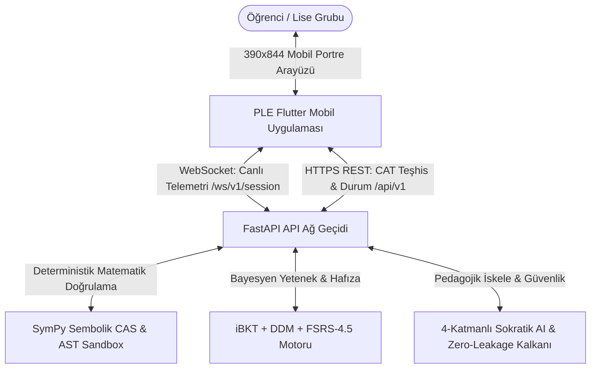
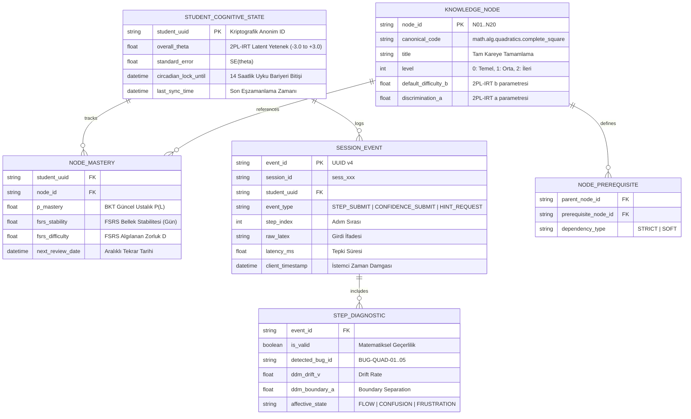
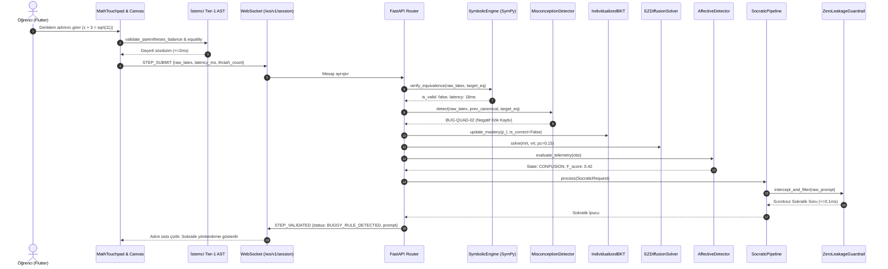
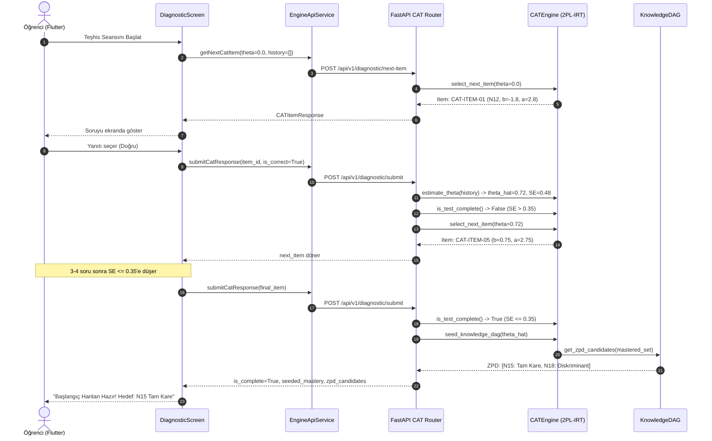
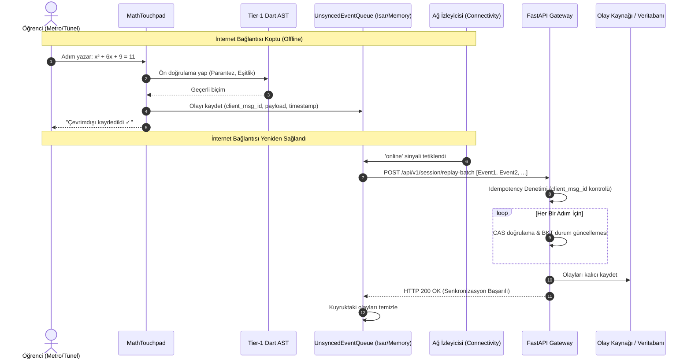
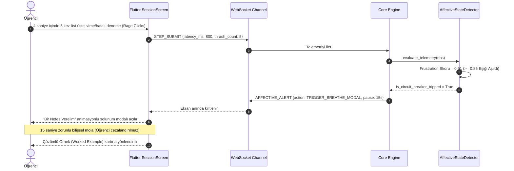

# SYSTEM ARCHITECTURE AND DATAFLOW SPECIFICATION (SİSTEM MİMARİSİ VE VERİ AKIŞ ŞARTNAMESİ)
## Kişisel Öğrenme Motoru (Personal Learning Engine) — C4 Mimarisi, ER Modelleri ve İletişim Akışları

**Tarih:** 14 Eylül 2026  
**Doküman Kodu:** ARCH-PLE-2026-V1  
**Kapsam:** Flutter Mobil İstemci, Python FastAPI Çekirdek Motor, Nöro-Sembolik CAS, WebSocket Canlı Akış ve Çevrimdışı Senkronizasyon  

---

## 1. MİMARİ GENEL BAKIŞ VE C4 MODELİ

Kişisel Öğrenme Motoru, **"Deterministik Sembolik Hakikat + Kısıtlanmış Sokratik Pedagoji"** (Neuro-Symbolic Architecture) felsefesine dayanan, olay güdümlü (event-driven), çift yönlü ve düşük gecikmeli bir mikro-istemci mimarisidir.

### 1.1. C4 Seviye 1: Sistem Bağlamı (System Context Diagram)



---

### 1.2. C4 Seviye 2: Konteyner ve Servis Mimarisi (Container Diagram)

```mermaid
graph TB
    subgraph Mobil Cihaz [İstemci Katmanı - Flutter / Dart]
        Touchpad[MathTouchpad: Çift Modlu Matematik Girişi]
        Canvas[AlKhwarizmiCanvas: x² + bx Geometrik Tuval]
        Scratchpad[ScratchpadOverlay: Serbest Çizim Katmanı]
        Tier1AST[Tier-1 Yerel Dart AST Sözdizim Denetleyici]
        OfflineQueue[In-Memory & Isar Çevrimdışı Olay Kuyruğu]
        WSClient[SessionWebSocketService: Canlı Soket İstemcisi]
    end

    subgraph Backend [Çekirdek Bilişsel Motor - Python 3.11 / FastAPI]
        APIRouter[FastAPI Uç Noktaları & WS Yöneticisi]
        SymEngine[SymbolicEquivalenceEngine: AST Whitelist]
        BugDetector[QuadraticMisconceptionDetector: BUG-QUAD-01..05]
        DAGService[KnowledgeDAG: 20 Çekirdek Düğümlü Topoloji]
        CATService[CATEngine: 2PL-IRT Fisher Bilgi Seçicisi]
        BKTService[IndividualizedBKT & CT-BKT: Kolmogorov Çözücü]
        DDMService[EZDiffusionSolver: Wagenmakers Kapalı Form]
        SPRTService[WaldSPRT: Sıralı Olasılık Karar Vericisi]
        FSRSService[FSRSEngine: 17 Parametre & Sirkadiyen Kilit]
        PropService[PartWholePropagator: Nilpotent Matris (I - 0.8A)⁻¹]
        AffectService[AffectiveStateDetector: 5-Durumlu HMM & Şalter]
        SocrService[SocraticPipeline & ZeroLeakageGuardrail]
    end

    Touchpad --> Tier1AST
    Tier1AST -->|Geçerli Adım| WSClient
    Tier1AST -->|Sözdizim Hatası| Touchpad
    WSClient <-->|WSS TLS 1.3| APIRouter
    WSClient -.->|Ağ Koptuğunda| OfflineQueue
    OfflineQueue -.->|Ağ Geldiğinde Replay| WSClient

    APIRouter --> SymEngine
    APIRouter --> BugDetector
    APIRouter --> DAGService
    APIRouter --> CATService
    APIRouter --> BKTService
    APIRouter --> DDMService
    APIRouter --> SPRTService
    APIRouter --> FSRSService
    APIRouter --> PropService
    APIRouter --> AffectService
    APIRouter --> SocrService
```

---

## 2. VARLIK VE BİLİŞSEL VERİ MODELLERİ (ENTITY RELATIONSHIP & DATA MODELS)

Sistemde öğrenci kişisel verisi (PII) tutulmaz. Tüm durum anonim bir `StudentUUID` ve matematiksel bilişsel durum matrisi ile saklanır.

### 2.1. ER Modeli Şeması



---

## 3. VERİ AKIŞLARI VE SIRALI DİYAGRAMLAR (SEQUENCE DIAGRAMS)

---

### 3.1. Canlı Adım Doğrulama ve Sokratik Geri Bildirim Akışı (WebSocket)



---

### 3.2. 2PL-IRT Dinamik CAT Teşhis ve Atlas Tohumlama Akışı (REST)



---

### 3.3. Çevrimdışı Mod, Yerel Kuyruk ve Çatışmasız Senkronizasyon (Offline Sync)



---

### 3.4. Afektif Kriz ve Şalter Müdahalesi (Circuit Breaker Interruption)



---

## 4. İLETİŞİM SÖZLEŞMELERİ VE PAYLOAD ŞEMALARI

### 4.1. WebSocket Mesaj Formatı (`/ws/v1/session`)
Tüm WebSocket mesajları aşağıdaki temel zarf (envelope) yapısını paylaşır:
```json
{
  "type": "STRING (STEP_SUBMIT | STEP_VALIDATED | CONFIDENCE_SUBMIT | AFFECTIVE_ALERT | HINT_REQUEST | PING)",
  "client_msg_id": "STRING (cmsg_uuid)",
  "session_id": "STRING (sess_uuid)",
  "timestamp": 1726328400.123,
  "payload": { ... }
}
```

### 4.2. REST Uç Noktaları Sözleşmesi
- **Adım Doğrulama:** `POST /api/v1/session/step/verify` $\to$ `StepVerificationResponse` (Gecikme $P_{95} \le 180\text{ ms}$)
- **Dinamik Teşhis Soru Talebi:** `POST /api/v1/diagnostic/next-item` $\to$ `CATItemResponse` (Gecikme $P_{95} \le 25\text{ ms}$)
- **Teşhis Cevap Gönderimi:** `POST /api/v1/diagnostic/submit` $\to$ `CATSubmitResponse`
- **Sokratik Diyalog Rehberi:** `POST /api/v1/socratic/respond` $\to$ `InnerMonologueLog` (Gecikme $P_{95} \le 10\text{ ms}$ yerel)
- **Günlük Seans Başlatma:** `POST /api/v1/session/start-daily`
- **Atlas Durumu:** `GET /api/v1/atlas/state`
- **Seans Kapanışı (14h Kilit):** `POST /api/v1/session/conclude`

Bu mimari; milisaniyelik deterministik matematiksel güvenceyi, insan bilişsel kapasitesine duyarlı koruyucu sınırları ve kesintisiz mobil deneyimi temin eder.
