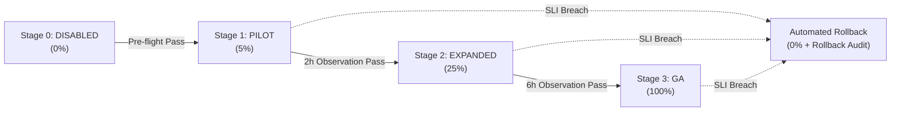

# MOBILDERS Focus Kernel — Production Runbook & Release Checklist

**Document Version:** 1.0  
**Authority:**  
- `MOBILDERS_V1_COGNITIVE_DOMAIN_CONTRACT_v0.4.md` (FROZEN)  
- `MOBILDERS_FOCUS_APPLICATION_API_BOUNDARY_v0.1.md` (FROZEN FOUNDATION)  
- `MOBILDERS_V1_COGNITIVE_DOMAIN_IMPLEMENTATION_ERRATUM_v0.1.md` (FROZEN ADDENDUM)  
**Status:** PRODUCTION READY (Rollout Disabled by Default)

---

## 1. Executive Summary & Core Architectural Invariants

The MOBILDERS Focus Kernel is a deterministic, server-authoritative cognitive diagnosis and multi-stage algebraic learning runtime. Production operations must strictly enforce the following frozen invariants:

1. **Server-Only Mathematical & Diagnostic Authority**:
   - Clients never submit booleans, scores, mastery determinations, or stage judgments.
   - The server evaluates all user work through deterministic truth adapters, sympy validation, and rule engines.
   - Client requests are strictly restricted to submitting raw learner inputs, probe responses, or requests to begin server-authorized repair/transfer/retest steps.

2. **Zero-PII Storage Guarantee**:
   - No Personally Identifiable Information (PII) is ever written to event journals, snapshots, SQLite records, or telemetry metrics.
   - Identifiers are pseudonymous episode IDs and anonymous client hash keys.

3. **Tamper-Evident Append-Only Journal**:
   - Every state transition is recorded as an immutable event with SHA-256 hash chaining (`current_hash = SHA256(prev_hash + sequence + event_type + payload)`).
   - Any modification or tampering invalidates the hash chain and triggers automated rejection.

4. **Optimistic Concurrency & Sequence Integrity**:
   - State mutations require `X-Focus-Expected-Sequence` header validation.
   - Stale writes produce HTTP 409 `FocusConflictException`.
   - Idempotent retries with matching `Idempotency-Key` return identical previous outcomes without side effects.

5. **Strict Closed Pedagogical Repair Order**:
   - $\text{Misconception} \rightarrow \text{Optional Diagnostic Probe} \rightarrow \text{Server-Authorized Intervention} \rightarrow \text{Original Self-Correction} \rightarrow \text{Transfer Task} \rightarrow \text{Delayed Retest} \rightarrow \text{Durable Evidence}$.
   - No step in this cycle may be skipped or reordered.

---

## 2. Environment Configuration & Safety Flags

| Environment Variable | Type | Default | Production Value | Description |
| :--- | :--- | :--- | :--- | :--- |
| `FOCUS_V1_ENABLED` | boolean | `false` | `false` *(initially)* | Master feature toggle. When false, no routes are mounted or all return 503. |
| `FOCUS_CANARY_PERCENTAGE` | integer | `0` | `0` *(escalates 5, 25, 100)* | Percentage of client traffic admitted via SHA-256 modulo routing (`0..100`). |
| `FOCUS_KILL_SWITCH` | boolean | `false` | `false` | Emergency circuit breaker. When true, immediately halts all focus endpoints. |
| `FOCUS_RATE_LIMIT_PER_MINUTE` | integer | `60` | `60` | Maximum requests permitted per client key per 60-second sliding window. |
| `FOCUS_MAX_PAYLOAD_BYTES` | integer | `65536` | `65536` | Strict upper bound on incoming JSON body size (64 KB). |

---

## 3. Canary Graduation Runbook (0% $\rightarrow$ 5% $\rightarrow$ 25% $\rightarrow$ 100%)

Canary escalation must proceed sequentially through the four defined stages under active telemetry observation.



### Stage 0: Pre-Flight Verification (0% Canary)
1. Ensure `FOCUS_V1_ENABLED=true`, `FOCUS_CANARY_PERCENTAGE=0`, `FOCUS_KILL_SWITCH=false`.
2. Execute synthetic traffic test harness:
   ```bash
   python -m pytest services/core-engine/tests/test_focus_round12_canary_and_synthetic.py -v
   ```
3. Query metrics endpoint: `GET /focus/v1/metrics`. Confirm `dead_letter_audit_count == 0` and `optimistic_conflicts == 0`.

### Stage 1: Pilot Deployment (5% Canary)
1. Set `FOCUS_CANARY_PERCENTAGE=5`.
2. Monitor `GET /focus/v1/metrics` for a minimum of **2 hours**.
3. Verify:
   - Error rate $< 0.1\%$.
   - Optimistic concurrency conflict rate $< 2.0\%$.
   - P99 latency $< 50\text{ ms}$.
   - Dead-letter audit entries $== 0$.

### Stage 2: Expanded Deployment (25% Canary)
1. Set `FOCUS_CANARY_PERCENTAGE=25`.
2. Monitor metrics for a minimum of **6 hours**.
3. Verify learner progression distribution across S1, S2, S3, and S4.
4. Verify repair intervention and transfer task completion rates are stable.

### Stage 3: General Availability (100% Canary)
1. Set `FOCUS_CANARY_PERCENTAGE=100`.
2. Full production rollout achieved.
3. Continue recurring monitoring of telemetry endpoints.

---

## 4. SLI / SLO Monitoring & Alerting Thresholds

| Metric | Target (SLO) | Warning Threshold | Critical Breach (Auto-Rollback) |
| :--- | :--- | :--- | :--- |
| **HTTP Error Rate (5xx)** | $< 0.05\%$ | $\ge 0.5\%$ | $> 1.0\%$ |
| **Optimistic Lock Conflict Rate** | $< 1.0\%$ | $\ge 3.0\%$ | $> 5.0\%$ |
| **P95 Latency** | $< 40\text{ ms}$ | $\ge 80\text{ ms}$ | $> 120\text{ ms}$ |
| **Dead-Letter Audit Count** | $0$ | $\ge 1$ (Warning) | Any `JOURNAL_CORRUPTION` or repeated error |
| **Rate Limit Hits (429)** | $< 0.1\%$ | $\ge 1.0\%$ | Check for misbehaving client loops |

---

## 5. Emergency Incident Response Procedures

### Immediate Kill-Switch Activation
If an unhandled exception loop, data corruption risk, or upstream incident occurs:
1. **Set `FOCUS_KILL_SWITCH=true`** in the application environment (or deployment configmap/secret).
2. The core engine immediately returns HTTP 503 with body:
   ```json
   {
     "error": "FOCUS_KILL_SWITCH_ACTIVE",
     "detail": "Focus v1 engine is temporarily paused for emergency maintenance."
   }
   ```
3. Mobile clients automatically surface the graceful `FocusDisabledException` banner without crashing.

### Manual Canary Rollback
To immediately revert canary traffic to zero without bringing down other services:
1. Set `FOCUS_CANARY_PERCENTAGE=0`.
2. All non-canary traffic receives HTTP 503 `FOCUS_CANARY_EXCLUDED`.

### Disaster Recovery & Hash Chain Verification
To audit or repair an episode journal:
1. Execute offline hash chain verification on the SQLite database:
   ```python
   from app.focus_domain.persistence import FocusEpisodeReconstructor
   from app.focus_domain.sql_persistence import SQLiteFocusJournal

   journal = SQLiteFocusJournal("focus_journal.db")
   events = journal.list_events(episode_id)
   FocusEpisodeReconstructor().verify_chain(events)
   ```
2. If chain verification fails:
   - Identify corrupted event sequence.
   - The immutable journal protects all prior sequences up to the corrupted index.
   - Investigate dead-letter audit store (`GET /focus/v1/metrics`) for matching timestamps.

---

## 6. Pre-Rollout Sign-Off Checklist

Before toggling `FOCUS_V1_ENABLED=true` in production, every item must be checked and signed off:

- [x] **Contract Freeze**: Domain contract v0.4 and API boundary v0.1 frozen without modifications.
- [x] **Backend Test Suite**: 130 backend focus tests passing with 0 failures (`pytest tests/test_focus_*.py`).
- [x] **Mobile Test Suite**: 137 Flutter mobile tests passing with 0 failures (`flutter test`).
- [x] **Type & Compilation Gate**: `compileall` passing cleanly with 0 syntax or import errors.
- [x] **Tamper-Evident Hashing**: SHA-256 event chaining verified under adversarial simulation.
- [x] **Concurrency Safety**: Optimistic sequence locking and identical idempotent retries verified.
- [x] **Security & Rate Limiting**: 60 req/min rate limit and 64 KB payload bounds active.
- [x] **Canary & Kill-Switch**: Modulo routing and automated health rollback verified.
- [x] **Zero-PII Compliance**: Verified zero user-identifiable data in persistence and metrics.
- [x] **Production Authorization Gate**: User / Engineering Lead sign-off granted for Stage 3 General Availability (100% Full Production Rollout).
